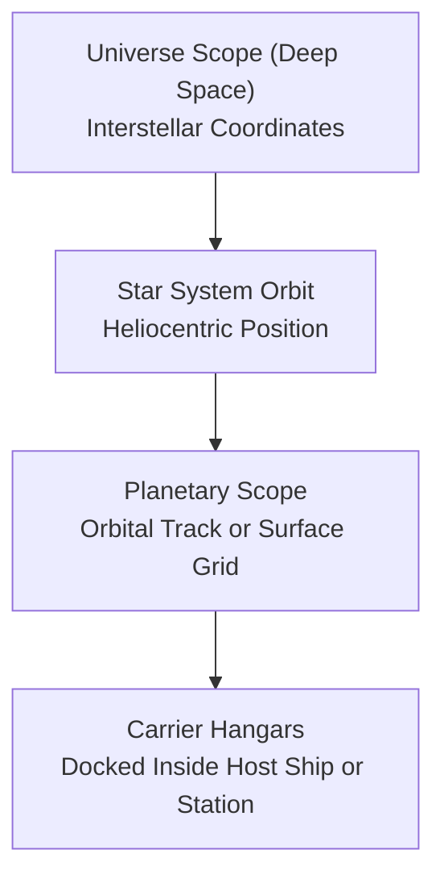

# Domain & Game Mechanics Documentation

When modernizing or discovering game subsystems (e.g., naval operations, orbital mechanics, economics, planetary ecology, governance, combat simulation), capture and document these domain rules in human-readable markdown guides within `docs/`.

---

## 1. Audience & Documentation Perspective

`docs/*.md` guides are **player-facing technical manuals** written for players and game strategists who want to understand exact game mechanics and subsystem behavior.

### 🚫 Rules of Perspective:
- **NO Source Code Identifiers**: Never use C++ class names, function names, enum tags, or variable types (e.g. avoid `doship()`, `doown()`, `ScopeLevel::LEVEL_UNIV`, `OTYPE_PROBE`, `player_t`, `EntityManager`).
- **Use Canonical Domain Terminology**: Use in-game concepts ("Universe Scope / Deep Space", "Star System Orbit", "Carrier Hangars", "Sensor Probes", "Mobile Factories", "Simulation Segments", "Turn Updates").
- **Pure Gameplay Mechanics**: Focus on cause and effect, tactical trade-offs, resource costs, lifecycle stages, and domain invariants.

---

## 2. Mathematical Rigor & Formulas

Document exact numerical formulas and probability distributions using LaTeX math ($`$...$`$ inline or display `$$...$$`):

- **Probabilities**: State exact success and failure distributions (e.g. $P(\text{Immobilized}) = \frac{\text{Radiation}}{100}$).
- **Rates and Scaling**: Express formulas for crew scaling, efficiency ratios, and resource costs:
  $$r_{\text{crew}} = \frac{\text{Current Crew}}{\text{Maximum Crew Capacity}}$$
  $$\text{Max Repair} = \text{Base Repair Rate} \times r_{\text{crew}}$$
  $$\text{Resource Cost} = \left\lfloor 0.005 \times \text{Max Repair} \times \text{Ship Construction Cost} \right\rfloor$$
- **Continuous & Discrete Degradation**: Detail degradation curves, attrition rates, and dissipation formulas (e.g. $\Delta \text{Damage} = \left\lfloor \frac{5 \times \text{Nova Stage}}{(\text{Effective Armor} + 1) \times S} \right\rfloor$).
- **Displacement & Mass Accumulation**: Express dynamic totals encompassing chassis, stored consumables, and nested units.

---

## 3. Visual Lifecycles & Mermaid Diagrams

Use Mermaid flowcharts and state diagrams to illustrate multi-step simulation pipelines, spatial hierarchies, and behavioral state transitions:



---

## 4. Standard Document Structure

Every domain guide in `docs/` should follow a structured layout:

1. **Title and Overview**: High-level conceptual summary of the subsystem.
2. **Core Concepts / Reference Frames**: Spatial, political, or economic hierarchies.
3. **Domain Mechanics & Subsystem Breakdown**: Section-by-section walkthrough of specific rules, actions, and constraints.
4. **Mathematical Models & Turn Lifecycles**: Step-by-step turn execution phases with LaTeX formulas.
5. **See Also**: Relative markdown links to related guides in `docs/`.

---

## 5. CMake Registration

Whenever creating a new document in `docs/`:

1. Save the file to `docs/<topic>.md`.
2. Register the filename in `docs/CMakeLists.txt` under `install(FILES ...)`:
   ```cmake
   install(FILES economy.md gb_FAQ.txt governance.md planetary_simulation.md
                 planets.md RACEGEN.COMPILE.HELP RACEGEN.PLAYER.HELP ships.md
                 stars.md von_neumann.md <new_topic>.md
           DESTINATION "${CMAKE_INSTALL_DOCDIR}")
   ```
3. Run `ninja -C build` to verify CMake configuration.
