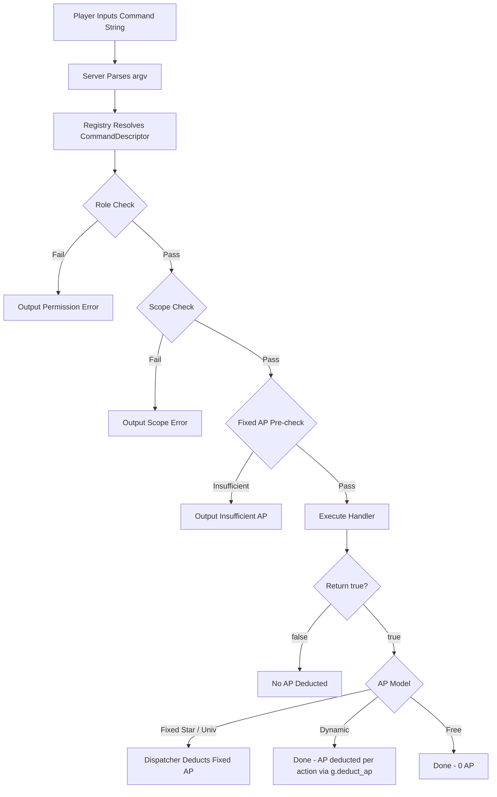
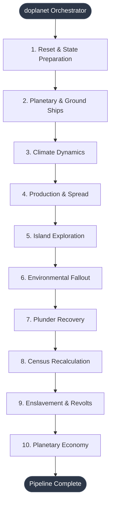
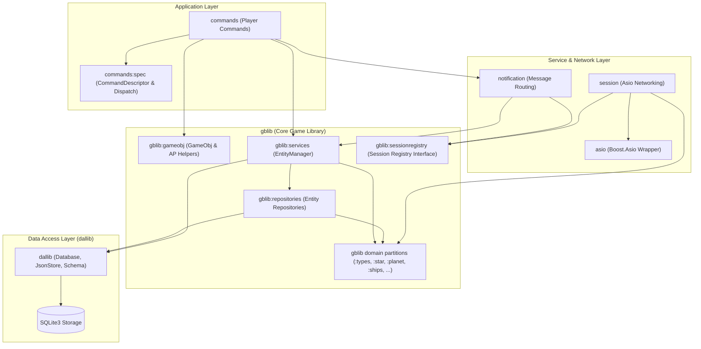

# Galactic Bloodshed Architecture

## Overview

Galactic Bloodshed uses a clean **n-tier architecture** with clear separation of concerns. Each layer has a single responsibility and communicates only with adjacent layers through well-defined interfaces.

The current implementation is centered on a repository-backed `EntityManager` service rather than a generic `GameDataService`. That is intentional: the codebase needs a pragmatic persistence boundary for game entities, not a large abstraction framework.

## Persistence API Guarantees

These are the architectural guarantees the project is converging toward. Some are already true in code today; the remaining cleanup work is tracked in [plan-database.md](plan-database.md).

1. **SQLite details stay in the DAL.** Raw `sqlite3_*` calls, pragmas, SQL statements, and connection lifecycle belong in `dallib` only.
2. **Repositories own serialization and table-specific persistence.** A repository may know how a `Race`, `Ship`, or `Planet` maps to storage, but it must not contain game rules.
3. **EntityManager is the game-facing persistence interface.** Commands and core game logic should load, cache, iterate, mutate, and flush entities through `EntityManager` rather than talking to repositories directly.
4. **Writable access is monadic and scoped.** `mutate_*()` executes mutations inside a scoped lambda and automatically persists changes upon lambda completion. Internal `get_*()` handles are private to `EntityManager` to prevent handle lifetime errors.
5. **Read-only access is explicit.** `peek_*()`, `with_*()`, and readonly iterators (`RaceList::readonly`, `StarList::readonly`, etc.) exist so callers can traverse and inspect state without paying writable-handle overhead or implying mutation.
6. **Lookup semantics are consistent.** The target API is that entity lookup failures are treated as service-layer errors, with user-input paths translating those errors into clear command output.
7. **Iteration semantics are consistent.** Read-only loops use explicit readonly patterns (`XxxList::readonly`); mutable loops use handle-based iterators or scoped monadic mutations.

## Layer Responsibilities

### Data Access Layer
- Owns SQLite connections, pragmas, transactions, schema creation, and SQL execution.
- Must not know game rules or command behavior.

### Repository Layer
- Owns entity-specific persistence, serialization, deserialization, and storage keys.
- May expose entity-specific queries, but not game-policy decisions.

### Service Layer
- Owns entity identity, caching, lifecycle management, persistence orchestration, and multi-entity game operations.
- Is the layer that should present a stable, game-friendly API to commands and turn processing.

### Application Layer
- Owns parsing, validation of user input, command-scoped error handling, and user-visible output.
- Must not talk to DAL or repository types directly.

## Architecture Layers

```
┌─────────────────────────────────────────────────────────┐
│                  Application Layer                       │
│              (Commands - User Interface)                 │
│                  gb/commands/*.cc                        │
└────────────────────┬────────────────────────────────────┘
                     │
                     ↓
┌─────────────────────────────────────────────────────────┐
│                   Service Layer                          │
│              (Business Logic & Coordination)             │
│                 gb/services/*.cc                         │
└────────────────────┬────────────────────────────────────┘
                     │
                     ↓
┌─────────────────────────────────────────────────────────┐
│                  Repository Layer                        │
│          (Type-Safe Data Access & Serialization)         │
│                gb/repositories/*.cc                      │
└────────────────────┬────────────────────────────────────┘
                     │
                     ↓
┌─────────────────────────────────────────────────────────┐
│              Data Access Layer (DAL)                     │
│            (Database Operations & Storage)               │
│                   gb/dal/*.cc                            │
└─────────────────────────────────────────────────────────┘
                     │
                     ↓
                 SQLite Database
```

## Subsystem Modules & Cross-Cutting Concerns

Galactic Bloodshed uses **C++26 modules** to enforce architectural boundaries. Subsystems are organized into distinct, modular libraries in `gb/`:

### Core Subsystem Modules

- **`dallib`** (Data Access Layer) - `gb/dal/dallib.cppm`
  - Database, JsonStore, Schema classes
  - Only layer with direct dependency on SQLite3

- **`gb.entities`** (Domain Model) - `gb/entities/entities.cppm`
  - Core domain entities: `Race`, `Star`, `Planet`, `Ship`, `Sector`, `SectorMap`, `Universe`, `Place`, `TurnStats`
  - Type-safe IDs (`player_t`, `shipnum_t`, `starnum_t`, `planetnum_t`), `PlayerVector<T, N>`, `Coordinates`, `bitops`
  - Configuration constants (`Tweakables`), entity lists, ship capabilities and filters

- **`gb.repositories`** (Repository Pattern) - `gb/repositories/repositories.cppm`
  - Persistence mapping layer between `EntityManager` and `dallib`
  - Specific repositories for races, ships, planets, stars, sectors, commodities, power, and blocks

- **`gb.services`** (Service Layer) - `gb/services/services.cppm`
  - `EntityManager`: Central entity lifecycle, caching, and monadic transaction coordinator
  - `GameObj`: Per-command execution context and AP deduction helpers
  - `SessionRegistry`: Cross-cutting abstract interface for session notifications
  - `DeferredWriteScope`: Scoped batched persistence manager

- **`gb.turn`** (Turn Simulation Engine) - `gb/turn/turn.cppm`
  - Multi-pass simulation pipeline (`doplanet`, `doship`, `dosector`, `doturncmd`, `do_update`, `do_segment`)

- **`gb.server`** (Server & Networking) - `gb/server/server_module.cppm`
  - Asio-backed TCP server (`Server`), client sessions (`Session`), authentication (`auth`), notifications (`notification`), and startup configuration (`server_config`)

- **`commands`** (Application Layer) - `gb/commands/commands.cppm`
  - 89 player command implementations authored with declarative `CommandDescriptor`s and domain handlers

- **`gblib`** (Legacy Aggregated Module) - `gb/gblib.cppm`
  - Transitional partition aggregator retained for backwards compatibility

### Module Dependencies

```
commands      --> gb.entities, gb.services, dallib, session, notification
gb.turn       --> gb.entities, gb.services
gb.services   --> gb.entities, gb.repositories, dallib
gb.repositories --> gb.entities, dallib
gb.server     --> gb.entities, gb.services, commands, dallib, asio
gb.entities   --> (standalone domain types, strong IDs, utilities)
dallib        --> SQLite3, Glaze
```

### Why This Structure?

1. **`dallib` is standalone** - It's the foundation; no other modules depend on internal DAL types
2. **`gb.entities` contains domain models** - Defines pure game data structures and strong types without dependencies on storage or business logic
3. **`gb.services` encapsulates business orchestration** - Centralizes entity mutations and session coordination
4. **`commands` imports only needed subsystems** - Player action handlers depend cleanly on entities and services
5. **Clear boundaries** - Module imports enforce architectural constraints at compile time

---

## Layer Details

### Layer 1: Data Access Layer (DAL)
**Location**: `gb/dal/`  
**Module**: `dallib` (standalone module)

The DAL is the **only** layer that knows about SQLite or any database implementation details.

#### Responsibilities
- Manage database connections
- Execute raw SQL queries
- Handle transactions
- Provide generic JSON storage interface
- Manage database schema

#### Key Components

**`Database` Class**
```cpp
export class Database {
public:
  Database(const std::string& path = ":memory:");
  ~Database();
  
  void begin_transaction();
  void commit();
  void rollback();
};
```
- Encapsulates SQLite connection
- Handles connection lifecycle
- Provides transaction support
- No business logic

**`JsonStore` Class**
```cpp
export class JsonStore {
public:
  JsonStore(Database& database);
  
  bool store(const std::string& table, int id, const std::string& json);
  std::optional<std::string> retrieve(const std::string& table, int id);
  bool remove(const std::string& table, int id);
  std::vector<int> list_ids(const std::string& table);
  int find_next_available_id(const std::string& table);
  std::vector<int> query_ids(const std::string& table,
                             const std::string& where_clause,
                             const std::vector<KeyValue>& params = {});
};
```
- Generic CRUD operations for JSON data
- Table-agnostic storage interface
- Parameterized WHERE queries returning matched IDs without exposing SQLite statements
- Gap-finding for ID allocation
- Error handling

**Schema Management**
```cpp
export void initialize_schema(Database& db);
```
- Creates all database tables
- Configures STORED generated columns (e.g. `storbits`, `whatorbits`, `destshipno`, `owner`, `alive`) for JSON field extraction
- Sets up B-Tree indexes on generated columns for high-speed spatial queries
- Configures SQLite pragmas

#### Design Principles
- **No business logic**: Pure data storage operations
- **Generic operations**: Works with any JSON data
- **Single responsibility**: Only database access
- **No type knowledge**: Doesn't know about Race, Ship, etc.

---

### Layer 2: Repository Layer
**Location**: `gb/repositories/`  
**Module**: `gblib:repositories`

Repositories provide type-safe access to game entities and handle JSON serialization.

#### Responsibilities
- Serialize/deserialize game entities to/from JSON
- Provide type-safe CRUD operations
- Manage entity-specific queries
- Handle data validation
- Abstract storage details from business logic

#### Key Components

**Base Repository Template**
```cpp
template<typename T>
class Repository {
protected:
  JsonStore& store;
  std::string table_name;
  
  virtual std::optional<std::string> serialize(const T& entity) = 0;
  virtual std::optional<T> deserialize(const std::string& json) = 0;
  
public:
  Repository(JsonStore& js, const std::string& table);
  
  bool save(int id, const T& entity);
  std::optional<T> find(int id);
  bool remove(int id);
  int next_available_id();
};
```

**Specific Repositories**

Each game entity type has its own repository:

- **`RaceRepository`**: Player races
- **`ShipRepository`**: Spacecraft
- **`PlanetRepository`**: Planets
- **`StarRepository`**: Star systems
- **`SectorRepository`**: Planet surface sectors
- **`CommodRepository`**: Commodity market
- **`BlockRepository`**: Communication blocks
- **`PowerRepository`**: Power reports

**Example: ShipRepository**
```cpp
export class ShipRepository : public Repository<Ship> {
public:
  ShipRepository(JsonStore& store);
  
  // Standard operations
  std::optional<Ship> find_by_number(shipnum_t num);
  bool save(const Ship& ship);
  void delete_ship(shipnum_t num);
  
  // Ship-specific operations
  shipnum_t next_ship_number();
  shipnum_t count_all_ships();
  
  // Spatial and indexed queries
  std::vector<shipnum_t> find_in_star(starnum_t star_id, bool alive_only = true);
  std::vector<shipnum_t> find_on_planet(starnum_t star_id, planetnum_t planet_id, bool alive_only = true);
  std::vector<shipnum_t> find_in_hangar(shipnum_t carrier_id, bool alive_only = true);
  std::vector<shipnum_t> find_by_owner(player_t owner_id, bool alive_only = true);
  std::vector<shipnum_t> find_alive();
  
protected:
  std::optional<std::string> serialize(const Ship& ship) const override;
  std::optional<Ship> deserialize(const std::string& json) const override;
};
```

#### Design Principles
- **Type safety**: Strong typing for all operations
- **Encapsulation**: Hides JSON/database details
- **Single entity focus**: Each repository handles one entity type
- **No business logic**: Pure data access
- **Dependency injection**: Receives `JsonStore` reference

#### JSON Serialization
Repositories use **Glaze** library for JSON serialization:
```cpp
// Glaze reflection defines the JSON mapping
namespace glz {
template<>
struct meta<Ship> {
  using T = Ship;
  static constexpr auto value = object(
    "owner", &T::owner,
    "shipnum", &T::shipnum,
    "fuel", &T::fuel,
    // ... all fields
  );
};
}
```

---

### Layer 3: Service Layer
**Location**: `gb/services/`  
**Modules**: 
- `gblib:services` - Core game service (EntityManager)
- `session` - Session management (standalone module)

Services contain business logic and coordinate operations across multiple repositories.

#### Responsibilities
- Implement game rules and business logic
- Coordinate multi-entity operations
- Enforce game constraints
- Provide high-level game operations
- Transaction management for complex operations

#### Key Component: EntityManager

```cpp
export class EntityManager {
public:
  explicit EntityManager(Database& database);

  // Monadic mutating access (scoped lambda execution with automatic persistence)
  template <typename Fn>
  decltype(auto) mutate_race(player_t player, Fn&& fn);
  template <typename Fn>
  decltype(auto) mutate_ship(shipnum_t num, Fn&& fn);
  template <typename Fn>
  decltype(auto) mutate_planet(starnum_t star, planetnum_t pnum, Fn&& fn);
  template <typename Fn>
  decltype(auto) mutate_star(starnum_t num, Fn&& fn);
  template <typename Fn>
  decltype(auto) mutate_sectormap(starnum_t star, planetnum_t pnum, Fn&& fn);
  template <typename Fn>
  decltype(auto) mutate_universe(Fn&& fn);
  template <typename Fn>
  decltype(auto) mutate_block(player_t player, Fn&& fn);
  template <typename Fn>
  decltype(auto) mutate_power(player_t player, Fn&& fn);
  template <typename Fn>
  decltype(auto) mutate_commod(commodnum_t num, Fn&& fn);
  template <typename Fn>
  decltype(auto) mutate_server_state(Fn&& fn);
  template <typename Fn>
  decltype(auto) mutate_ship_exam(ShipType ship_type, Fn&& fn);

  // Direct read-only access (throws EntityNotFoundError on invalid internal IDs)
  const Race* peek_race(player_t player);
  const Ship* peek_ship(shipnum_t num);
  const Planet& peek_planet(starnum_t star, planetnum_t pnum);
  const Star& peek_star(starnum_t num);

  // Monadic scoped peeks (safe inspection with zero-cost lambda execution)
  template <typename Fn>
  auto with_race(player_t player, Fn&& fn) -> std::optional<decltype(fn(std::declval<const Race&>()))>;
  template <typename Fn>
  auto with_ship(shipnum_t num, Fn&& fn) -> std::optional<decltype(fn(std::declval<const Ship&>()))>;
  template <typename Fn>
  auto with_planet(starnum_t star, planetnum_t pnum, Fn&& fn);
  template <typename Fn>
  auto with_star(starnum_t num, Fn&& fn);

  // Batch persistence / cache lifecycle
  void flush_all();
  void clear_cache();
  player_t num_races();
  shipnum_t num_ships();

private:
  // Internal handles encapsulated to prevent handle lifetime / premature save errors
  EntityHandle<Race> get_race(player_t player);
  EntityHandle<Ship> get_ship(shipnum_t num);
  EntityHandle<Planet> get_planet(starnum_t star, planetnum_t pnum);
  EntityHandle<Star> get_star(starnum_t num);
  // ... (all get_* methods private)
};
```

`EntityManager` is the practical service boundary for the game. It coordinates repositories, caches loaded entities, provides monadic mutating access with automatic persistence, and exposes read-only and monadic scoped access for inspection and iteration.

#### Monadic Mutating Entity Access

```cpp
g.entity_manager.mutate_ship(shipno, [](Ship& ship) {
  ship.fuel() += 10.0;
});
// Auto-save happens automatically when the mutation lambda completes
```

#### Read-Only & Monadic Scoped Access

Read-only inspection supports two complementary patterns:

1. **Monadic Scoped Peeks (`with_*`)**: Safely inspects an entity inside a scoped lambda without pointer ceremony or lifetime leaks, returning an `std::optional<Result>`:
```cpp
// Inspect ship safely; lambda only executes if the ship exists
auto name = g.entity_manager.with_ship(target_ship_no, [](const Ship& ship) {
  return ship.name();
});
```

2. **Direct Peeks (`peek_*`)**: Used when accessing validated internal IDs (e.g. `g.player`, `g.snum()`). Lookups throw `EntityNotFoundError` on missing internal IDs to fail fast against database corruption:
```cpp
const auto* race = g.entity_manager.peek_race(g.player);
g.out << std::format("Race: {}\n", race->name);
```

#### Service Layer Responsibilities In Practice
- Coordinate repositories behind a game-specific API.
- Preserve identity/caching guarantees for loaded entities.
- Support batch flushing after turn processing (`DeferredWriteScope`).
- Host game-facing persistence operations like entity deletion, news/telegram posting, and other multi-entity actions.
- Avoid exposing DAL internals upward.

#### Design Principles
- **Business logic centralization**: All game rules in one place
- **Transaction management**: Ensures data consistency
- **Coordination**: Orchestrates multiple repositories
- **No direct database access**: Only uses repositories
- **Domain-driven**: Methods reflect game concepts

---

### Layer 4: Application Layer (Commands)
**Location**: `gb/commands/`  
**Module**: `commands` (standalone module with `:spec` partition)

The application layer handles player interaction, input parsing, command dispatch, and formatted output.

#### Core Concepts

1. **Declarative Command Metadata (`CommandDescriptor`)**:
   Instead of writing manual permission and scope checks inside each command handler, commands declare their requirements up front:
   - **Role & Privilege Rules**: Restricts execution based on player roles (e.g. deity-only, prohibiting guest races, leader-only Governor 0, or star system control).
   - **Allowed Scopes**: Restricts execution to valid game scopes (Universe, Star, Planet, Ship, or combinations).
   - **Action Point (AP) Costs**: Specifies whether a command is free, costs fixed AP (deducted from Star or Universe), or computes dynamic costs per action.
   - **Syntax & Argument Requirements**: Defines minimum argument counts and usage syntax strings.

2. **Centralized Dispatch & Transactional APs**:
   The dispatch pipeline (`dispatch_command()`) centralizes all preconditions before invoking the command handler:
   - Verifies permissions, valid scope, and minimum arguments.
   - Pre-checks that the player has sufficient AP to pay the command's fixed cost.
   - Invokes the command handler (`bool (*)(const command_t& argv, GameObj& g)`).
   - Deducts fixed AP **only** when the handler returns `true`. If the handler returns `false` due to domain errors or invalid input, no AP is deducted.
   - Dynamic commands (e.g. multi-ship combat or movement) deduct AP per-action using atomic helpers (`g.deduct_ap()` / `g.deduct_univ_ap()`).

3. **Command Lifecycle**:



#### Command Pattern Example

Command handlers focus strictly on domain logic and output formatting, while their descriptor pairs them with their validation rules:

```cpp
namespace GB::commands {

bool examine(const command_t& argv, GameObj& g) {
  auto shipno = string_to_shipnum(argv[1]);
  if (!shipno) {
    g.out << "Specify a valid ship number.\n";
    return false;
  }
  const auto* ship = g.entity_manager.peek_ship(*shipno);
  if (!ship) {
    g.out << "Ship not found.\n";
    return false;
  }
  g.out << std::format("Ship #{}: {}\n", ship->number(), ship->name());
  return true;
}

export constexpr CommandDescriptor examine_cmd{
    .name = "examine",
    .roles = {},
    .scopes = AllowedScopes::ship_only(),
    .ap = APCost::free(),
    .min_args = 2,
    .syntax = "examine <ship>",
    .description = "Examine ship systems and cargo",
    .handler = &examine,
};

} // namespace GB::commands
```

#### Design Principles
- **Declarative constraints**: Validation rules are declared in metadata rather than written procedurally in handlers.
- **Uniform signature**: Every command handler conforms to `bool (*)(const command_t& argv, GameObj& g)`.
- **Fail-safe AP transactions**: AP is never lost on failed commands or invalid arguments.
- **Thin handlers**: Handlers focus purely on user interaction and service layer delegation.
- **No direct data access**: All state mutation goes through `EntityManager` RAII handles.

---

## Planetary Turn Pipeline Architecture

Planetary simulation during turn execution (`update = true`) is modeled as an **n-tier sequential pipeline** orchestrated by `doplanet()`. Each pass is a single-responsibility domain function with low cyclomatic complexity ($\text{CC} \le 4$), operating over rich domain entities (`Planet`, `SectorMap`, `Sector`, `plinfo`) and returning structured result records before decoupled presentation helpers dispatch telegram notifications.



### Core Design Patterns in Turn Simulation

1. **Decoupled Simulation and Presentation**:
   Simulation passes never call `push_telegram()` directly. Instead, passes return structured event records (`RecoveryReport`, `EnslavementResult`, `IslandDiscovery`, `std::optional<Coordinates>`), which presentation helpers format into ASCII bulletins.
2. **Point-of-Action State Consistency**:
   Domain mutating methods (`Sector::devastate()`, `Sector::terraform()`, `Planet::free_slaves()`, `plinfo::collect_tax()`) leave entities in an invariant-satisfying state atomically at the point of action, eliminating end-of-loop cleanup sweeps.
3. **`PlayerVector<T, N>` Strong ID Container**:
   Multi-player metrics are stored in `PlayerVector<T, N>` (`gblib:types`), offering 1-indexed `player_t` bounds checking, container iteration, and zero-allocation JSON serialization via `glz::meta`.
4. **Dimensions & `num_sectors()` Encapsulation**:
   Planetary grids are sized by `Coordinates dimensions` (`data_.dimensions.x`, `data_.dimensions.y`) and `num_sectors()` (`dimensions.x * dimensions.y`), providing uniform toroidal wrapping and geometric validation without raw dimensions arithmetic.

---

## Data Flow Examples

### Simple Read Operation: Get Ship

```
Command (examine.cc)
  ↓ g.entity_manager.peek_ship(shipnum)
Service (EntityManager)
    ↓ ships.find_by_number(shipnum)
Repository (ShipRepository)
    ↓ store.retrieve("tbl_ship", shipnum)
    ↓ deserialize(json)
DAL (JsonStore)
    ↓ SELECT ship_data FROM tbl_ship WHERE ship_id = ?
Database (SQLite)
```

### Simple Write Operation: Save Planet

```
Command (build.cc)
  ↓ g.entity_manager.mutate_planet(star, pnum, [](Planet& planet) { ... })
Service (EntityManager)
  ↓ planets.find_by_location(star, pnum)
  ↓ [executes lambda mutating planet]
  ↓ [lambda completion triggers auto-save]
Repository (PlanetRepository)
    ↓ serialize(planet)
    ↓ store.store("tbl_planet", id, json)
DAL (JsonStore)
    ↓ REPLACE INTO tbl_planet VALUES (?, ?, ?, ?)
Database (SQLite)
```

### Complex Operation: Build Ship

```
Command (build.cc)
  ↓ g.entity_manager.create_ship(init_data)
Service (EntityManager)
    ↓ [Check tech requirements]
  ↓ [Create ship object]
  ↓ ships.next_ship_number()
  ↓ ships.save(new_ship)
  ↓ planets.find_by_location(...)
    ↓ [Deduct resources from planet]
  ↓ [planet handle persists changes]
Repository Layer
    ↓ [Multiple repository operations]
DAL (JsonStore)
  ↓ [Multiple SQL statements]
Database (SQLite)
```

---

## Module Organization

### Module Architecture & Dependencies



### Export Philosophy

**What to Export:**
- Public interfaces users of the layer need
- Types required by public interfaces
- Factory functions for creating objects

**What NOT to Export:**
- Internal implementation details
- Helper functions
- Database connection objects
- JSON serialization internals

**Example Module Interface:**

```cpp
// gblib-repositories.cppm
export module gblib:repositories;

import dallib;
import :types;

// Export the repository classes
export class RaceRepository { /* ... */ };
export class ShipRepository { /* ... */ };
// ... other repositories

// Do NOT export:
// - Glaze reflection (internal detail)
// - Helper functions like serialize/deserialize
// - JsonStore (DAL concern)
```

---

## Dependency Injection

### Initialization Pattern

```cpp
// In main() or initialization code
Database db(PKGSTATEDIR "gb.db");
initialize_schema(db);

// Create service boundary
EntityManager entity_manager(db);

// Commands receive EntityManager via GameObj
GameObj game_context{
  .player = current_player,
  .entity_manager = entity_manager,
  .out = player_output_stream
};

// Execute command
GB::commands::examine(command_args, game_context);
```

### Benefits
- **No global state**: All dependencies explicit
- **Testability**: Easy to mock any layer
- **Flexibility**: Can swap implementations
- **Thread safety**: Each connection independent

---

## Testing Strategy

### Test Pyramid

```
         /\
        /  \       Command Tests (few)
       /    \      - Integration tests
      /      \     - Use real service
     /--------\    
    /          \   Service Tests (some)
   /            \  - Mock repositories
  /              \ - Business logic focus
 /________________\
Repository/DAL Tests  (many)
- Unit tests
- In-memory database
- Fast and isolated
```

### Layer-Specific Testing

**DAL Tests**
```cpp
// Tests use in-memory database
Database db(":memory:");
initialize_schema(db);
JsonStore store(db);

// Test basic operations
store.store("test_table", 1, R"({"field": "value"})");
auto result = store.retrieve("test_table", 1);
assert(result.has_value());
```

**Repository Tests**
```cpp
// Tests use in-memory database
Database db(":memory:");
initialize_schema(db);
JsonStore store(db);
ShipRepository repo(store);

Ship ship = create_test_ship();
repo.save_ship(ship);

auto retrieved = repo.find_by_number(ship.shipnum);
assert(retrieved.has_value());
assert(retrieved->owner == ship.owner);
```

**Service Tests**
```cpp
Database db(":memory:");
initialize_schema(db);
EntityManager em(db);

// Test service-layer behavior
const auto* result = em.peek_ship(123);
assert(result == nullptr || result->number() == 123);
```

**Command Tests: The 4-Way Test Matrix**

Command unit tests use `TestContext` to verify player commands across four standard execution paths:

1. **Happy Path**: Valid arguments, authorized role, correct scope, and sufficient Action Points (AP). The command executes, returns `true`, and deducts the exact declared AP cost.
2. **Insufficient AP**: Player has fewer AP than required. The dispatch pipeline rejects execution prior to calling the domain handler and deducts 0 AP.
3. **Scope & Role Rejection**: Unauthorized roles (such as guests on restricted commands or non-leaders on governor commands) or invalid scope levels (e.g. planetary commands executed at universe scope) are rejected with 0 AP deducted.
4. **Domain Error**: Invalid game conditions (e.g. targeting a non-existent ship) cause the command handler to return `false`, aborting the action with 0 AP deducted.

```cpp
TestContext ctx;
auto& registry = get_test_session_registry();
GameObj g(ctx.em, registry);
ctx.setup_game_obj(g, player_t{1}, governor_t{0});

// Happy Path: Executes and verifies AP deduction
ctx.assert_dispatch_success(g, tax_cmd, {"tax", "15"}, /*expected_star_ap_deducted=*/1);

// Insufficient AP / Role Rejection: Rejected with 0 AP deducted
ctx.assert_dispatch_rejected(g, tax_cmd, {"tax", "15"});
```

---

## Design Principles

### Single Responsibility Principle
Each layer and class has one clear purpose:
- **DAL**: Database operations only
- **Repositories**: Entity persistence only
- **Services**: Business logic only
- **Commands**: User interaction only

### Dependency Inversion
High-level modules don't depend on low-level modules:
- Commands depend on services (abstractions)
- Services depend on repositories (abstractions)
- Repositories depend on DAL (abstractions)
- No layer knows implementation details of layers below

### Open/Closed Principle
Easy to extend without modifying:
- New repositories added without changing DAL
- New services added without changing repositories
- New commands added without changing services

### Interface Segregation
Clients only depend on what they use:
- Commands only see service interface
- Services only see repository interface
- Repositories only see DAL interface

---

## Benefits of This Architecture

### Maintainability
- **Clear structure**: Easy to find code
- **Isolated changes**: Modifications don't ripple
- **Consistent patterns**: Same approach everywhere

### Testability
- **Layer isolation**: Test each layer independently
- **Mock support**: Easy to create test doubles
- **Fast tests**: In-memory database for speed

### Flexibility
- **Pluggable storage**: Can swap SQLite for PostgreSQL
- **Format changes**: JSON serialization isolated
- **Feature addition**: Clear where new code goes

### Understandability
- **Clear boundaries**: Each layer has defined role
- **Predictable flow**: Data flows through layers
- **Domain-driven**: Code reflects game concepts

### Type Safety
- **Compile-time checks**: Wrong types caught early
- **Strong interfaces**: Clear contracts between layers
- **No stringly-typed code**: IDs are proper types

---

## Anti-Patterns to Avoid

### ❌ Don't Skip Layers
```cpp
// BAD: Command directly accessing database
void command(const command_t& argv, GameObj& g) {
  sqlite3_stmt* stmt;
  sqlite3_prepare_v2(dbconn, "SELECT ...", ...);  // NO!
}

// GOOD: Command uses service
void command(const command_t& argv, GameObj& g) {
  const auto* ship = g.entity_manager.peek_ship(shipnum);  // YES!
}
```

### ❌ Don't Put Business Logic in Repositories
```cpp
// BAD: Repository contains game rules
class ShipRepository {
  bool can_build_ship(const Race& race) {  // NO!
    return race.tech >= 10;
  }
};

// GOOD: Service contains game rules
class EntityPolicyService {
  bool can_build_ship(const Race& race) {  // YES!
    return race.tech >= 10;
  }
};

// In current code, this kind of logic may live in free functions or service
// helpers that operate on EntityManager-backed entities. The rule is the same:
// keep policy out of repositories.
```

### ❌ Don't Use Global State
```cpp
// BAD: Global database connection
extern sqlite3* dbconn;  // NO!

// GOOD: Dependency injection
class Repository {
  JsonStore& store;  // YES!
};
```

### ❌ Don't Mix Concerns
```cpp
// BAD: Command contains database code
void command(const command_t& argv, GameObj& g) {
  Ship ship;
  // ... database access
  // ... business logic
  // ... output formatting
  // All mixed together - NO!
}

// GOOD: Separated concerns
void command(const command_t& argv, GameObj& g) {
  const auto* ship = g.entity_manager.peek_ship(num);  // Data access
  bool can_do = check_rules(*ship);                   // Business logic
  g.out << format_ship(ship);               // Presentation
}
```

## Iterator Cleanup Direction

The persistence API is intentionally moving toward two distinct iteration modes:

1. **Readonly iteration** for reporting, scans, and validation.
2. **Writable iteration** for mutation with RAII persistence.

### Target Patterns

```cpp
for (const Race& race : RaceList::readonly(entity_manager)) {
  // Read-only traversal
  g.out << std::format("Race: {}\n", race.name);
}

for (auto race_handle : RaceList{entity_manager}) {
  race_handle->tech += 1.0;
}
```

### Why This Matters
- It makes mutation visible at the call site.
- It avoids accidental writable-handle use in read-only loops.
- It gives the service layer a more coherent, ORM-like interface without hiding too much behavior.

## What This Is Not

This architecture is not trying to become a generic ORM.

- There is no goal of a database-agnostic query DSL.
- There is no goal of runtime mapping metadata or automatic relationship loading.
- The goal is a strong game-specific persistence API built around repositories, entity identity, caching, and RAII saves.

---

## File Structure

```
gb/
├── dal/                         # Data Access Layer (dallib)
│   ├── dallib.cppm             # DAL module interface
│   ├── database.cc             # SQLite3 connection & transaction management
│   ├── json_store.cc           # Type-erased JSON storage
│   ├── schema.cc               # Schema migrations & table setup
│   └── *_test.cc               # In-memory DAL test suites
│
├── entities/                    # Domain Entities & Types (gb.entities)
│   ├── entities.cppm           # Domain entities module interface
│   ├── gblib-race.cppm         # Race entity structure
│   ├── gblib-ships.cppm        # Ship entity structure & types
│   ├── gblib-star.cppm         # Star entity structure & class
│   ├── gblib-planet.cppm       # Planet entity structure & Stockpile
│   ├── gblib-sector.cppm       # Sector entity structure
│   ├── gblib-galaxy.cppm       # Universe & Galaxy structures
│   ├── gblib-types.cppm        # Strong ID types & PlayerVector<T, N>
│   ├── gblib-entitylists.cppm  # Entity list iteration views
│   └── *_test.cc               # Entity unit tests
│
├── repositories/                # Repository Pattern DAL Adapters (gb.repositories)
│   ├── repositories.cppm       # Repositories module interface
│   ├── race_repository.cc      # Race persistence
│   ├── ship_repository.cc      # Ship persistence
│   ├── planet_repository.cc    # Planet persistence
│   ├── star_repository.cc      # Star persistence
│   ├── sector_repository.cc    # Sector persistence
│   ├── commod_repository.cc    # Commodity persistence
│   ├── block_repository.cc     # Communication block persistence
│   ├── power_repository.cc     # Power metrics persistence
│   └── *_test.cc               # Repository unit tests
│
├── services/                    # Domain Services & Orchestration (gb.services)
│   ├── services.cppm           # Services module interface
│   ├── entity_manager.cc       # Central lifecycle & monadic mutations
│   ├── gameobj.cc              # Per-command execution context
│   ├── prompt.cc               # Contextual prompt formatting
│   ├── session_registry.cc     # Cross-cutting notification dispatch
│   └── *_test.cc               # Service unit tests
│
├── turn/                        # Turn Simulation Engine (gb.turn)
│   ├── turn.cppm               # Turn engine module interface
│   ├── doplanet.cc             # Planetary lifecycle & movement
│   ├── doship.cc               # Ship navigation & combat passes
│   ├── dosector.cc             # Sector population & ecology passes
│   ├── doturncmd.cc            # Turn update & segment loop
│   └── *_test.cc               # Turn engine unit tests
│
├── server/                      # Server & Networking Layer (gb.server)
│   ├── server_module.cppm      # Server subsystem module interface
│   ├── server.cc               # Asio TCP server implementation
│   ├── session.cc              # Connected player session management
│   ├── auth.cc                 # Authentication & login handshake
│   ├── notification.cc         # Cross-player broadcast & routing
│   ├── server_config.cc        # Configuration & CLI parsing
│   ├── GB_server.cc            # Main server entrypoint
│   └── *_test.cc               # Server unit tests
│
├── commands/                    # Player Commands (commands)
│   ├── commands.cppm           # Commands module interface
│   ├── command_spec.cppm       # CommandDescriptor specification
│   ├── *.cc                    # 89 individual player commands
│   └── *_test.cc               # 4-way command unit test matrix
│
├── creator/                     # Universe Generation (makeuniv)
│   ├── makeuniv.cc             # Universe generator entrypoint
│   ├── makeplanet.cc           # Planetary system generation
│   ├── makestar.cc             # Star system generation
│   └── *_test.cc               # Creator unit tests
│
├── testing/                     # Test Framework & Invariant Checking (test)
│   ├── test.cppm               # Test module interface
│   ├── test_context.cc         # TestContext fixture
│   ├── test_matrix.cc          # 4-way role/scope test runner
│   ├── test_builders.cc        # Entity test builders
│   └── universe_invariants.cc  # Domain invariant assertions
│
└── third_party/                 # Third-Party C++ Module Wrappers
    ├── asio.cppm               # Boost.Asio networking
    ├── scnlib.cppm             # scnlib parsing
    └── glaze_json.cppm         # Glaze JSON serialization
```

---

## Summary

This n-tier architecture provides:

1. **Clear Separation**: Each layer has a single, well-defined responsibility
2. **Maintainability**: Easy to understand, modify, and extend
3. **Testability**: Each layer can be tested independently
4. **Flexibility**: Easy to swap implementations or add features
5. **Type Safety**: Strong typing throughout the stack
6. **No Global State**: All dependencies explicitly managed

The architecture follows SOLID principles and provides a clean, professional structure that scales well as the codebase grows.
