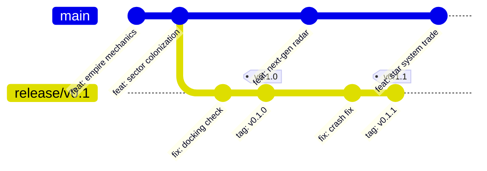

# Galactic Bloodshed Release Guide

This guide describes the release process, branching strategy, versioning conventions, and automated supply-chain verification for maintainers of Galactic Bloodshed.

---

## 1. Branching Strategy & Versioning

Galactic Bloodshed follows trunk-based development on `main` combined with stabilization release branches.



### Branches
- **`main`**: Active development branch. All feature PRs and general development land here. Unreleased development builds automatically identify as `0.0.0-dev+<commit>` in CMake.
- **`release/vX.Y` (e.g. `release/v0.1`)**: Stabilization branches cut from `main` when a version is feature-complete. Only bug fixes, packaging fixes, and release documentation land here.
- **Point Releases (`vX.Y.Z`)**: Tags cut directly from the corresponding `release/vX.Y` branch (e.g. `v0.1.0`, `v0.1.1`).
- **Fix Synchronization**: Bug fixes can land on `main` and be cherry-picked to `release/vX.Y` (or vice-versa).

---

## 2. Cutting a Release

Releases can be published either through GitHub's Web UI or via the Git CLI.

### Method A: GitHub Web UI (Recommended)

1. Navigate to the repository's **Releases** page on GitHub (`/releases`).
2. Click **Draft a new release**.
3. Click **Choose a tag**:
   - Type the new release tag (e.g., `v0.1.0` or `v0.1.1`).
   - Click **+ Create new tag: <tag> on publish**.
4. In the **Target** dropdown, select the target release branch (e.g., `release/v0.1`). *Do not leave this as `main` if releasing from a release branch.*
5. In **Release title**, enter the release name (e.g., `v0.1.0` or `Release v0.1.0`).
6. Click **Generate release notes** to automatically populate release notes from merged pull requests and commit titles.
7. Click **Publish release**.

GitHub will automatically push the tag to the target branch and fire the `Release` workflow. The workflow will build, test, package, attest, and attach the release assets directly to the published release.

---

### Method B: Git CLI

```bash
# 1. Check out the release branch and ensure it is clean and up to date
git checkout release/v0.1
git pull origin release/v0.1

# 2. Tag the release
git tag -a v0.1.0 -m "Release v0.1.0"

# 3. Push the tag to GitHub
git push origin v0.1.0
```

Pushing the tag triggers the `Release` workflow, which compiles, packages, attests, and creates the GitHub Release with auto-generated notes.

---

## 3. Automated Release Pipeline

When triggered by a tag push (`v*`) or a published release, the `.github/workflows/release.yml` workflow automatically runs:

1. **Toolchain Setup**: Configures the Clang/LLVM toolchain inside the container (`ghcr.io/kaladron/cpp-image/dev-env:latest`) parameterized via `LLVM_VERSION: "22"`.
2. **Dynamic SemVer Discovery**: CMake queries `git describe` to detect the release version from the tag, sanitizing the numeric `X.Y.Z` for `project(VERSION ...)` and setting `PROJECT_VERSION_FULL`.
3. **Test Suite Gate**: Runs `ctest --output-on-failure`. All unit and integration tests must pass before any packaging begins.
4. **Standalone Debian Package (`.deb`)**:
   - Generated via CPack (`cpack -G DEB`).
   - Binaries statically link all runtimes and dependencies (`libc++`, `libc++abi`, SQLite3, Boost, glaze, scnlib, tabulate).
   - The only runtime package dependency is **`libc6`** (`Depends: libc6 (>= 2.38)`).
   - Populates `/usr/bin/` (`GB`, `makeuniv`, `enrol`, `racegen`), `/usr/share/galactic-bloodshed/` (`star.list`, `planet.list`, `exam.dat`, `ship.dat`), `/usr/share/galactic-bloodshed/help/` (all 136 help manuals), and `/var/lib/galactic-bloodshed/` (game database directory).
5. **Automated Package Verification**:
   - `dpkg -c` checks that executables, catalogs, all 136 help files, and `/var/lib/galactic-bloodshed/` are present in the package before proceeding.
6. **Binary & Source Tarballs**:
   - Standalone binary tarball (`galactic-bloodshed-<version>-Linux-x86_64.tar.gz`).
   - Source archive (`galactic-bloodshed-<version>-source.tar.gz`) with an embedded `VERSION` file so offline builds preserve SemVer.
7. **SPDX 2.3 SBOM**:
   - Anchore Syft scans the compiled Debian package and source tree to generate `galactic-bloodshed-sbom.spdx.json`.
8. **Cryptographic Attestations (Sigstore)**:
   - Keyless build provenance is attested via `actions/attest-build-provenance@v2`.
   - Keyless SBOM provenance is attested via `actions/attest-sbom@v2`.
9. **Release Publishing**:
   - Releases assets (`.deb`, `.tar.gz`, `.spdx.json`, `SHA256SUMS`) directly to the GitHub Release.

---

## 4. Verifying Release Assets

Consumers can verify the cryptographic provenance and authenticity of downloaded release artifacts using the official GitHub CLI:

```bash
# Verify the Debian package
gh attestation verify galactic-bloodshed_0.1.0_amd64.deb \
  --repo kaladron/galactic-bloodshed

# Verify the binary tarball
gh attestation verify galactic-bloodshed-0.1.0-Linux-x86_64.tar.gz \
  --repo kaladron/galactic-bloodshed
```

---

## 5. Dry-Run Testing

To test the entire build, packaging, verification, and attestation pipeline without publishing a release:

1. Navigate to **Actions** → **Release** workflow on GitHub.
2. Click **Run workflow**.
3. Select the branch to build (e.g. `main` or a feature branch).
4. Set **Publish formal GitHub Release** to `false`.
5. Click **Run workflow**.

The workflow will run the complete pipeline and upload the resulting packages as workflow run artifacts (`release-dist-<ref>`) for inspection without publishing a public GitHub Release.
