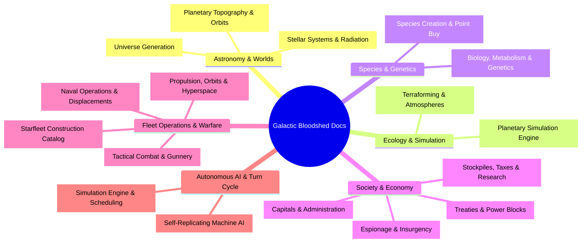

# Galactic Bloodshed Technical & Gameplay Documentation

## Overview

Welcome to the technical manuals and gameplay guides for **Galactic Bloodshed**. This documentation suite provides rigorous, comprehensive explanations of game subsystems, mathematical models, simulation lifecycles, and tactical mechanics.

These guides are written for players, fleet commanders, and empire strategists seeking an exact understanding of game mechanics without exposing internal source code implementations.

---

## 📚 Guide Directory & Subject Index

The documentation is organized into six functional areas:

---

### 1. Astronomy, Worlds & Celestial Mechanics

| Guide | Scope & Key Mechanics |
| :--- | :--- |
| **[Stellar Systems and Radiation](stars.md)** | Spectral classifications, stellar luminosity, radiation hazard zones, planetary orbital radii, and supernova lifecycle stages. |
| **[Planetary Mechanics and Surface Topography](planets.md)** | Toroidal surface coordinate geometry, polar boundaries, Keplerian heliocentric orbital motion ($T^2 \propto r^3$), orbital entrainment of stationed vessels, surface mobilization, planetary defense guns, and slave uprisings. |
| **[Universe Generation and Galaxy Topography](universe_creation.md)** | Procedural galaxy generation (`makeuniv`), star density distributions, system seeding, resource endowments, and homeworld allocation. |

---

### 2. Planetary Simulation & Geoengineering

| Guide | Scope & Key Mechanics |
| :--- | :--- |
| **[Planetary Simulation Engine and Sector Dynamics](planetary_simulation.md)** | Turn processing pipeline of planets and sectors: demographic carrying capacity, spontaneous colonist migration across longitudinal seams, mineral strip mining, agricultural harvest yields, munitions manufacturing, and Jovian gas giant skimming. |
| **[Geoengineering, Terraforming, and Ecological Warfare](geoengineering.md)** | Atmospheric processing, planetary thermal equilibrium, orbital space mirrors, greenhouse gas dispersal, toxic waste encapsulation, and biological terraforming seeds. |

---

### 3. Species, Genetics & Demographics

| Guide | Scope & Key Mechanics |
| :--- | :--- |
| **[Species Creation, Genetics, and Evolutionary Archetypes](race_generation.md)** | Player race design using `racegen`: point-buy balancing, environmental preference curves (temperature, gravity, breath gas), reproductive fertility, and metabolic rates. |
| **[Species Biology, Ecology, and Racial Genetics](races.md)** | Biological trait formulas, biomass scaling, habitability compatibility calculations, population growth curves, and metabolic nutrition demands. |

---

### 4. Economy, Governance & Diplomacy

| Guide | Scope & Key Mechanics |
| :--- | :--- |
| **[Imperial Economy, Planetary Stockpiles, and Technology Investment](economy.md)** | Planetary commodity stockpiles (fuel, resources, destruct, crystals), progressive taxation, governor system treasuries, naval maintenance upkeep, research budgeting, Interstellar Exchange market bids, and capital recycling (`scrap`). |
| **[Governance, Capitals, and Imperial Administration](governance.md)** | Government Center designation, system governor administration, Action Point (AP) accrual and expenditures, administrative reach, and the catastrophic costs of imperial anarchy. |
| **[Diplomacy, Coalitions, and Power Blocks](diplomacy.md)** | Formal diplomatic stances (Neutral, War, Allied), mutual defense pacts, collective security voting, trade access, and alliance block structures. |
| **[Covert Operations, Espionage, and Planetary Insurgency](covert_ops.md)** | Intelligence gathering, agent infiltration, industrial sabotage, inciting civil rebellions, and counter-espionage security networks. |

---

### 5. Fleet Operations, Navigation & Warfare

| Guide | Scope & Key Mechanics |
| :--- | :--- |
| **[Starships, Orbital Hierarchies, and Naval Mechanics](ships.md)** | Reference frames, carrier hangar berthing vs spaceborne mooring, arbitrary multi-tier carrier nesting, cycle prevention, atomic cargo transfers, dynamic displacement formulas, joint crew/troop berthing, peak-dose radiation, and vessel decommissioning (`scrap`). |
| **[Ship Classes, Technical Specifications, and Construction Catalog](ship_types.md)** | Complete technical specifications and operational capabilities across all 47 starship and installation classes, including armor, speeds, fuel tanks, gun mounts, and technology requirements. |
| **[Interstellar Navigation, Propulsion, and Hyperspace Mechanics](navigation.md)** | Sub-light impulse engines, course plotting, planetary surface launch escape costs, landing de-orbit maneuvers, carrier recovery and surface berthing, flight computer fuel projections, and crystal-powered FTL hyperspace jumps. |
| **[Tactical Combat, Naval Gunnery, and Planetary Warfare](combat.md)** | Kinetic gun calibers (Light, Medium, Heavy) and caliber multipliers, direct-fire combat lasers, concentrated energy weapons (CEW), guided missiles, proximity space mines, hit probability ballistics, armor mitigation, critical hits, automated retaliation, and escort screening nets. |

---

### 6. Autonomous Machine AI & Turn Lifecycle

| Guide | Scope & Key Mechanics |
| :--- | :--- |
| **[Autonomous Machine AI, Von Neumann Probes, and Berserker Warships](von_neumann.md)** | Automated self-replicating machine life cycles, automated resource harvesting, factory replication loops, Berserker combat doctrine, and planetary infestation containment. |
| **[Turn Simulation Lifecycle and Scheduling](turn_cycle.md)** | Architecture of the simulation loop: macro-economic turn updates vs tactical movement segments, subsystem execution ordering, technological discovery thresholds, and victory point determination. |

---

## 🎯 Recommended Reading Paths

- **New Commanders**: Start with [Species Creation](race_generation.md) $\to$ [Planetary Mechanics](planets.md) $\to$ [Imperial Economy](economy.md) $\to$ [Starships](ships.md).
- **Fleet Navigators & Tacticians**: Consult [Navigation & Propulsion](navigation.md) $\to$ [Tactical Combat](combat.md) $\to$ [Ship Construction Catalog](ship_types.md).
- **Empire Administrators**: Study [Governance](governance.md) $\to$ [Planetary Simulation Engine](planetary_simulation.md) $\to$ [Geoengineering](geoengineering.md) $\to$ [Diplomacy](diplomacy.md).
