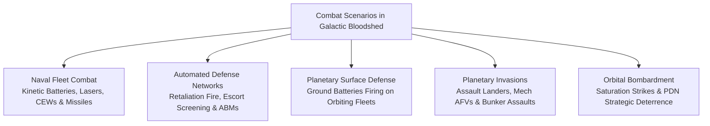
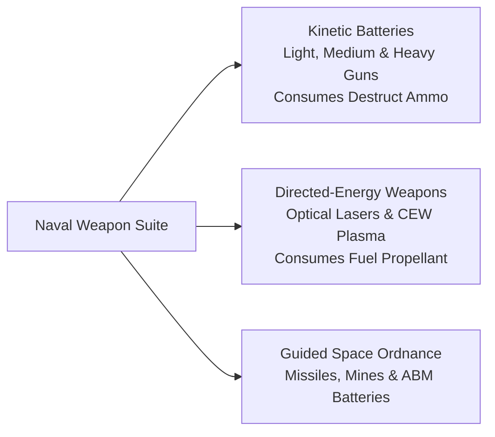
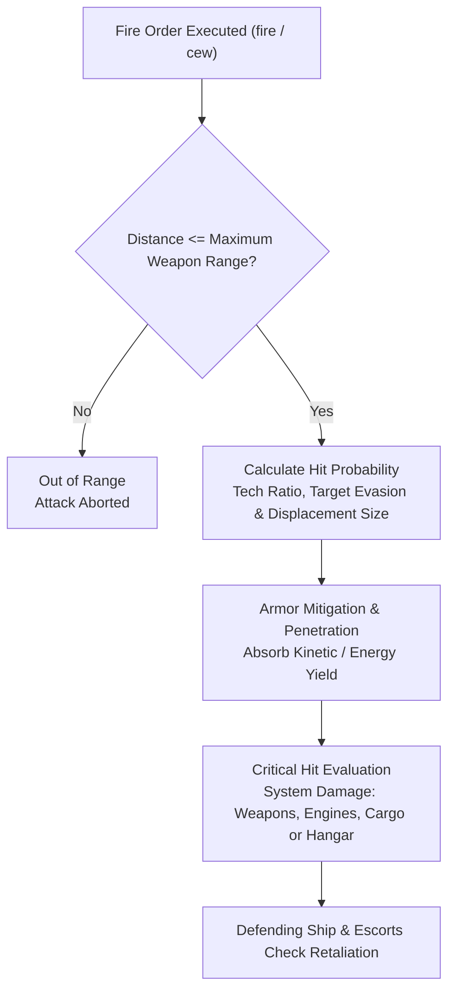
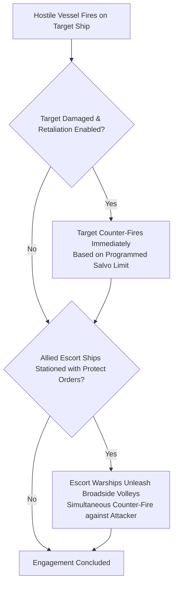
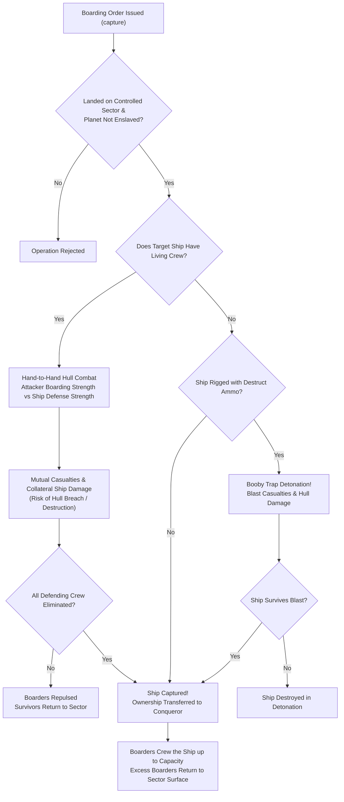
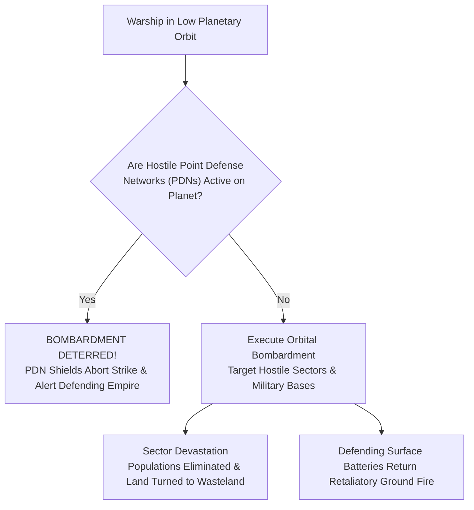

# Tactical Combat, Naval Gunnery, and Planetary Warfare

## Overview

Warfare in **Galactic Bloodshed** spans high-velocity deep-space skirmishes, heliocentric fleet engagements, surface-to-orbit defense barrages, ground invasions, and devastating orbital bombardments. Combat operations range from automated perimeter defense nets and interceptor screens to coordinated multi-ship fleet battles and planetary sieges.

---

## 1. Naval Weapon Systems and Battery Calibers

Starships mount a diverse array of kinetic guns, directed-energy beam weapons, and deployable space ordnance:

### Kinetic Gun Calibers and Caliber Multipliers
Kinetic batteries fire high-velocity physical warheads stored in ship cargo holds. Each gun installation belongs to one of three caliber tiers, characterized by an integer caliber multiplier $K$:

| Caliber Designation | Caliber Multiplier ($K$) | Relative 50% Tracking Range ($c \propto 1/K$) | Displacement Mass | Kinetic Damage ($D \propto K$) | Optimal Fleet Role |
| :--- | :---: | :---: | :---: | :--- | :--- |
| **Light Guns** | $1$ | **$3.0\times$** (High precision) | $0.2$ / gun | Standard ($1\times$) | Anti-fighter screening, missile point defense, agile escorts. |
| **Medium Guns** | $2$ | **$1.5\times$** (Moderate precision) | $0.4$ / gun | Double ($2\times$) | Destroyer and cruiser line engagements, balanced broadsides. |
| **Heavy Guns** | $3$ | **$1.0\times$** (Close-range / large targets) | $0.6$ / gun | Triple ($3\times$) | Battleship spinal cannons, planetary siege batteries, dreadnoughts. |

All kinetic guns consume $1$ unit of stored destructive ordnance (`destruct`) per gun discharged in a volley.

### Directed-Energy Weapons
Energy weapons draw power directly from the ship's fuel reserves ($2.0\text{ fuel per strength point}$):
- **Combat Lasers**: Direct-fire optical beams delivering instantaneous, high-precision strikes. When equipped with optical focus lenses, lasers achieve pinpoint armor penetration.
- **Concentrated Energy Weapons (CEW)**: High-yield plasma and charged particle projectors that fire tunable beam discharges with calibrated focus ranges.
- **Radiative Firing Mode**: Ships configured to fire in radiative mode (`order <ship> mode rad`) direct ionizing radiation into target hulls, disabling operational computers and inflicting severe radiation sickness on enemy crews without destroying the ship chassis.

### Guided Ordnance and Area Denial
- **Guided Missiles (`^`)**: Self-propelled kinetic warheads that close with target ships at point-blank range ($`D_{\text{effective}} = 0`$) before detonating their destructive payload.
- **Proximity Space Mines (`!`)**: Autonomous area-denial munitions that monitor local space and detonate their full explosive charge when unallied vessels enter proximity ($`D_{\text{effective}} = D^2 / 200`$).
- **Anti-Ballistic Missiles (ABM `&`)**: Point defense platforms that track and intercept incoming hostile missiles and mines before impact.

---

## 2. Engagement Dynamics, Ballistics, and Damage Resolution

During combat encounters, tactical fire control calculates hit probabilities, armor mitigation, and critical system damage:

### Effective Distance and Weapon Range
Attacks succeed only if the target is within the maximum effective range of the active weapon system:

$$D = \sqrt{(x_{\text{target}} - x_{\text{attacker}})^2 + (y_{\text{target}} - y_{\text{attacker}})^2}$$

Maximum kinetic weapon range scales logarithmically with imperial scientific technology:

$$R_{\text{max}} = \log_{10}(\text{Technology} + 1) \times \text{System Scale}$$

Targets positioned beyond $R_{\text{max}}$ cannot be engaged by kinetic batteries.

### Hit Probability and Combat Multipliers
The probability of scoring hits depends on relative scientific technology, attacker gunnery precision, target evasion throttling, target physical displacement size, and the weapon caliber multiplier $K$:
- **Effective 50% Hit Factor**: The tracking baseline where fire control achieves a $50\%$ hit probability scales inversely with caliber:
  $$c = \frac{a \times b}{K}$$
  where $a$ scales with fire control technology and target displacement profile ($a \propto \text{Target Size}^{1/3}$), and $b$ accounts for relative speeds and evasive maneuvering. Light guns ($K = 1$) maintain high tracking precision over longer effective baselines, while heavy spinal mounts ($K = 3$) require closer range or larger targets to ensure hits.
- Higher imperial technology provides superior fire control computers, increasing penetration odds.
- Small strike craft (such as Fighters and Shuttles) utilize agile thrusters to evade incoming heavy gun fire.
- Massive dreadnoughts and space stations present large target profiles, absorbing higher proportions of volleys.

### Critical System Hits, Structural Damage, and Collateral Attrition
Volleys penetrating defensive hull armor inflict structural destruction and internal subsystem devastation:
- **Structural Rupture**: Inflicts direct percentage damage scaled by penetrating hits and caliber multiplier $K$:
  $$\text{Damage} \propto \frac{\text{Base Weapon Damage} \times K \times \text{Penetrating Hits}}{\text{Target Hull Volume}}$$
  Accumulating $\text{Damage} \ge 100\%$ destroys the vessel.
- **Critical Subsystem Hits**: Penetrating heavy caliber rounds lower effective internal compartment protection, substantially increasing the odds of disabling hyperspace jump drives, rupturing fuel tanks, or destroying docked parasite craft.
- **Collateral Subsystem & Personnel Casualties**: Every penetrating hit inflicts collateral damage across living personnel and mounted gun batteries with probability:
  $$P(\text{Casualty or Gun Loss}) = \frac{\text{Inflicted Damage Percentage}}{100}$$
  Each carried colonist, troop, primary gun, and secondary gun is evaluated independently.
- **Battery Depletion & Caliber Reset**: When collateral damage destroys the last remaining gun in a battery, its count reaches zero and its caliber automatically resets to None. If the depleted battery was the ship's active battery, offensive kinetic fire and kinetic retaliation are immediately disabled until repaired.

---

## 3. Automated Retaliation and Escort Defense Networks

Warships can be integrated into automated fleet defense grids to ensure instantaneous counter-fire:

### Automated Retaliation and Salvo Limits
Captains program automated counter-fire using standing tactical orders:
- `order <ship> retaliate on|off`: Arms or disarms automated defensive counter-fire when struck by hostile fire.
- `order <ship> salvo <guns>`: Sets a ceiling on the number of guns fired per defensive volley (clamped to the active battery's operational gun count).
- `order <ship> laser on <strength>`: Arms directed-energy retaliation using combat lasers and fuel reserves.

#### Retaliation Prerequisites and Firepower
When attacked, a defending warship evaluates automated counter-fire immediately before subsequent commands resolve:
1. **Operational Readiness**: The ship must be active and operational. Ships immobilized by radiation sickness cannot return fire.
2. **Mobility Prerequisite**: The ship must have a positive base propulsion speed ($> 0$), or be landed on a planetary surface. Unlanded orbital platforms and space stations in deep space cannot retaliate.
3. **Crew Staffing Constraint**: For standard warships, retaliation firepower cannot exceed living crew ($1$ crew member required per active gun). Strike craft (Fighters, AFVs) and robotic warships (Berserkers) are specifically exempt from this limit.
4. **Effective Kinetic Retaliation**:
   $$\text{Defensive Counter-Fire} = \min\Big(\text{Programmed Salvo Limit}, \text{Active Battery Gun Count}, \text{Effective Crew Staffing}, \text{Stored Destruct Ammo}\Big)$$
5. **Effective Directed-Energy Retaliation**:
   $$\text{Laser Counter-Fire} = \min\left(\text{Programmed Laser Strength}, \left\lfloor \frac{\text{Stored Fuel}}{2} \right\rfloor\right)$$
   Laser retaliation requires an operational focus crystal mounted in the propulsion drive.

When struck, the vessel immediately returns fire before subsequent tactical orders are executed.

### Escort Screening and Fleet Protection
Allied warships stationed in the same planetary or stellar orbit can be assigned to protect critical flagships, freighters, or carriers using `order <ship> protect <flagship_id>`:
- When the protected vessel sustains hostile fire, all active escort warships in the orbital sector immediately unleash coordinated broadside counter-volleys against the attacking vessel.
- Armored Fighting Vehicles (AFVs) on planetary surfaces are immune to naval escort retaliation.

---

## 4. Planetary Surface Defense, Ground Warfare, and Boarding Actions

Planetary defenses combine fixed surface batteries, mechanized ground forces, surface maneuvers, and amphibious boarding operations:

### Surface-to-Orbit Defense Batteries
Planets convert sector mobilization points into up to $20$ heavy surface gun batteries:

$$N_{\text{guns}} = \min\left(20, \left\lfloor \frac{\text{Total Mobilization Points}}{1000} \right\rfloor\right)$$

- **Defend Command**: Planetary governors command surface batteries to fire on enemy warships in orbit or intercept incoming assault landers during descent (`defend <planet> <target_ship>`).
- Surface batteries consume destructive ordnance from local colony stockpiles and fire medium-caliber volleys at point-blank range.

### Ground Movement and Maneuver Costs
Ground populations maneuver across adjacent planetary sectors using `move` (for civilians) and `deploy` (for military troops).
- **Directional Paths**: Movement commands accept multi-step compass paths (`h`, `j`, `k`, `l`, `y`, `u`, `b`, `n`) traversing toroidal east/west seams and polar boundaries.
- **Population Quantities**: Omitting the quantity moves the entire sector population. Passing a negative number $-N$ moves all but $N$ personnel.
- **Action Point (AP) Costs**: Tactical maneuver costs scale logarithmically with group size, with an additional surcharge for assaulting foreign-occupied sectors:
  - **Civilian Movement (`move`)**:
    $$\text{AP} = \text{MOVE\_FACTOR} \times \left(\lfloor \ln(1 + \text{Personnel}) \rfloor + \text{Assault}\right) + 1$$
  - **Military Deployment (`deploy`)**:
    $$\text{AP} = \text{MOVE\_FACTOR} \times \left(\lfloor \log_{10}(1 + \text{Troops}) \rfloor + \text{Assault}\right) + 1$$
  where $\text{Assault} = 1$ when entering an enemy-occupied sector, and $0$ when traversing friendly or unowned territory.
- **Colonization and Abandonment**: Moving population into an unowned sector immediately colonizes it, claiming territory and adding mobilization points. Vacating all personnel from an origin sector abandons it, resetting sector ownership to neutral ($0$) and updating planetary records atomically.

### Ground Assault Resolution
When entering an enemy sector, troops or armed civilians execute a ground assault:
- **Mechanized Perimeter Defense**: Defending Armored Fighting Vehicles (AFVs `R`) in the target sector automatically open fire on advancing forces before ground engagement resolves.
- **Combat Strength Factors**: Attacker and defender combat strengths evaluate personnel count, military fighter ratings, technological superiority, environmental terrain preferences, sector defensive fortification factors, and morale differentials:
  $$\text{Strength}_{\text{atk}} = \text{Personnel} \times (\text{Military} \text{ ? } (\text{Fighters} \times 10) : 1) \times 0.01 \times \text{Tech} \times (\text{Preference}_{\text{terrain}} + 0.01) \times (\text{Fortification} + 1.0) \times \text{MoraleFactor}(\Delta \text{Morale})$$
- **Assault Victory**: If defending forces are eliminated, the attacker captures the sector. Victorious civilians or military personnel occupy the territory.
- **Metamorph Flesh Absorption**: Species with the Metamorph genetic trait absorb fallen alien corpses:
  - Victorious metamorph attackers absorb random casualties as new citizens ($\text{Absorbed} \in [0, \text{Defenders}_{\text{killed}}]$).
  - Defending metamorphs that successfully repel an invasion absorb fallen attackers into their population.
- **Assault Repulse**: If defenders survive, surviving attackers retreat to their origin sector with reciprocal morale adjustments.

### Orbital Disembarkation Assaults (`unload`)
When a landed starship unloads civilian personnel (`c`) or military troops (`m`) onto a sector controlled by a foreign empire (`unload <ship> c|m <amount>`), the disembarking force launches an immediate amphibious ground assault against the defending sector garrison:
- **Landing Craft Cover Bonus**: The landing craft's hull armor plating and structural integrity ($1.0 - \text{Damage}/100$) provide protective cover for the disembarking troops, pitted against the defender's terrain defense multiplier and environmental terrain affinity.
- **Diplomatic & Linguistic Contact**: Both empires gain $+5\%$ mutual translation knowledge (up to $100\%$).
- **Sector Capture & Biomass Absorption**: If all defenders are eliminated, the disembarking force captures the sector (with Metamorph attackers absorbing fallen defenders into the sector population), and planetary demographic summaries resynchronize atomically.
- **Repulsed Disembarkation**: If the defending garrison holds the sector, surviving attackers retreat back aboard the landing craft (restoring ship crew and troop mass), while defending Metamorphs absorb fallen attackers.

### Amphibious Boarding Operations and Ship Capture
Landed starships are vulnerable to boarding operations executed from the host sector via the `capture` command (`capture <ship> [<boarders>] [civilians|military]`):

#### Boarding Combat Resolution
1. **Prerequisites**: Target ship must be landed on a planet sector owned by the boarding player. Boarding is prohibited on worlds enslaved by foreign empires.
2. **Boarding Strength**:
   $$\text{Strength}_{\text{atk}} = \text{Boarders} \times (\text{Military} \text{ ? } (\text{Fighters} \times 10) : 1) \times 0.01 \times \text{Tech}_{\text{atk}} \times (\text{Preference}_{\text{terrain}} + 0.01) \times (\text{Defense}_{\text{terrain}} + 1.0) \times \text{MoraleFactor}(\text{Morale}_{\text{atk}} - \text{Morale}_{\text{def}})$$
3. **Ship Defensive Strength**: Defending crew leverage internal ship bulkheads, armor plating, and ship systems:
   $$\text{Strength}_{\text{def}} = (\text{Crew}_{\text{civ}} + \text{Crew}_{\text{mil}} \times 10 \times \text{Fighters}_{\text{def}}) \times 0.01 \times \text{Tech}_{\text{def}} \times (\text{Armor}_{\text{eff}} + 0.01) \times 0.01 \times (100 - \text{Damage}) \times \text{MoraleFactor}(\text{Morale}_{\text{def}} - \text{Morale}_{\text{atk}})$$
4. **Casualties and Collateral Hull Damage**: Both boarding parties and defending crews suffer proportional casualties. Internal firefights inflict up to $25\%$ collateral structural damage on the vessel, risking hull destruction if damage reaches $100\%$.
5. **Booby Traps on Crewless Vessels**: Unmanned robot craft or abandoned vessels storing destructive munitions (`destruct`) trigger internal anti-tamper booby traps:
   $$\text{Explosion Severity} = \min(100, \text{UniformRandom}(0, 10 \times \text{Destruct}))$$
   Each boarder faces a percentage chance equal to the explosion severity of being killed in the blast, and the vessel sustains equal structural damage.
6. **Vessel Seizure & Crew Integration**:
   - If defending crew is eliminated and the hull survives, the vessel transfers to the conqueror.
   - Surviving boarders crew the ship up to operational capacity (`max_crew_capacity` for civilians, `available_mil` for troops), with excess personnel returning to the planetary sector.
   - Planetary population totals and sector garrison counts decrement accurately to reflect personnel transferred into space and casualties sustained.
   - Docked parasite ships and carried cargo pods transfer to the new owner.

### Spaceborne Boarding Assaults (`assault`)
Warships operating in deep space, star orbit, or planetary orbit can execute spaceborne boarding assaults against hostile vessels within docking range ($D \le 10.0$) via `assault <ship> <target> [<boarders>] [civ|mil]`:
- **Maneuvering Fuel & Action Point Cost**: Executing an assault consumes $1$ Action Point (universe AP in deep space, star AP in orbit) and burns maneuvering propellant:
  $$\text{Fuel Burn} = 0.05 + 0.05 \times D \times \sqrt{\text{Mass}_{\text{attacker}}}$$
- **Defensive Fire Phase**: Before boarding airlocks link, the target vessel fires a defensive volley (`fire-from-dock`) against the approaching attacker. If either ship is destroyed during defensive fire, the boarding operation terminates.
- **Moored Vessel Decoupling**: If the target ship is spaceborne-moored alongside a partner vessel, the assault automatically decouples the mooring tether before boarding combat begins. (Landed ships and parasite craft inside carrier hangars cannot be space-assaulted.)
- **Boarding Combat & Booby Traps**: Boarding parties fight defending crews with proportional casualties and collateral hull damage (up to $25\%$ structural damage per side). Unmanned robot craft rigged with destructive ordnance (`destruct`) detonate internal booby traps against the boarding ship:
  $$\text{Booby Trap Damage} = \min(100, \text{UniformRandom}(0, 10 \times \text{Destruct}))$$
  inflicting direct hull damage on the attacking vessel.

---

## 5. Orbital Bombardment and Strategic Deterrence

Warships stationed in planetary orbit can execute tactical orbital bombardment against enemy surface colonies:

### Orbital Bombardment Firepower and Blast Geometry
Effective orbital bombardment power (`bombard <ship> [<x,y> [<strength>]]`) is bounded by the ship's maximum retaliation strength (either active gun battery count or armed laser strength, clamped by stored `destruct` or `fuel / 2`) and costs $1$ Star AP per firing ship:
- **Blast Radius**: A bombardment strike of strength $S$ affects all planetary sectors within toroidal Euclidean distance:
  $$r = 0.4 \times S$$
  If target coordinates `<x,y>` are omitted, a random sector on the planet is targeted.
- **Distance-Attenuated Sector Damage Factor**: Each sector at distance $d \le r$ from ground zero sustains a blast intensity factor:
  $$\text{Factor}(d) = \frac{0.2 \times S \times K}{d + 1}$$
  where $K \in \{1, 2, 3\}$ is the active gun caliber multiplier ($K = 1$ for armed combat lasers).
- **Landed Armored Fighting Vehicles (AFVs)**: Landed AFVs (`R`) can bombard only adjacent sectors ($\max(|dx|, |dy|) \le 1$), bypass orbital Point Defense Network deterrence, and are immune to surface-to-orbit gun and orbital fleet retaliation.

### Surface Devastation, Nuclear Fallout, and Retaliation
- **Wasteland Conversion & Fallout**: Sectors where $\text{round}(\text{Factor}(d))$ exceeds terrain fortification times a random roll ($[0, 10]$) are converted into radioactive wasteland (`SEC_WASTED`), eliminating civilian populations and increasing planetary atmospheric toxicity:
  $$\Delta \text{Toxicity} = (100 - \text{Toxicity}) \times \frac{N_{\text{destroyed}}}{N_{\text{total\_sectors}}}$$
- **Surface-to-Orbit & Orbital Protector Retaliation**: Whenever an orbital bombardment destroys one or more sectors ($N_{\text{destroyed}} > 0$) on an unenslaved planet, every empire whose sectors were devastated immediately fires its planetary surface defense batteries ($\min(\text{Guns}, \text{Destruct})$) back at the bombarding vessel, followed by counter-fire from all active ships in orbit configured with planetary protection orders (`order <ship> protect`).

### Point Defense Networks (PDNs) and Strategic Deterrence
Point Defense Networks (PDNs `P`) are heavy defensive grid installations stationed on planetary surfaces:
- The presence of any active, unallied PDN on a world blocks orbital bombardment from spaceborne warships (`Target has planetary defense networks`) without deducting Action Points, and acts as an **absolute strategic deterrent** against automated Berserker saturation strikes.

---

## See Also
- [Starships, Orbital Hierarchies, and Naval Mechanics](ships.md)
- [Ship Classes and Construction Catalog](ship_types.md)
- [Planetary Mechanics, Colonization, and Surface Topography](planets.md)
- [Planetary Simulation Engine and Sector Dynamics](planetary_simulation.md)
- [Governance, Capitals, and Imperial Administration](governance.md)
- [Autonomous Machine AI, Von Neumann Probes, and Berserker Warships](von_neumann.md)
- [Turn Simulation Lifecycle and Scheduling](turn_cycle.md)
