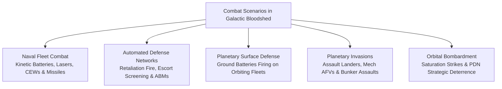
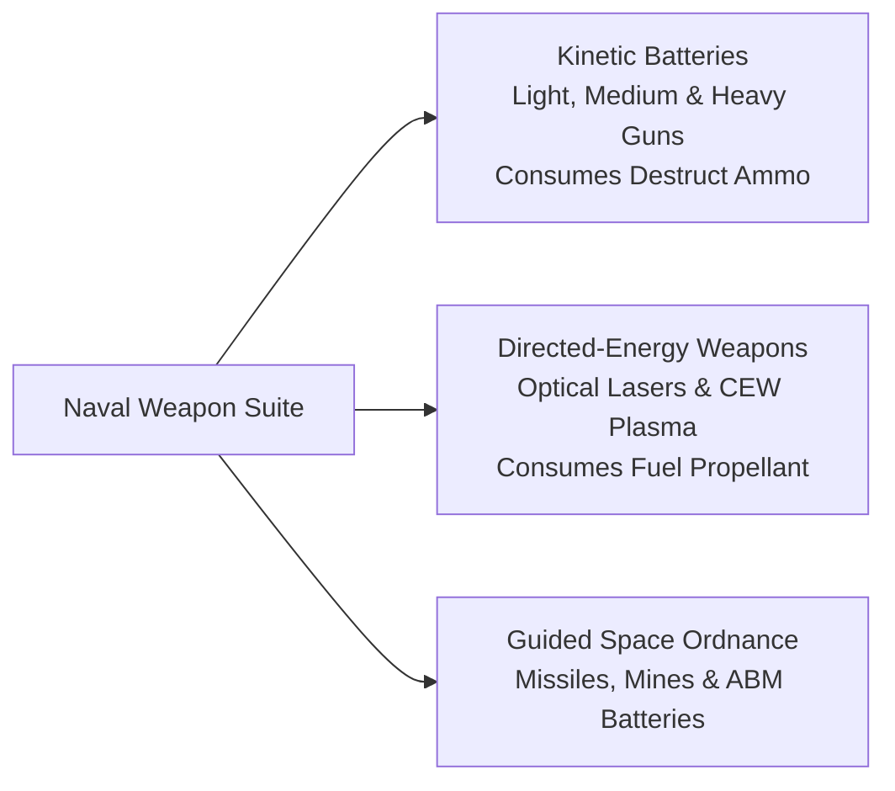
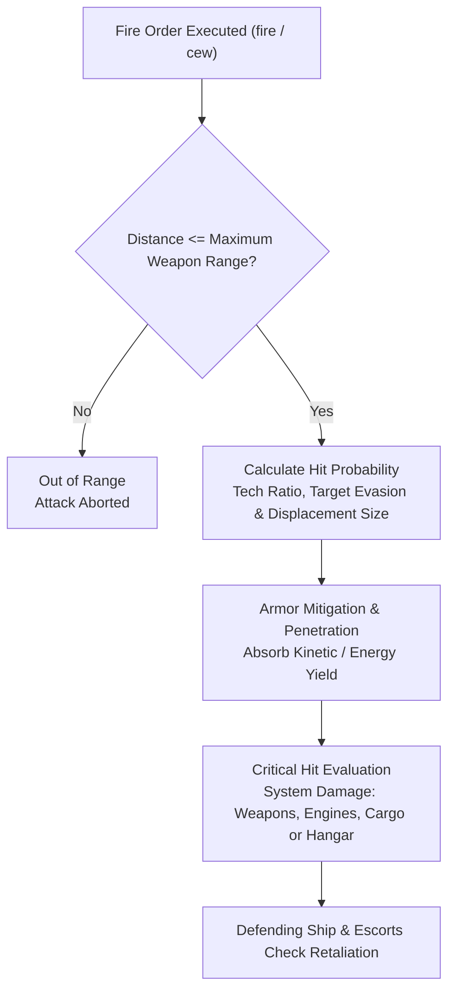
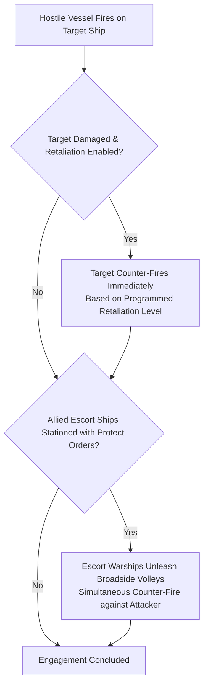
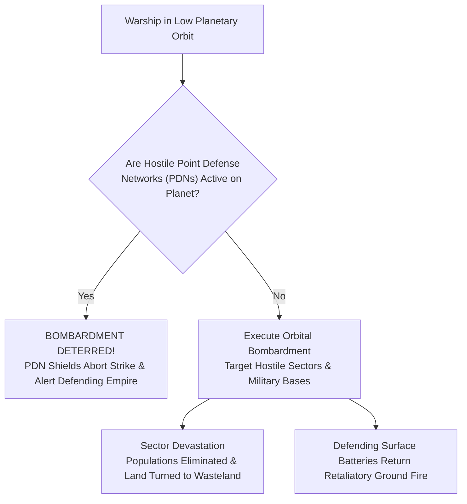

# Tactical Combat, Naval Gunnery, and Planetary Warfare

## Overview

Warfare in **Galactic Bloodshed** spans high-velocity deep-space skirmishes, heliocentric fleet engagements, surface-to-orbit defense barrages, ground invasions, and devastating orbital bombardments. Combat operations range from automated perimeter defense nets and interceptor screens to coordinated multi-ship fleet battles and planetary sieges.

---

## 1. Naval Weapon Systems and Battery Calibers

Starships mount a diverse array of kinetic guns, directed-energy beam weapons, and deployable space ordnance:

### Kinetic Gun Calibers
Kinetic batteries fire high-velocity physical warheads stored in ship cargo holds:

| Caliber Designation | Maximum Range | Armor Penetration | Ammo Consumption | Optimal Fleet Role |
| :--- | :---: | :---: | :---: | :--- |
| **Light Guns** | $50$ units | Low | Low ($1$ destruct / volley) | Anti-fighter screening, missile interception, light scouts. |
| **Medium Guns** | $150$ units | Moderate | Standard ($1$ destruct / gun) | Destroyer and cruiser fleet engagements, balanced broadsides. |
| **Heavy Guns** | $250$ units | Devastating | High ($1$ destruct / gun) | Battleship spinal cannons, planetary siege batteries, dreadnoughts. |

### Directed-Energy Weapons
Energy weapons draw power directly from the ship's fuel reserves ($2.0\text{ fuel per strength point}$):
- **Combat Lasers**: Direct-fire optical beams delivering instantaneous, high-precision strikes. When equipped with optical focus lenses, lasers achieve pinpoint armor penetration.
- **Concentrated Energy Weapons (CEW)**: High-yield plasma and charged particle projectors that fire tunable beam discharges with calibrated focus ranges.
- **Radiative Firing Mode**: Ships configured to fire in radiative mode (`order <ship> mode rad`) direct ionizing radiation into target hulls, disabling operational computers and inflicting severe radiation sickness on enemy crews without destroying the ship chassis.

### Guided Ordnance and Area Denial
- **Guided Missiles (`^`)**: Self-propelled kinetic warheads that close with target ships at point-blank range ($`D_{\text{effective}} = 0`$) before detonating their destructive payload.
- **Proximity Space Mines (`!`)**: Autonomous area-denial munitions that monitor local space and detonate their full explosive charge when unallied vessels enter proximity ($`D_{\text{effective}} = D^2 / 200`$).
- **Anti-Ballistic Missiles (ABM `&`)**: Point defense platforms that track and intercept incoming hostile missiles and mines before impact.

---

## 2. Engagement Dynamics, Ballistics, and Damage Resolution

During combat encounters, tactical fire control calculates hit probabilities, armor mitigation, and critical system damage:

### Effective Distance and Weapon Range
Attacks succeed only if the target is within the maximum effective range of the active weapon system:

$$D = \sqrt{(x_{\text{target}} - x_{\text{attacker}})^2 + (y_{\text{target}} - y_{\text{attacker}})^2}$$

### Hit Probability and Combat Multipliers
The probability of scoring hits depends on relative scientific technology, attacker gunnery precision, target evasion throttling, and the target's physical displacement size:
- Higher imperial technology provides superior fire control computers, increasing penetration odds.
- Small strike craft (such as Fighters and Shuttles) utilize agile thrusters to evade incoming heavy gun fire.
- Massive dreadnoughts and space stations present large target profiles, absorbing higher proportions of volleys.

### Critical System Hits and Structural Damage
Volleys penetrating defensive hull armor inflict critical internal damage:
- **Structural Rupture**: Inflicts direct percentage damage ($\text{Damage} \ge 100\%$ destroys the vessel).
- **Subsystem Destruction**: Penetrating hits destroy mounted gun batteries, disable hyperspace jump drives, rupture fuel/destruct holds, or damage docked parasite craft.
- **Crew Casualties**: Secondary blast shockwaves cause casualties among living bridge officers and carried troops.

---

## 3. Automated Retaliation and Escort Defense Networks

Warships can be integrated into automated fleet defense grids to ensure instantaneous counter-fire:

### Automated Retaliation Thresholds
Captains program automated counter-fire thresholds using `order <ship> retaliate <strength>`:

$$\text{Effective Counter-Fire} = \min\Big(\text{Programmed Retaliation Level}, \text{Active Battery Power}, \text{Stored Ammo}\Big)$$

When struck, the vessel immediately returns fire before subsequent tactical orders are executed.

### Escort Screening and Fleet Protection
Allied warships stationed in the same planetary or stellar orbit can be assigned to protect critical flagships, freighters, or carriers using `order <ship> protect <flagship_id>`:
- When the protected vessel sustains hostile fire, all active escort warships in the orbital sector immediately unleash coordinated broadside counter-volleys against the attacking vessel.
- Armored Fighting Vehicles (AFVs) on planetary surfaces are immune to naval escort retaliation.

---

## 4. Planetary Surface Defense and Ground Warfare

Planetary defenses combine fixed surface batteries with mechanized ground forces:

### Surface-to-Orbit Defense Batteries
Planets convert sector mobilization points into up to $20$ heavy surface gun batteries:

$$N_{\text{guns}} = \min\left(20, \left\lfloor \frac{\text{Total Mobilization Points}}{1000} \right\rfloor\right)$$

- **Defend Command**: Planetary governors command surface batteries to fire on enemy warships in orbit or intercept incoming assault landers during descent (`defend <planet> <target_ship>`).
- Surface batteries consume destructive ordnance from local colony stockpiles and fire medium-caliber volleys at point-blank range.

### Planetary Invasions and Ground Assaults
Conquering settled worlds requires amphibious planetary landings and ground warfare:
- **Assault Landers (`L`)**: Heavily armored landing craft capable of delivering up to $500$ ground soldiers through heavy defensive fire.
- **Mechanized AFVs (`R`)**: Armored fighting vehicles that provide mobile heavy fire support on planetary sector grids.
- **Fortified Bunkers (`b`)**: Surface strongholds that garrison troops, house parasite hangars, and resist orbital bombardment.
- **Sector Capture**: Defeating all defending troops and civilian population in a sector transfers territorial ownership to the attacking empire, capturing local infrastructure and resource deposits.

---

## 5. Orbital Bombardment and Strategic Deterrence

Warships stationed in planetary orbit can execute tactical orbital bombardment against enemy surface colonies:

### Orbital Bombardment Firepower
Effective orbital bombardment power scales with operational gun mounts, vessel structural health, and available destructive munitions:

$$\text{Strike Firepower} = \min\left(\left\lfloor \text{Template Gun Mounts} \times \frac{100 - \text{Damage}}{100} \right\rfloor, \text{Stored Destruct Ammo}\right)$$

### Surface Devastation and Nuclear Fallout
Orbital bombardment converts targeted planetary sectors into radioactive nuclear wasteland, obliterating civilian populations, demolishing industrial facilities, and creating toxic pollution that raises planetary toxicity levels.

### Point Defense Networks (PDNs) and Absolute Deterrence
Point Defense Networks (PDNs `P`) are heavy defensive grid installations stationed on planetary surfaces:
- The presence of any active, unallied PDN on a world acts as an **absolute strategic deterrent** against automated Berserker saturation strikes and orbital bombardment.
- Automated bombardment runs are immediately aborted upon detecting active foreign PDNs, shielding the biosphere from devastation.

---

## See Also
- [Starships, Orbital Hierarchies, and Naval Mechanics](ships.md)
- [Ship Classes and Construction Catalog](ship_types.md)
- [Planetary Mechanics, Colonization, and Surface Topography](planets.md)
- [Planetary Simulation Engine and Sector Dynamics](planetary_simulation.md)
- [Governance, Capitals, and Imperial Administration](governance.md)
- [Autonomous Machine AI, Von Neumann Probes, and Berserker Warships](von_neumann.md)
- [Turn Simulation Lifecycle and Scheduling](turn_cycle.md)
