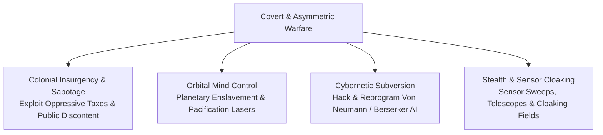
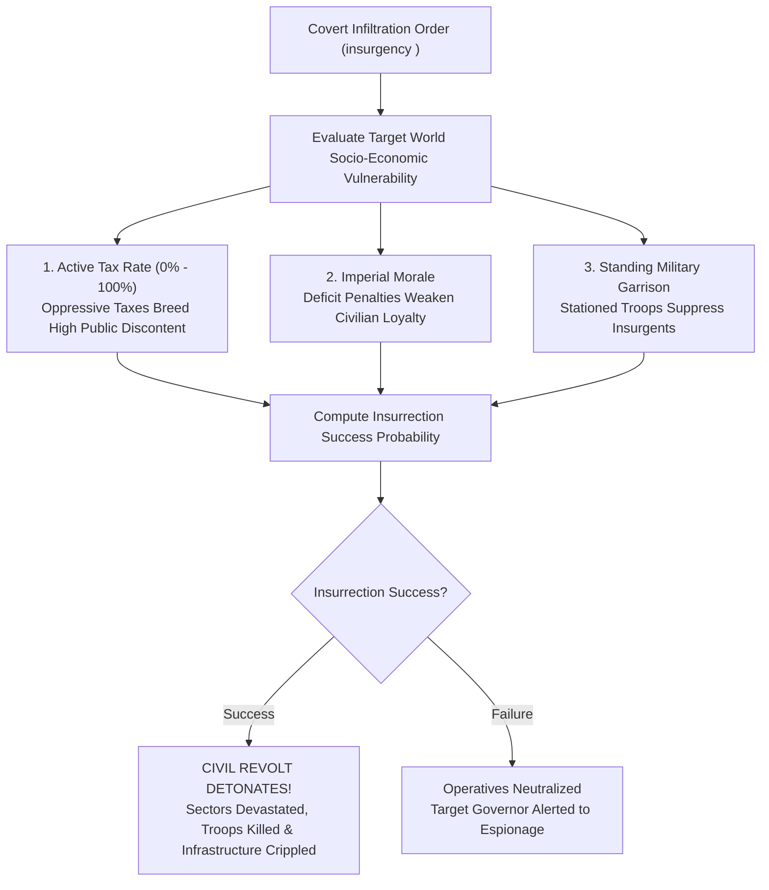
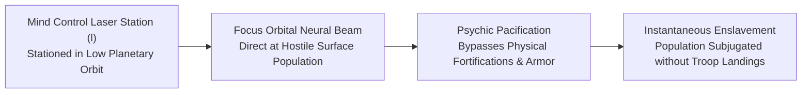
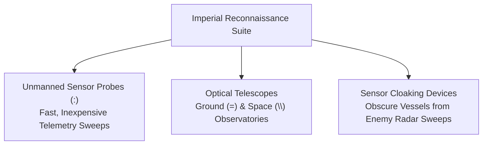

# Covert Operations, Espionage, and Insurgency

## Overview

When open warfare is too costly or politically impractical, star empires employ **Covert Operations, Espionage, and Asymmetric Subversion**. Intelligence operatives infiltrate foreign colonies to incite civil insurrections, orbital mind-control beams pacify hostile populations from orbit, cybernetic hackers reprogram autonomous machine minds, and cloaked sensor probes map enemy territory from deep space.

---

## 1. Colonial Insurgency and Civil Rebellion

Empires can deploy covert operatives to ignite internal rebellions on enemy worlds using the `insurgency` command:

### Insurrection Probability Factors
The likelihood of an insurgency succeeding depends directly on local planetary discontent and sector garrison strength:
- **Taxation Grievances**: Each populated sector owned by the target empire rolls against the target governor's active planetary tax rate ($\text{Tax}\%$). Higher tax rates directly increase the probability of a sector joining the uprising.
- **Garrison Suppression Formula**: When a sector's population attempts to revolt, a random uprising roll $R \in [1, \text{Population}]$ is compared against the defending garrison's suppression threshold:

$$\text{Suppression Threshold} = 10 \times \text{Fighters}_{\text{race}} \times \text{Troops}_{\text{sector}}$$

  If $R \le \text{Suppression Threshold}$, the stationed troops crush the uprising in that sector; if $R > \text{Suppression Threshold}$, the sector successfully revolts.

### Consequences of a Successful Insurgency
1. **Sector Defection**: Every revolting sector immediately transfers ownership to the instigating empire.
2. **Garrison Elimination**: All defending military troops ($\text{Troops}_{\text{sector}}$) stationed in the revolting sector are wiped out.
3. **Civilian Casualties & Demographic Sync**: Street fighting inflicts random civilian casualties between $0$ and $\text{Population} - 1$, and planetary civilian, military, sector ownership, and mobilization totals are immediately reconciled across both empires.

---

## 2. Orbital Mind Control and Population Pacification

Advanced scientific empires (requiring **Technology Level $350.0+$**) can construct **Mind Control Laser Platforms (`l`)**:

- **Orbital Neural Projection**: Stationed in low planetary orbit, the platform projects focused psionic beams through the upper atmosphere.
- **Bloodless Subjugation**: Bypasses fortified surface bunkers, defense gun batteries, and ground troops, directly pacifying native colonists and forcing the population into imperial servitude (`enslave`).

---

## 3. Cybernetic Subversion and Machine AI Hacking

Autonomous Von Neumann machines and Berserkers operating across the galaxy can be intercepted and subverted:

- **Mind Reprogramming**: Specialist cyber-warfare teams can capture landed probes or orbital Berserkers and tamper with their core neural matrices.
- **Mission Redirection**: Hackers can overwrite the machine's ancestral progenitor ID, wipe out its target aggression hitlists, or reprogram Berserker battlefleets to hunt down enemy star systems.

---

## 4. Stealth Reconnaissance and Sensor Cloaking

Information superiority is the foundation of covert strategy:

- **Sensor Probes (`:`)**: Fast, automated reconnaissance vehicles built inside warship hangars. Probes scout uncharted star systems, mapping planetary compositions and detecting hidden enemy installations.
- **Space and Ground Telescopes (`=`, `\\`)**: Long-range astronomical observatories that peer across deep space to survey distant star systems without crossing hostile borders.
- **Sensor Cloaking Fields ($999.0\text{ Tech}$)**: Advanced electromagnetic cloaking devices that render capital ships invisible to standard orbital sensor sweeps, allowing surprise fleet deployments and covert strikes.

---

## See Also
- [Diplomacy, Coalitions, and Power Blocks](diplomacy.md)
- [Imperial Economy, Planetary Stockpiles, and Technology Investment](economy.md)
- [Governance, Capitals, and Imperial Administration](governance.md)
- [Tactical Combat, Naval Gunnery, and Planetary Warfare](combat.md)
- [Autonomous Machine AI, Von Neumann Probes, and Berserker Warships](von_neumann.md)
- [Starships, Orbital Hierarchies, and Naval Mechanics](ships.md)
