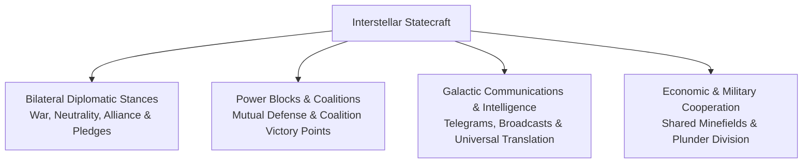
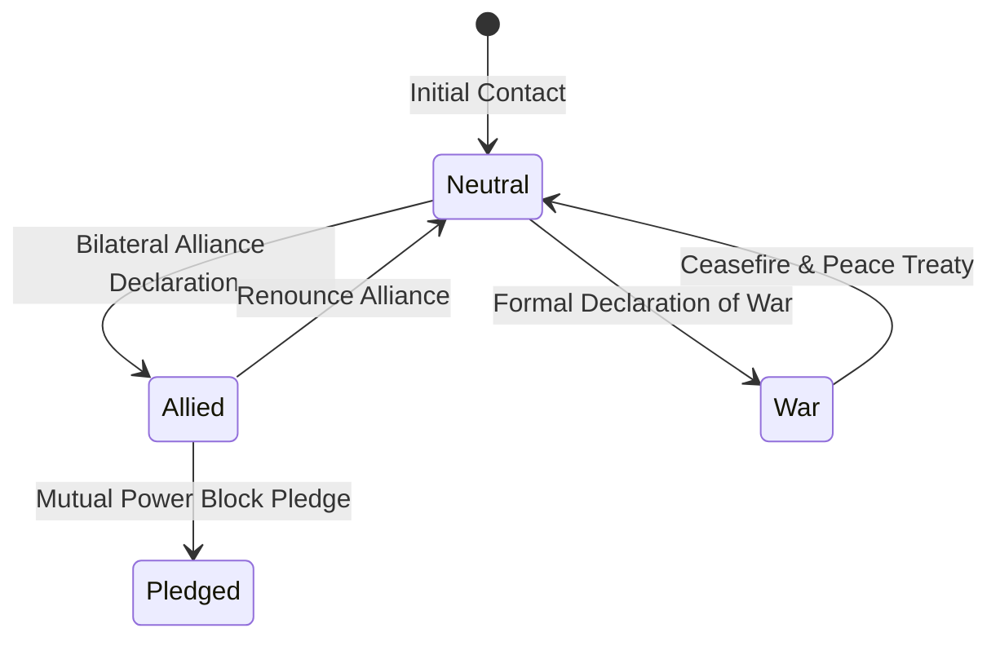
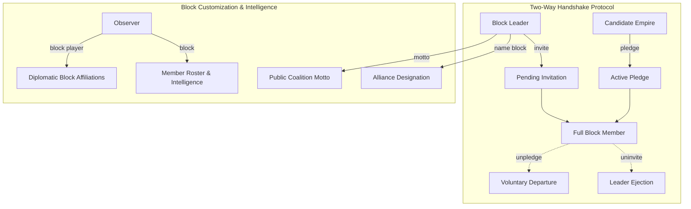
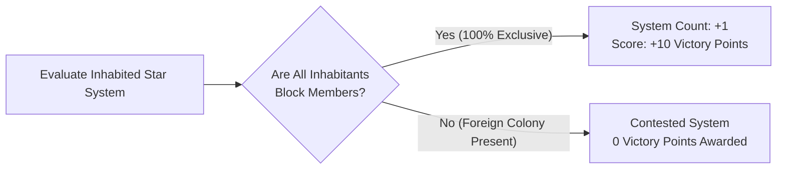
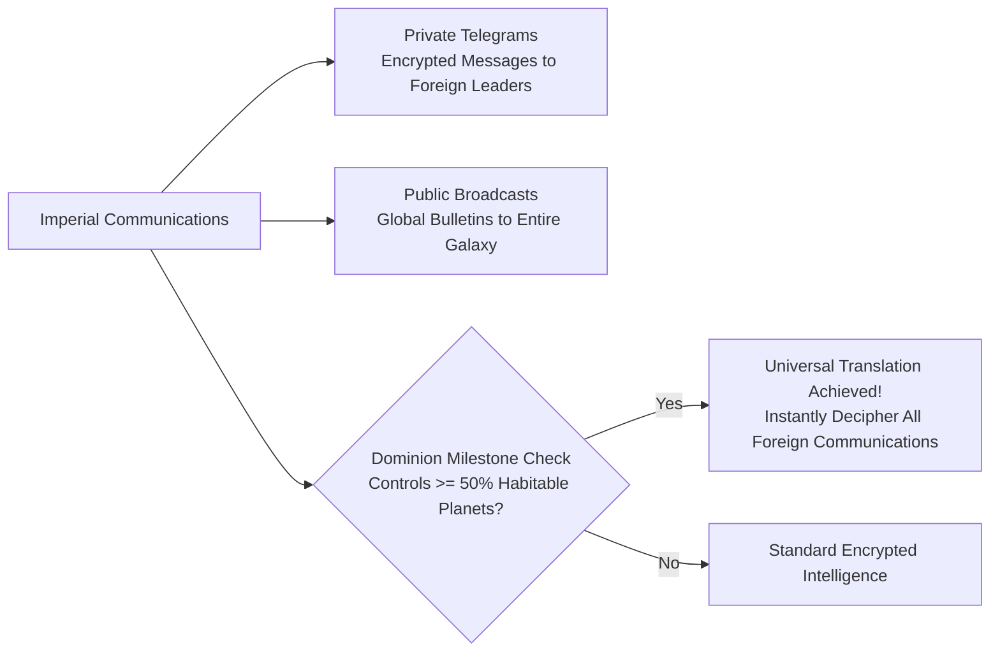

# Diplomacy, Coalitions, and Power Blocks

## Overview

In **Galactic Bloodshed**, interstellar survival requires not only military might and industrial strength, but also strategic statecraft. Empires forge bilateral diplomatic relations, establish multilateral **Power Blocks** (coalitions), share conquered commodity plunder, coordinate joint orbital defense, and negotiate non-aggression treaties.

---

## 1. Bilateral Diplomatic Stances and Treaties

Empires configure their official diplomatic posture toward every foreign power using the `declare` command:

| Diplomatic Stance | Operational Rules & Engagement Doctrine | Strategic Implications |
| :--- | :--- | :--- |
| **Neutral** | Default diplomatic posture. Weapons do not fire automatically; market trade permitted. | Standard interstellar coexistence. |
| **Allied** | Mutual trust. Shared safe passage through minefields; combined plunder sharing on conquered worlds. | Coalition partnership and joint naval operations. |
| **War** | Active hostilities. Automated Berserkers prioritize colonies; tactical counter-fire authorized. | Unrestricted fleet engagements and orbital bombardment. |
| **Pledged** | Deep political and military integration within a formal Power Block. | Shared coalition victory points and block hegemony. |

---

## 2. Multilateral Power Blocks and Coalitions

Empires can band together to form formal geopolitical coalitions known as **Power Blocks**. Power blocks serve as galactic voting and score-sharing alliances that compete collectively for coalition victory.

### Power Block Command Suite

| Command | Role | Description |
| :--- | :--- | :--- |
| `block` | All | Display the global standing report of all power blocks as of the last turn update. |
| `block <leader>` | All | Inspect the member roster and demographic/industrial intelligence for a specific block. |
| `block player <race>` | All | Query which blocks an empire leads, belongs to, has been invited to, or has pledged to. |
| `invite <race>` | Leader | Extend a formal invitation to a foreign empire to join your power block. |
| `uninvite <race>` | Leader | Rescind a pending invitation or expel an existing member from your block. |
| `pledge <leader>` | Sovereign | Ratify an invitation by pledging allegiance to a foreign alliance block. |
| `unpledge <leader>` | Member | Renounce your pledge and withdraw your empire from an alliance block. |
| `name block <name>` | Leader | Establish or rename your power block's official designation. |
| `motto <motto>` | Leader | Set or update your power block's public motto. |

### The Two-Way Handshake Protocol

Membership in a power block is strictly bilateral and requires concurrent mutual consent:
1. **Charter Leadership**: Every empire automatically founds and leads its own power block upon entering the galaxy. The founder is permanently considered a member of their own block.
2. **Mutual Consent Required**: A foreign empire becomes a full member of an alliance block if and only if **both** conditions are simultaneously satisfied:
   - The block leader has issued an invitation (`invite <race>`).
   - The candidate empire has pledged allegiance to that leader (`pledge <leader>`).
3. **Pending States**:
   - **Invited**: The leader has extended an offer, but the candidate has not yet pledged.
   - **Pledged**: The candidate has proclaimed allegiance, but the leader has not yet issued an invitation.
4. **Unilateral Termination**: Either party can dissolve membership instantly without confirmation from the other: the leader via `uninvite <race>` or the member via `unpledge <leader>`.

### Non-Exclusive Membership & Multiple Allegiances

Unlike faction systems in traditional strategy games:
- Empires are **not restricted** to a single alliance block.
- An empire may simultaneously maintain membership in its own sovereign block while holding confirmed membership in multiple foreign power blocks, provided the two-way handshake is established with each block leader.
- The `block player <race>` report reveals an empire's complete web of block memberships, pending invitations, and active pledges.

### Power Block Politics vs. Bilateral Alliance Treaties

A critical strategic distinction exists between **Power Block Membership** and **Bilateral Diplomatic Alliances**:
- **Political Coalitions, Not Automatic Treaties**: Joining an alliance block is a political association and **does not automatically establish bilateral alliances** between members or with the leader.
- **Independent Alliance Declarations**: Empires within the same block remain bound by their individual bilateral diplomatic stances. To enable military cooperation, members must independently execute `declare <race> allied`.
- **Treaty-Gated Privileges**: Privileges such as safe transit through proximity minefields and equitable plunder distribution require formal mutual bilateral alliances (`declare <race> allied`), regardless of shared block membership.

### Star System Dominance & Coalition Victory Scoring

During each full turn update, the simulation engine calculates galactic dominance for each power block:

#### 1. System Exclusivity Requirement
A power block claims control of an inhabited star system if and only if **every inhabited planet in that system is colonized exclusively by members of the block**:

$$\text{System Inhabitants} \subseteq \text{Block Members}$$

If even a single world in the star system harbors a colony belonging to an unpledged foreign empire, the system is deemed contested and yields zero ownership credits to any block.

#### 2. Victory Point Calculation
Each exclusively controlled star system awards **$+10\text{ Victory Points}$** directly to the power block's cumulative score:

$$\text{Victory Points}_{\text{block}} = 10 \times \text{Systems Owned}$$

System ownership is non-cumulative across turns: total controlled systems are reset to zero at the beginning of each turn update and dynamically re-evaluated across the galaxy.

### Cryptographic Intelligence and Roster Estimation

When inspecting a power block roster via `block <leader>`, foreign demographic and economic statistics (population, troops, treasury, starships, planets, minerals, fuel, and munitions) are not shown as raw database values. Instead, they are filtered through your empire's cryptographic knowledge of that specific race:

$$\text{Reported Metric} = \text{estimate}(\text{Actual Metric}, \text{Translation Matrix Knowledge } \%)$$

Your knowledge percentage is determined by your bilateral translation matrix ($`\text{Translate}\%`$). As your cryptographers decipher a foreign empire's dialect, your intelligence estimates approach exact fidelity ($100\%$).

---

## 3. Galactic Communications and Universal Translation

Interstellar diplomacy relies on secure communication networks and cryptological translation:

### Communication Channels
- **Direct Telegrams**: Secure bilateral transmissions sent directly to foreign emperors and system governors (`telegram <player> <msg>`).
- **Galactic Broadcasts**: System-wide or galaxy-wide public proclamations (`announce` command).
- **Combat & Disaster Bulletins**: Automated intelligence bulletins alerting players to fleet battles, supernova collapses, and slave uprisings.

### Universal Translation Milestone (Lesser Winner)
When an ascendant empire achieves control of at least **$50\%$ of all habitable planets** in the galaxy:
- The empire achieves a cryptological breakthrough, mastering **Universal Translation**.
- All foreign empires across the galaxy decipher the dominant empire's communications ($100\%$ translation matrix), signaling imminent galactic hegemony.

---

## See Also
- [Governance, Capitals, and Imperial Administration](governance.md)
- [Imperial Economy, Planetary Stockpiles, and Technology Investment](economy.md)
- [Tactical Combat, Naval Gunnery, and Planetary Warfare](combat.md)
- [Turn Simulation Lifecycle and Scheduling](turn_cycle.md)
- [Covert Operations, Espionage, and Insurgency](covert_ops.md)
