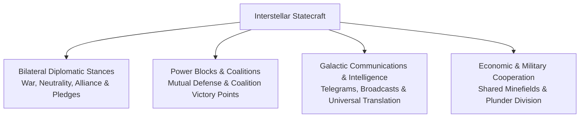
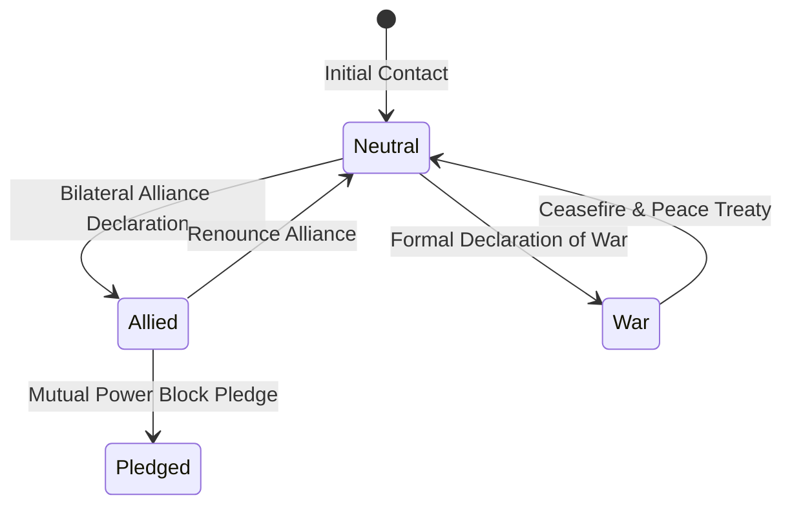
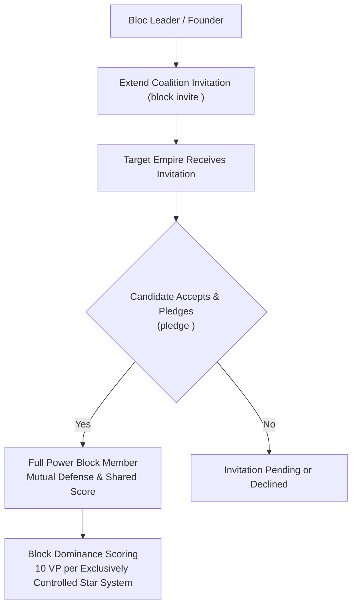
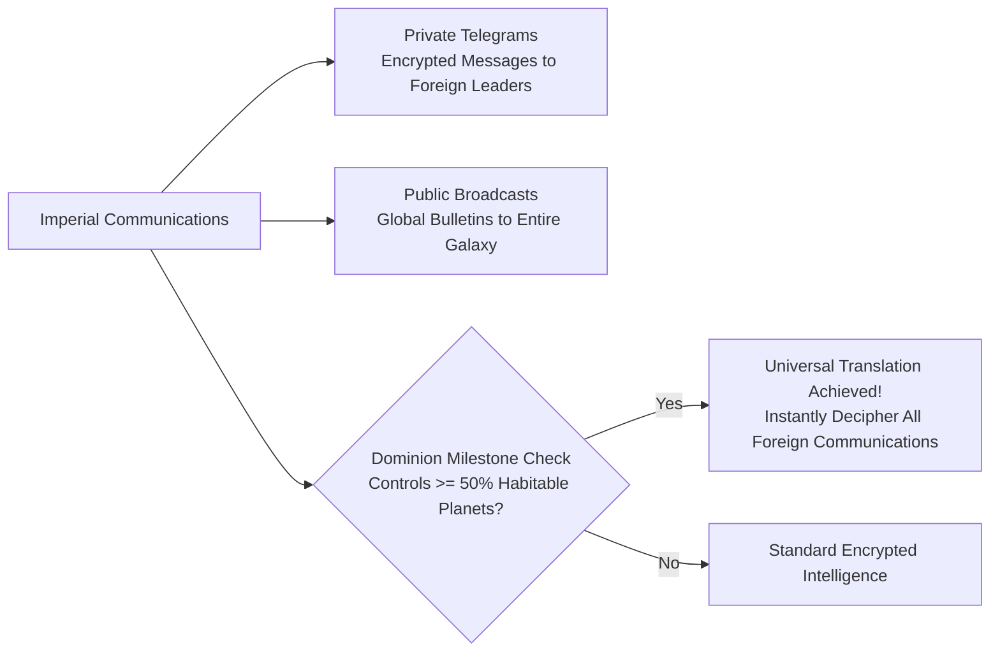

# Diplomacy, Coalitions, and Power Blocks

## Overview

In **Galactic Bloodshed**, interstellar survival requires not only military might and industrial strength, but also strategic statecraft. Empires forge bilateral diplomatic relations, establish multilateral **Power Blocks** (coalitions), share conquered commodity plunder, coordinate joint orbital defense, and negotiate non-aggression treaties.

---

## 1. Bilateral Diplomatic Stances and Treaties

Empires configure their official diplomatic posture toward every foreign power using the `declare` command:

| Diplomatic Stance | Operational Rules & Engagement Doctrine | Strategic Implications |
| :--- | :--- | :--- |
| **Neutral** | Default diplomatic posture. Weapons do not fire automatically; market trade permitted. | Standard interstellar coexistence. |
| **Allied** | Mutual trust. Shared safe passage through minefields; combined plunder sharing on conquered worlds. | Coalition partnership and joint naval operations. |
| **War** | Active hostilities. Automated Berserkers prioritize colonies; tactical counter-fire authorized. | Unrestricted fleet engagements and orbital bombardment. |
| **Pledged** | Deep political and military integration within a formal Power Block. | Shared coalition victory points and block hegemony. |

---

## 2. Multilateral Power Blocks and Coalitions

Empires can band together to form formal geopolitical coalitions known as **Power Blocks** (`block` command):

### Coalition Formation Lifecycle
1. **Chartering a Bloc**: An empire establishes a coalition charter, designating itself as the bloc leader.
2. **Invitations and Pledges**: The leader extends formal invitations to allied powers (`block invite <player>`). Candidate empires formally ratify membership using `pledge <leader>`.
3. **Mutual Alliances**: A power block is fully cemented when all participating members maintain mutual bilateral alliances with each other.

### Coalition Victory Points
During each full turn update, Power Blocks evaluate galactic system dominance:
- If all inhabited planets within a star system are exclusively colonized by members of the same power block (with zero unallied foreign colonies present), the coalition claims total star control.
- Each exclusively controlled star system awards **$+10\text{ Victory Points}$** directly to the block's score.

### Shared Military and Economic Benefits
- **Minefield Safe Passage**: Starships belonging to allied coalition members safely navigate through friendly proximity minefields without triggering detonations.
- **Equitable Plunder Distribution**: When allied forces conquer a hostile world, captured fuel, minerals, destruct munitions, and crystals are automatically divided among the conquerors based on troop participation.

---

## 3. Galactic Communications and Universal Translation

Interstellar diplomacy relies on secure communication networks and cryptological translation:

### Communication Channels
- **Direct Telegrams**: Secure bilateral transmissions sent directly to foreign emperors and system governors (`telegram <player> <msg>`).
- **Galactic Broadcasts**: System-wide or galaxy-wide public proclamations (`announce` command).
- **Combat & Disaster Bulletins**: Automated intelligence bulletins alerting players to fleet battles, supernova collapses, and slave uprisings.

### Universal Translation Milestone (Lesser Winner)
When an ascendant empire achieves control of at least **$50\%$ of all habitable planets** in the galaxy:
- The empire achieves a cryptological breakthrough, mastering **Universal Translation**.
- All foreign empires across the galaxy decipher the dominant empire's communications ($100\%$ translation matrix), signaling imminent galactic hegemony.

---

## See Also
- [Governance, Capitals, and Imperial Administration](governance.md)
- [Imperial Economy, Planetary Stockpiles, and Technology Investment](economy.md)
- [Tactical Combat, Naval Gunnery, and Planetary Warfare](combat.md)
- [Turn Simulation Lifecycle and Scheduling](turn_cycle.md)
- [Covert Operations, Espionage, and Insurgency](covert_ops.md)
