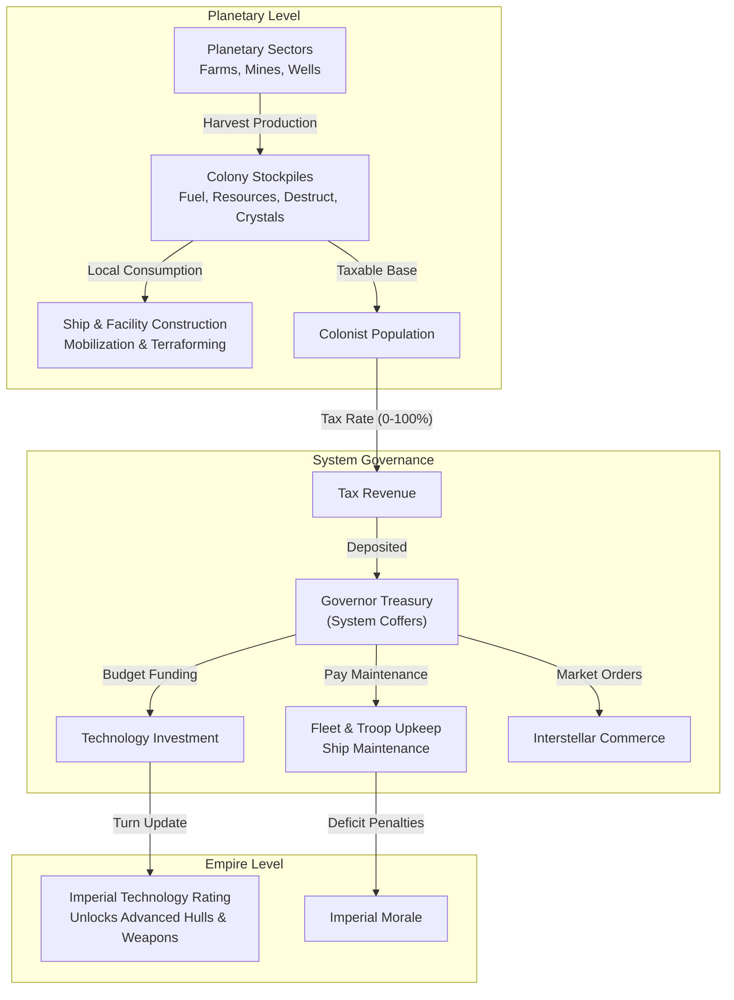
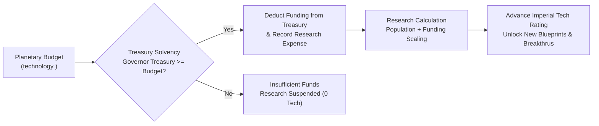
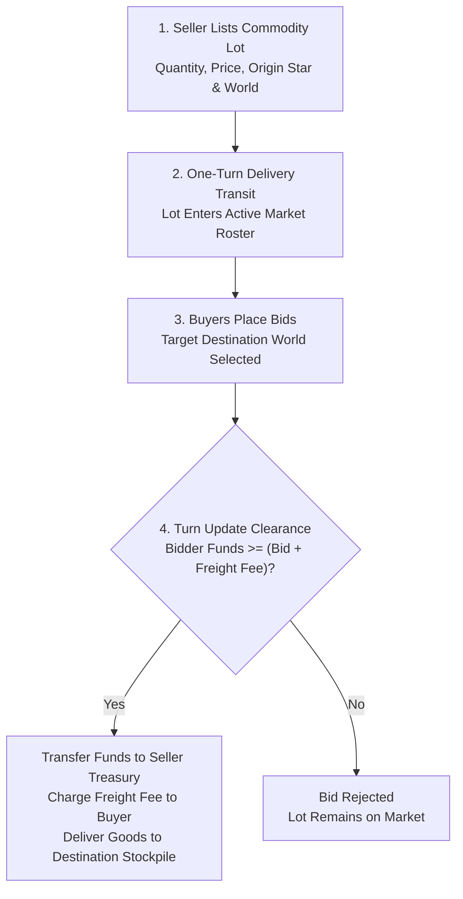

# Imperial Economy, Planetary Stockpiles, and Technology Investment

## Overview

The economic engine of **Galactic Bloodshed** operates across three interconnected levels: local planetary colonies, star system governor treasuries, and empire-wide scientific advancement. Colonies harvest raw commodities from planetary sectors, governors levy taxes to finance naval maintenance and research, and merchants trade commodities across the Interstellar Exchange.

---

## 1. Planetary Commodity Stockpiles

Every settled world maintains independent commodity stockpiles for each inhabiting empire:

- **Fuel**: Liquid hydrocarbons and refined propellant required for launching starships from planetary gravity wells, orbital maneuvers, and powering active weapon plants.
- **Resources**: Refined minerals and industrial metals consumed during ship construction, structural hull repairs, infrastructure plating, and automated defense installations.
- **Destructive Potential (Destruct)**: High-explosive kinetic ordnance and warhead charges consumed by naval batteries, planetary defense guns, and orbital bombardment sweeps.
- **Crystals**: Rare warp-active crystalline minerals essential for hyperspace jump drives, continuous energy beam optics, and advanced sensory equipment.

During each turn update, planetary mining and harvesting operations deposit newly extracted commodities directly into local colony stockpiles.

---

## 2. Taxation System and Revenue Generation

Colonists inhabiting planetary sectors generate financial revenue for the governor administering the host star system.

### Setting Tax Policies
Governors set taxation policies using the `tax` command:
- `tax`: Displays current active tax rate and target tax rate.
- `tax <rate>`: Adjusts the target tax rate ($0\%$ to $100\%$).

### Revenue Formula
Turn tax revenue scales with the active tax rate and total planetary population:

$$\text{Tax Revenue} = \left\lfloor \frac{\text{Tax Rate} \times \text{Population}}{500} \right\rfloor$$

All collected revenue is deposited directly into the treasury of the star system governor.

### Rate-Limiting Policy (+5% Max Increase)
To avoid economic shock and public unrest:
- **Tax Increases**: Capped at a maximum increase of **$+5\%$ per turn update** towards the target rate.
- **Tax Decreases**: Take effect **immediately** on the subsequent turn update.

### Socio-Economic Consequences of Taxation
While high taxation enriches the treasury, it places heavy burdens on the populace:
- **Metabolism & Birthrate Suppression**: Heavy tax rates depress living standards, reducing effective population growth and industrial vigor: $\text{Metabolism}_{\text{effective}} = \text{Metabolism}_{\text{base}} \times \left(1 - \frac{\text{Tax Rate}}{100}\right)$.
- **Insurgency Vulnerability**: Populous worlds under oppressive tax burdens experience rising civil unrest, dramatically increasing the success probability of hostile covert insurgency operations.

---

## 3. Technology Investment and Scientific Advancement

Scientific research is budgeted on individual planets and financed by the local system governor's treasury.

### Investment Budgeting
Empires allocate research funding on a world using the `technology` command (`technology <money>`).

### Research Processing Lifecycle
During each full turn update:
1. **Treasury Solvency Check**: The star system governor's treasury must contain sufficient funds to cover the configured investment budget. If the treasury lacks funds, research fails for that turn and zero scientific progress occurs.
2. **Fund Deduction**: The investment amount is deducted from the governor's treasury and logged under research expenditures.
3. **Research Output Formula**: Scientific breakthroughs scale with financial funding and local planetary population: $\Delta \text{Tech} = \frac{\text{Investment Funding}}{100} \times \left(1.0 + \log_{10}\left(\max(1, \text{Population})\right)\right)$.
4. **Imperial Discovery**: Generated research points are added directly to the empire's global technology rating, unlocking advanced vessel blueprints, energy weapon calibers, and planetary terraforming systems.

---

## 4. Governor Treasuries and Maintenance Accounting

Every star system is administered by an appointed governor who manages an independent financial treasury.

### Treasury Inflows and Outflows

| Accounting Category | Flow Direction | Description |
| :--- | :---: | :--- |
| **Planetary Taxes** | Inflow ($+$) | Revenue collected from civilian populations across system worlds. |
| **Market Sales** | Inflow ($+$) | Profits from selling surplus commodities on the Interstellar Exchange. |
| **Ship Maintenance** | Outflow ($-$) | Upkeep costs for standing naval vessels and active starships. |
| **Troop Maintenance** | Outflow ($-$) | Upkeep expenses for stationed ground armies ($10$ currency per troop unit per update). |
| **Technology Research** | Outflow ($-$) | Planetary research grants budgeted by the governor. |
| **Market Purchases** | Outflow ($-$) | Capital spent buying lots, including long-distance freight shipping fees. |

### Maintenance Deficits and Morale Collapse
If standing fleet and garrison maintenance obligations exceed available treasury reserves:

$$\text{Deficit} = \text{Total Maintenance} - \text{Governor Treasury}$$

$$\Delta \text{Morale} = -\left\lfloor \frac{\text{Deficit}}{10} \right\rfloor$$

When a deficit occurs, the governor's treasury is emptied to zero, and the resulting morale penalty immediately degrades imperial combat readiness and victory scores across the empire.

---

## 5. Interstellar Market and Freight Logistics

Empires trade surplus commodities with other star systems and foreign powers through the Interstellar Exchange.

### Market Lifecycle

### Freight Shipping Fees
Transporting bulky commodities across interstellar distances incurs freight costs proportional to Cartesian spatial distance:

$$\text{Distance} = \sqrt{(x_{\text{dest}} - x_{\text{origin}})^2 + (y_{\text{dest}} - y_{\text{origin}})^2}$$

$$\text{Freight Fee} = \left\lfloor \frac{\text{Distance} \times \text{Bid Price}}{1000} \right\rfloor$$

The winning bidder pays both the agreed lot price (transferred to the seller's governor) and the freight fee (deducted as logistical shipping expense).

---

## 6. Central Authority and Imperial Anarchy

All economic taxation, budgetary research, and action point distribution require an active, operational **Government Center** designated as the empire's seat of power.

### Consequences of Anarchy
If an empire's seat of government is destroyed, lost, or unassigned:
- **Zero Tax Collection**: Planetary taxation ceases entirely across all colonies.
- **Suspended Research**: All technology investment orders are frozen with zero scientific advancement.
- **Action Point Collapse**: Action Point generation drops by $95\%$, paralyzing administrative and military operations until a new capital is established.

---

## See Also
- [Governance, Capitals, and Imperial Administration](governance.md)
- [Planetary Mechanics, Colonization, and Surface Topography](planets.md)
- [Planetary Simulation Engine and Sector Dynamics](planetary_simulation.md)
- [Species Biology, Ecology, and Racial Genetics](races.md)
- [Diplomacy, Coalitions, and Power Blocks](diplomacy.md)
- [Turn Simulation Lifecycle and Scheduling](turn_cycle.md)
- [Starships, Orbital Hierarchies, and Naval Mechanics](ships.md)
