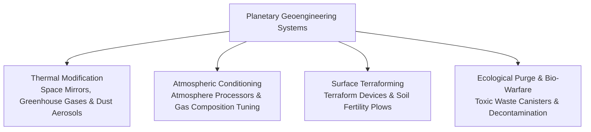
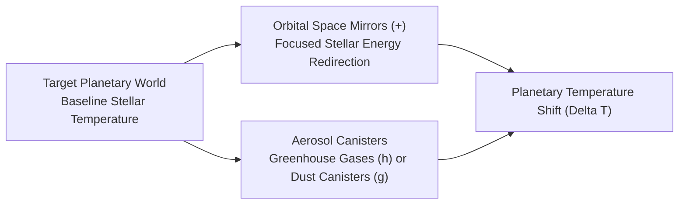
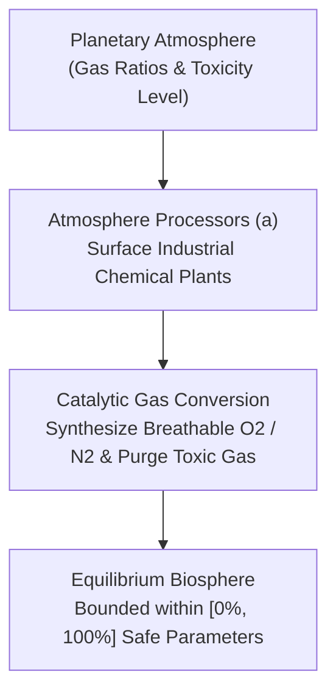
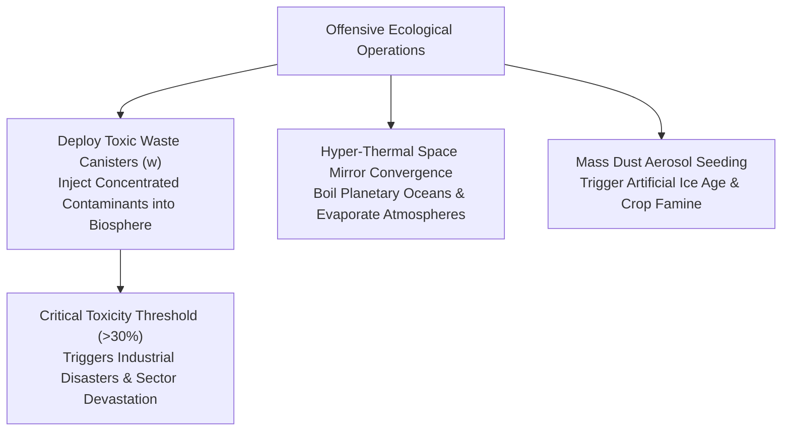

# Geoengineering, Terraforming, and Ecological Warfare

## Overview

In **Galactic Bloodshed**, worlds vary from paradisiacal Earth-like biospheres to scorched volcanic hellscapes, frozen methane wastes, and radioactive ruins. Through advanced **Geoengineering and Terraforming**, empires alter planetary climates, adjust atmospheric gas compositions, melt glaciers, restore agricultural fertility, and purge industrial toxicity to convert barren worlds into thriving colonies.

Conversely, these same environmental technologies can be weaponized as instruments of **Ecological Warfare**, destabilizing enemy biospheres through runaway greenhouse heating, artificial nuclear winters, or toxic contamination.

---

## 1. Thermal Modification and Climate Engineering

Planetary surface temperatures can be shifted toward species-compatible equilibrium through orbital mirrors and atmospheric aerosols:

### Orbital Space Mirrors (`+`)
Space Mirrors are massive orbital reflector arrays designed to capture and redirect stellar radiation:
- **Heating Mode**: Positioned in low orbit and aimed directly at a freezing or glaciated world, mirrors focus concentrated solar energy into the upper atmosphere to warm surface temperatures and melt ice sheets.
- **Cooling / Shading Mode**: Angled away from the sun, mirrors cast permanent orbital shadows over volcanic or scorched worlds, shielding the biosphere from blistering stellar heat.
- **Thermal Redirection Formula**:
  $$\Delta T = \left\lfloor \frac{\text{Solar Radiation} \times \text{Mirror Efficiency}}{\max(1, \text{Planet Radius})} \right\rfloor$$

### Atmospheric Aerosol Canisters
- **Greenhouse Gas Canisters (`h`)**: Injected into the troposphere to trap infrared radiation, raising global planetary temperatures.
- **Dust Canister Aerosols (`g`)**: Dispersed into the stratosphere to create artificial cloud cover, reflecting incoming sunlight and lowering global temperatures to counteract runaway greenhouse effects.

---

## 2. Atmospheric Processing and Gas Composition

Planetary atmospheres consist of distinct chemical gas concentrations (Oxygen, Nitrogen, Carbon Dioxide, Methane, Helium, Sulfur) and ambient toxicity:

### Atmosphere Processors (`a`)
Atmosphere Processors are fixed industrial installations constructed on planetary sectors:
- **Catalytic Gas Synthesis**: Active processors systematically modify local atmospheric gas concentrations each turn segment, adjusting gas ratios toward the operating species' ideal respiratory profile.
- **Toxicity Neutralization**: Processors chemically scrub corrosive and acidic gases from the troposphere, gradually lowering planetary toxicity levels.
- **Safety Clamping**: Gas concentrations and toxicity ratings are strictly bounded within $[0\%, 100\%]$ to prevent unphysical atmospheric density or ecological collapse.

---

## 3. Surface Terraforming and Soil Conditioning

Transforming hostile planetary terrain into arable land is accomplished through mobile ground machinery:

### Terraform Devices (`T`)
Terraform Devices are autonomous ground vehicles programmed with sequential movement routes across the planetary grid:
- **Surface Conditioning**: As the device traverses sectors, it systematically terraforms hostile biomes (deserts, glaciers, volcanic crags) into the owning species' preferred habitat classification (`likesbest`).
- **Wasteland Reclamation**: Converts radioactive wastelands into clean, habitable landmasses.

### Space Plows (`K`)
Space Plows are specialized agricultural engineering vehicles that cultivate surface topsoil:
- **Fertility Enhancement**: Moving across arable sectors, plows condition the soil, systematically increasing agricultural fertility ($0\%$ to $100\%$).
- **Debris and Radiation Cleanup**: Cleans lingering orbital debris and purges residual radiation fallout from ground sectors.
- **Industrial Waste Byproduct**: Continuous heavy plowing generates trace industrial waste, requiring periodic environmental monitoring.

---

## 4. Ecological Warfare and Toxicity Manipulation

Environmental technologies can be deployed offensively to collapse enemy ecosystems:

### Toxic Waste Canisters (`w`)
- **Environmental Remediation**: Colonies construct canisters to purge up to $20$ points of toxicity from their biospheres.
- **Offensive Biological Warfare**: Canisters can be transported aboard starships and detonated inside hostile enemy atmospheres, rapidly spiking planetary pollution past critical safety limits.

### Environmental Disaster Thresholds
When planetary toxicity exceeds **$30\%$ Toxicity**, the world enters ecological crisis:
- Severe industrial catastrophes trigger spontaneously during turn updates.
- Random populated sectors are atomically incinerated into radioactive wastelands (`SectorType::SEC_WASTED`), destroying civilian populations, wiping out ground infrastructure, and destroying resource veins.

---

## See Also
- [Planetary Mechanics, Colonization, and Surface Topography](planets.md)
- [Planetary Simulation Engine and Sector Dynamics](planetary_simulation.md)
- [Species Biology, Ecology, and Racial Genetics](races.md)
- [Ship Classes and Construction Catalog](ship_types.md)
- [Tactical Combat, Naval Gunnery, and Planetary Warfare](combat.md)
- [Turn Simulation Lifecycle and Scheduling](turn_cycle.md)
