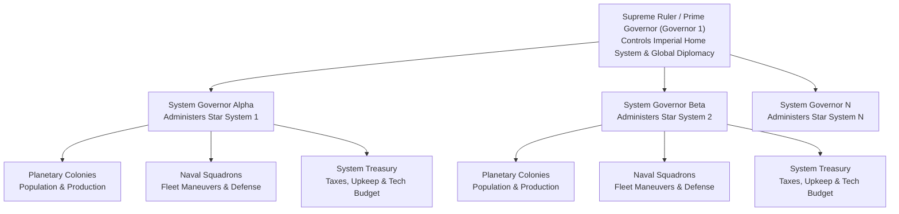
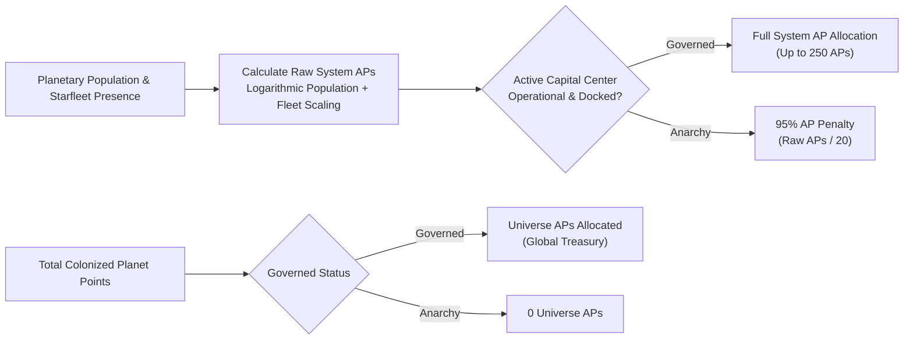
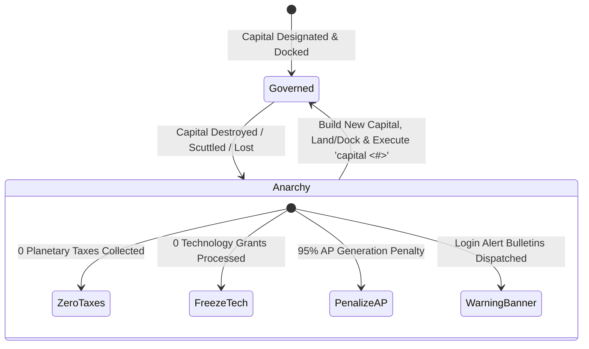
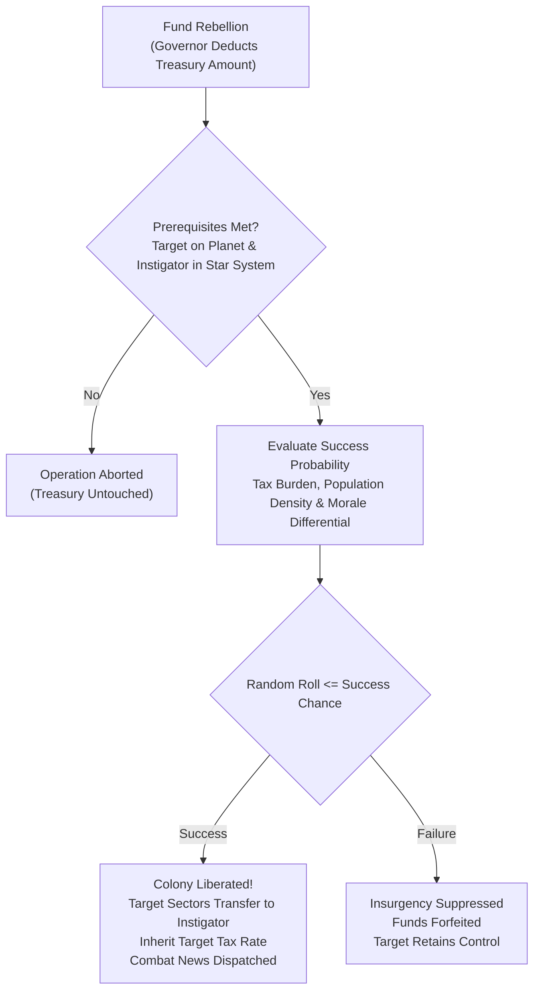

# Governance, Capitals, and Imperial Administration

## Overview

In **Galactic Bloodshed**, imperial governance links high-level strategic commands to local star systems. Bureaucratic authority is anchored by a designated capital vessel known as the **Governmental Center**. An empire's governance state governs its capacity to generate Action Points (APs), collect planetary taxes, fund scientific research, and maintain military discipline.

---

## 1. The Governmental Center (Seat of Power)

Every star empire requires an active seat of government to coordinate its interstellar administration.

### Operational Requirements
A vessel serves as a legitimate Governmental Center only if it meets all of the following criteria:
1. **Dedicated Capital Hull**: The vessel must be a specialized Governmental Center class hull.
2. **Stationary / Docked State**: The center must be either **landed on a planetary surface** or **docked inside an orbital habitat** stationed in planetary or stellar orbit. Flying in deep space or maneuvering un-docked suspends governmental functionality.
3. **Operational Integrity**: The vessel must be actively crewed and structural hull damage must not exceed catastrophic limits.

### Designation and Capital Relocation
Governors inspect or relocate their seat of government using the `capital` command:
- `capital`: Displays the current capital ship designation, host planet/system, and operational efficiency rating.
- `capital <ship_id>`: Designates a new landed or habitat-docked Governmental Center as the official imperial seat of power (costs $50$ Action Points in the destination star system).

### Capital Efficiency Rating
The operational efficiency of the governmental center reflects bureaucratic health:

$$\text{Efficiency} = \left(\frac{\text{Current Staffing Crew}}{\text{Maximum Crew Capacity}}\right) \times \left(\frac{100 - \text{Structural Damage}}{100}\right)$$

---

## 2. Administrative Hierarchy and Governor Scopes

Empires are divided administratively into distinct star systems overseen by appointed governors:

- **Supreme Leader / Prime Governor (Governor 1)**: The imperial leader who directly commands the empire's home star system, sets global diplomatic stances, oversees unassigned star systems, and controls central diplomacy.
- **System Governors (Governors $\ge 2$)**: Dynamically appointed administrators assigned to manage specific star systems (`appoint [<gov>] <password>`). Each governor exercises local authority over planetary taxes, military mobilization, defensive gun batteries, technology research budgets, and naval orders within their star system.
- **Independent Treasuries**: System governors maintain independent treasury accounts, receiving tax revenues from local worlds and paying upkeep expenses for stationed ships and garrisons.

---

## 3. Action Point Generation and Distribution

Action Points (APs) represent the bureaucratic throughput and logistical capacity required to issue commands, mobilize planetary sectors, and navigate starfleets.

### Star System Action Points
During each full turn update, each star system generates Action Points based on local planetary population ($P$) and stationed starships ($`N_{\text{ships}}`$):

$$\text{Raw APs} = \left\lfloor \frac{N_{\text{ships}}}{10} + 5 \log_{10}\left(1 + \max(0, P)\right) + \text{Uniform}(0, 1) \right\rfloor$$

$$\text{Final System APs} = \begin{cases} \min(250, \text{Current APs} + \text{Raw APs}) & \text{if Governed} \\ \min\left(250, \text{Current APs} + \max\left(1, \left\lfloor \frac{\text{Raw APs}}{20} \right\rfloor\right)\right) & \text{if in Anarchy} \end{cases}$$

### Universe Action Points
Universe-level Action Points are pooled globally from an empire's planetary network:

$$\Delta \text{AP}_{\text{univ}} = \text{Total Colonized Planet Points}$$

Governed empires accumulate these points into their universe-level pool (capped at $250$ APs). Empires in a state of anarchy receive **$0$ Universe APs**.

---

## 4. Treasury Management and Expense Accounting

During each full turn update, system governors balance their budgets:

$$\text{Net Revenue} = \text{Planetary Taxes} + \text{Market Sales} - \text{Ship Upkeep} - \text{Troop Upkeep} - \text{Tech Grants} - \text{Market Purchases}$$

### Upkeep Tariffs
- **Standing Starships**: Active vessels requiring maintenance incur turn upkeep fees equal to their base hull construction cost.
- **Ground Garrisons**: Stationed military troops incur upkeep costs of **$10$ currency per troop unit** each full update.

### Maintenance Deficits and Morale Collapse
If standing fleet and garrison expenses exceed available treasury reserves:

$$\text{Deficit} = \text{Total Maintenance Obligations} - \text{Governor Treasury}$$

$$\Delta \text{Morale} = -\left\lfloor \frac{\text{Deficit}}{10} \right\rfloor$$

The governor's treasury is wiped to $0$, and imperial morale suffers immediate degradation, penalizing combat performance and victory standings.

---

## 5. The State of Anarchy

If an empire's designated Governmental Center is destroyed, scuttled, or rendered un-docked, the empire enters a **state of anarchy**:

### Consequences of Anarchy
1. **Tax Collection Collapse**: Planetary tax collection is completely suspended across every colony in the galaxy.
2. **Research Stoppage**: Technology investment orders on all worlds are frozen with zero scientific advancement.
3. **Action Point Paralysis**: System AP generation is slashed by $95\%$, and Universe AP generation drops to zero.
4. **Administrative Alert**: Governors receive urgent login bulletins warning of governmental paralysis.

### Restoring Order
To end anarchy:
1. Construct a new Governmental Center hull at a planetary factory or habitat shipyard.
2. Land the center on a colonized world or dock it inside an orbiting habitat.
3. Execute `capital <ship_id>` to designate the new seat of government and restore imperial administration.

---

## 6. Imperial Communications (Telegrams and Galactic News)

Interstellar communication in Galactic Bloodshed is divided into private telegram dispatches and public news broadcasts:

### Private Telegrams (`read`, `read telegram`)
- **Governor Mailbox Isolation**: Telegrams are delivered to specific `(player, governor)` pairs. A system governor reading their dispatches does not access or clear messages destined for the Prime Governor or other system administrators.
- **Delete-on-Read Semantics**: Reading telegrams displays all queued messages prefixed with local calendar timestamps (`MM/DD HH:MM:SS`) and automatically purges the recipient's mailbox.
- **Login Waiting Prompts**: When unread telegrams are queued, the server notifies the player upon session login or prompt generation to issue `read`.

### Galactic News Bulletins (`read news`)
- **Four News Categories**: Public dispatches are organized into four separate news desks:
  1. **Declarations**: Diplomatic treaties, war pacts, alliances, and power block alignments.
  2. **Combat**: Naval engagements, orbital bombardments, planetary invasions, and ground skirmishes.
  3. **Business**: Interstellar commodity transfers, market sales, and commerce.
  4. **Bulletins**: General announcements, server updates, and player notices.
- **Independent Read Watermarks**: Each governor independently tracks their last-read article ID (`newspos`) across all four categories. Reading news updates the governor's watermark to the latest article ID, preventing redundant repeats during subsequent reads.
- **Message Formatting Delimiters**: In public broadcasts, semicolons (`;`) are automatically converted into line breaks (`\n`) and vertical pipes (`|`) into tabular tab stops (`\t`).

---

## 7. Planetary Defense Batteries (`defend`)

Planetary governors can direct planetary defense gun batteries to engage hostile or trespassing warships in planetary orbit using the `defend` command (`defend <ship> <sector> [<strength>]`, costing $1$ Star Action Point).

### Battery Availability and Destruct Stockpiles
A colony's defensive firepower depends on sector mobilization status and stored planetary destruct resources:

$$\text{Available Guns} = \min\left(20, \left\lfloor \frac{\sum \text{Sector Mobilization Points}}{1000} \right\rfloor \right)$$

$$\text{Effective Attack Strength} = \min(\text{Requested Strength}, \text{Available Guns}, \text{Planetary Destruct Stockpile})$$

- **Targeting Restrictions**: Gun batteries can only target spaceborne vessels stationed in **orbit around the defending planet**. Vessels landed on the planetary surface, vessels orbiting parent stars, or ships docked inside other hulls cannot be targeted by planetary guns. Firing on already destroyed hulls is rejected.
- **Surface Origin**: The firing origin sector must be an occupied sector owned by the defending player. Firing expends planetary destruct points on a $1:1$ ratio with attack strength.
- **Naval Retaliation**: If the defending planet inflicts damage on the target vessel:
  1. If the target has self-defense enabled (`protect.self`), it immediately retaliates with orbital bombardment against the designated firing sector using pre-damage weapons systems.
  2. Any active escort vessels in planetary orbit assigned to protect the target (`protect.ship = target`) independently launch retaliatory orbital strikes against the firing sector.

---

## 8. Covert Operations: Planetary Insurgency (`insurgency`)

Governors can fund clandestine rebel movements to overthrow enemy colonies and incite planetary uprisings using the `insurgency` command (`insurgency <player> <planet> <amount>`, costing $1$ Star Action Point).

### Insurgency Mechanics and Probability
To fund an insurgency:
1. The target player must occupy sectors on the designated planet.
2. The instigating player must maintain at least one colonized sector in the host star system.
3. The instigating governor must have sufficient funds in their local star system treasury.

The probability of sparking a successful planetary revolution is determined by:

$$P(\text{Success}) = \text{Amount} \times \left(\frac{\text{Target Tax Rate}}{\text{Target Population}}\right) \times \left(1.0 + \frac{\text{Target Morale} - \text{Instigator Morale}}{100.0}\right) \times \frac{1}{50.0}$$

- **High Tax Vulnerability**: Oppressive planetary tax rates dramatically increase citizen unrest, making heavily taxed colonies vulnerable to low-cost insurgencies.
- **Population Resistance**: Dense populations dilute rebel funding per capita, requiring larger financial backing to incite revolt.
- **Morale Influence**: A demoralized target population is more susceptible to external agitation.
- **Victory Outcomes**: Upon success, **all sectors owned by the target player on the planet are transferred to the instigator**, and the instigator inherits the target's active tax rate. A news bulletin is automatically posted to the galactic **Combat** desk.
- **Failed Revolts**: If the revolt fails, the funds are forfeit and the colony remains under enemy control.

---

## 9. Demographic Profiles and Intelligence Decryption (`profile`)

Governors examine the racial attributes, physiological traits, and technological discoveries of known civilizations using the `profile` command (`profile [<player>]`).

### Translation Decryption Thresholds
Intelligence gathering on foreign empires depends on the linguistic and cultural translation status achieved with that race:

| Decryption Level | Translation Range | Information Disclosed |
|---|---|---|
| **Obscured** | $\le 50\%$ | Species classification, race name, and home planet name. Full demographic and technological attributes are classified. |
| **Decrypted** | $> 50\%$ | Complete physiological profiles, mass, metabolism, birth rates, environmental affinities, tech levels, discoveries, and moral standing. |
| **Omniscient** | Deity / Self | Unrestricted access to all racial metrics, internal governance ships, and hidden parameters regardless of translation level. |

### Demographic Metrics
- **Species Classification**: Identifies physical archetype (e.g., Humanoid, Insectoid, Avian, Robotic, Amphibian).
- **Physiological Traits**: Displays biological mass, metabolic rate, reproductive speed, and temperature/methane environmental tolerances.
- **Technological Discoveries**: Tracks major breakthrough milestones including Hyper-Drive, Laser Optics, Crystal Synthesizers, Planetary Defense shields, and Terraforming arrays.
- **Metamorphosis State**: For polymorphic species, tracks stage transitions and developmental maturation.

---

## 10. Automated Production Reporting (`autoreport`)

Governors can automate turn-by-turn industrial surveillance across their planetary empire using the `autoreport` command (`autoreport [<planet>]`).

- **Per-Planet Toggle**: Alternates the automated production delivery flag between **ON** and **OFF** for the designated world.
- **Scope Flexibility**: Can be issued directly from planetary scope (`autoreport`), or from star system scope targeting a specific planet by name or index (`autoreport Earth` or `autoreport 0`).
- **Turn Delivery**: When enabled, comprehensive industrial production tallies (resource extraction, fuel synthesis, manufacturing throughput, and population growth) are automatically dispatched to the governor's session during turn cycle processing.

---

## 11. Divine Intervention and Deity Blessings (`bless`)

Game administrators and deities wield absolute administrative power via the `bless` command (`bless <player> <what> <+amount>`, costing $0$ APs, scoped exclusively to planetary level). Blessings allow targeted divine interventions to adjust player species attributes, tune environmental preferences, manipulate planetary exploration metadata, or grant emergency stockpiles.

### Blessing Categories

#### 1. Racial Characteristics and Governance Attributes
Deities can grant or adjust core racial statistics:
- **Treasury Capital (`money`)**: Deposits treasury funds directly into the target race's Prime Governor (Governor 1) treasury.
- **Morale (`morale`)**: Adds or subtracts racial morale points.
- **Scientific Progress (`technology`)**: Advances technological research levels.
- **Combat & Biological Attributes**: Sets racial fighting prowess (`fight`), intelligence (`IQ`), maximum IQ threshold (`maxiq`), and fertilization speed (`fertility`).
- **Physiological Dimensions**: Overwrites species mass (`mass`), metabolic rate (`metabolism`), reproductive birth rate (`birthrate`), and colonization drive percentage (`adventurism`).
- **Racial Privileges & Governance Class**:
  - `god`: Elevates a race to divine status.
  - `guest`: Marks a race with guest privileges.
  - `mortal`: Strips divine and guest privileges, returning the race to standard mortal status.
  - `pods` / `nopods`: Grants or revokes spore pod colonization ability.
  - `collectiveiq` / `nocollectiveiq`: Grants or revokes gestalt collective intelligence scaling.
  - `password`: Overwrites race access credentials.

#### 2. Sector Environmental Preferences
Deities can modify species habitat preferences across all 8 sector types (`water`, `land`, `mountain`, `gas`, `ice`, `forest`, `desert`, `plated`), setting the compatibility percentage ($0\%\dots100\%$).

#### 3. Planetary and Stellar State
At planetary scope, deities can adjust surface and orbital tracking variables:
- **Exploration Bits (`explorebit` / `noexplorebit`)**: Marks or clears exploration awareness for the target player on the current planet and its parent star.
- **Stellar Inhabitation (`inhabited`)**: Marks the parent star system as inhabited by the target player.
- **Colony Header Overrides (`planetpopulation`, `numsectsowned`)**: Directly updates the colony summary records for the target player on the current world.

#### 4. Commodity Grants and Action Points
Deities can inject resources into local stockpiles or grant system authority:
- **Planetary Stockpiles**: Injects resources (`resource` / `r`), destruct (`destruct` / `d`), fuel (`fuel` / `f`), or crystals (`crystal` / `x`) directly into the recipient's planetary storage.
- **Stellar Action Points (`ap` / `a`)**: Instantly credits Action Points to the recipient in the host star system.

---

## See Also
- [Imperial Economy, Planetary Stockpiles, and Technology Investment](economy.md)
- [Planetary Mechanics, Colonization, and Surface Topography](planets.md)
- [Planetary Simulation Engine and Sector Dynamics](planetary_simulation.md)
- [Diplomacy, Coalitions, and Power Blocks](diplomacy.md)
- [Covert Operations, Espionage, and Insurgency](covert_ops.md)
- [Turn Simulation Lifecycle and Scheduling](turn_cycle.md)
- [Starships, Orbital Hierarchies, and Naval Mechanics](ships.md)

