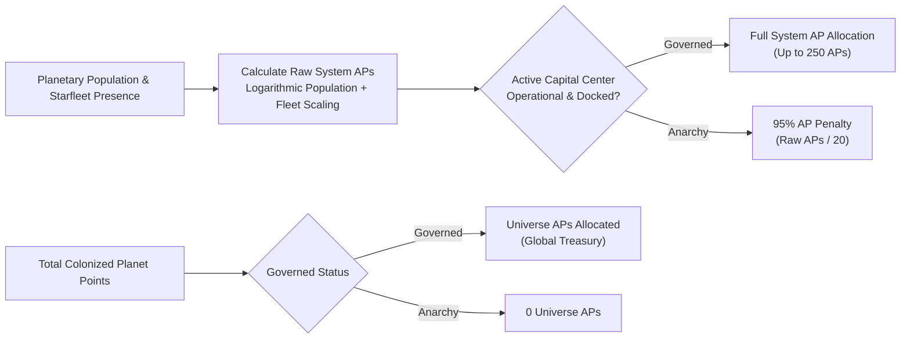
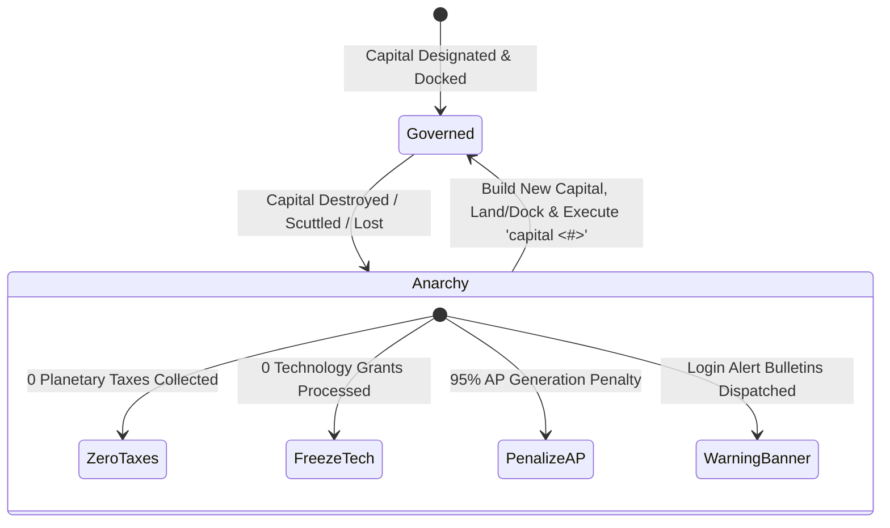

# Governance, Capitals, and Imperial Administration

## Overview

In **Galactic Bloodshed**, imperial governance links high-level strategic commands to local star systems. Bureaucratic authority is anchored by a designated capital vessel known as the **Governmental Center**. An empire's governance state governs its capacity to generate Action Points (APs), collect planetary taxes, fund scientific research, and maintain military discipline.

---

## 1. The Governmental Center (Seat of Power)

Every star empire requires an active seat of government to coordinate its interstellar administration.

### Operational Requirements
A vessel serves as a legitimate Governmental Center only if it meets all of the following criteria:
1. **Dedicated Capital Hull**: The vessel must be a specialized Governmental Center class hull.
2. **Stationary / Docked State**: The center must be either **landed on a planetary surface** or **docked inside an orbital habitat** stationed in planetary or stellar orbit. Flying in deep space or maneuvering un-docked suspends governmental functionality.
3. **Operational Integrity**: The vessel must be actively crewed and structural hull damage must not exceed catastrophic limits.

### Designation and Capital Relocation
Governors inspect or relocate their seat of government using the `capital` command:
- `capital`: Displays the current capital ship designation, host planet/system, and operational efficiency rating.
- `capital <ship_id>`: Designates a new landed or habitat-docked Governmental Center as the official imperial seat of power (costs $50$ Action Points in the destination star system).

### Capital Efficiency Rating
The operational efficiency of the governmental center reflects bureaucratic health:

$$\text{Efficiency} = \left(\frac{\text{Current Staffing Crew}}{\text{Maximum Crew Capacity}}\right) \times \left(\frac{100 - \text{Structural Damage}}{100}\right)$$

---

## 2. Administrative Hierarchy and Governor Scopes

Empires are divided administratively into distinct star systems overseen by appointed governors:

- **Supreme Leader / Prime Governor (Governor 0)**: The imperial leader who directly commands the empire's home star system, sets global diplomatic stances, oversees unassigned star systems, and controls central diplomacy.
- **System Governors (Governors 1..N)**: Appointed administrators assigned to manage specific star systems. Each governor exercises local authority over planetary taxes, military mobilization, defensive gun batteries, technology research budgets, and naval orders within their star system.
- **Independent Treasuries**: System governors maintain independent treasury accounts, receiving tax revenues from local worlds and paying upkeep expenses for stationed ships and garrisons.

---

## 3. Action Point Generation and Distribution

Action Points (APs) represent the bureaucratic throughput and logistical capacity required to issue commands, mobilize planetary sectors, and navigate starfleets.

### Star System Action Points
During each full turn update, each star system generates Action Points based on local planetary population ($P$) and stationed starships ($`N_{\text{ships}}`$):

$$\text{Raw APs} = \left\lfloor \frac{N_{\text{ships}}}{10} + 5 \log_{10}\left(1 + \max(0, P)\right) + \operatorname{Uniform}(0, 1) \right\rfloor$$

$$\text{Final System APs} = \begin{cases} \min(250, \text{Current APs} + \text{Raw APs}) & \text{if Governed} \\ \min\left(250, \text{Current APs} + \max\left(1, \left\lfloor \frac{\text{Raw APs}}{20} \right\rfloor\right)\right) & \text{if in Anarchy} \end{cases}$$

### Universe Action Points
Universe-level Action Points are pooled globally from an empire's planetary network:

$$\Delta \text{AP}_{\text{univ}} = \text{Total Colonized Planet Points}$$

Governed empires accumulate these points into their universe-level pool (capped at $250$ APs). Empires in a state of anarchy receive **$0$ Universe APs**.

---

## 4. Treasury Management and Expense Accounting

During each full turn update, system governors balance their budgets:

$$\text{Net Revenue} = \text{Planetary Taxes} + \text{Market Sales} - \text{Ship Upkeep} - \text{Troop Upkeep} - \text{Tech Grants} - \text{Market Purchases}$$

### Upkeep Tariffs
- **Standing Starships**: Active vessels requiring maintenance incur turn upkeep fees equal to their base hull construction cost.
- **Ground Garrisons**: Stationed military troops incur upkeep costs of **$10$ currency per troop unit** each full update.

### Maintenance Deficits and Morale Collapse
If standing fleet and garrison expenses exceed available treasury reserves:

$$\text{Deficit} = \text{Total Maintenance Obligations} - \text{Governor Treasury}$$

$$\Delta \text{Morale} = -\left\lfloor \frac{\text{Deficit}}{10} \right\rfloor$$

The governor's treasury is wiped to $0$, and imperial morale suffers immediate degradation, penalizing combat performance and victory standings.

---

## 5. The State of Anarchy

If an empire's designated Governmental Center is destroyed, scuttled, or rendered un-docked, the empire enters a **state of anarchy**:

### Consequences of Anarchy
1. **Tax Collection Collapse**: Planetary tax collection is completely suspended across every colony in the galaxy.
2. **Research Stoppage**: Technology investment orders on all worlds are frozen with zero scientific advancement.
3. **Action Point Paralysis**: System AP generation is slashed by $95\%$, and Universe AP generation drops to zero.
4. **Administrative Alert**: Governors receive urgent login bulletins warning of governmental paralysis.

### Restoring Order
To end anarchy:
1. Construct a new Governmental Center hull at a planetary factory or habitat shipyard.
2. Land the center on a colonized world or dock it inside an orbiting habitat.
3. Execute `capital <ship_id>` to designate the new seat of government and restore imperial administration.

---

## See Also
- [Imperial Economy, Planetary Stockpiles, and Technology Investment](economy.md)
- [Planetary Mechanics, Colonization, and Surface Topography](planets.md)
- [Planetary Simulation Engine and Sector Dynamics](planetary_simulation.md)
- [Diplomacy, Coalitions, and Power Blocks](diplomacy.md)
- [Covert Operations, Espionage, and Insurgency](covert_ops.md)
- [Turn Simulation Lifecycle and Scheduling](turn_cycle.md)
- [Starships, Orbital Hierarchies, and Naval Mechanics](ships.md)
