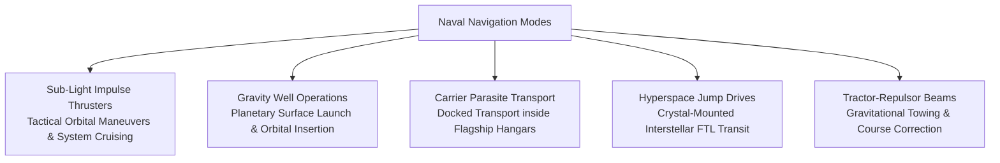
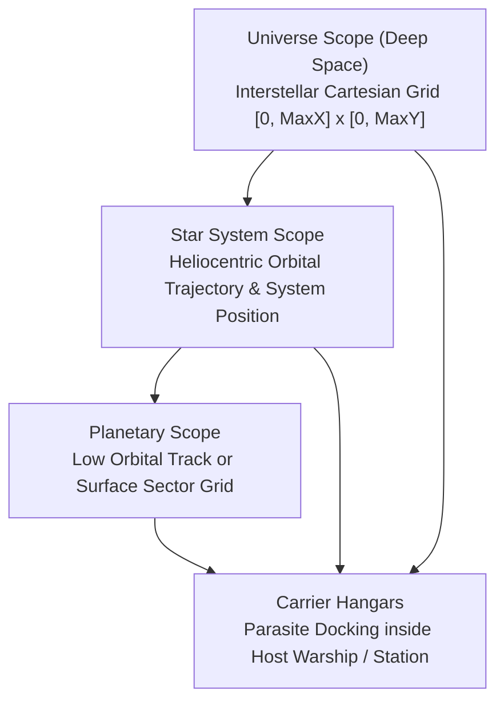
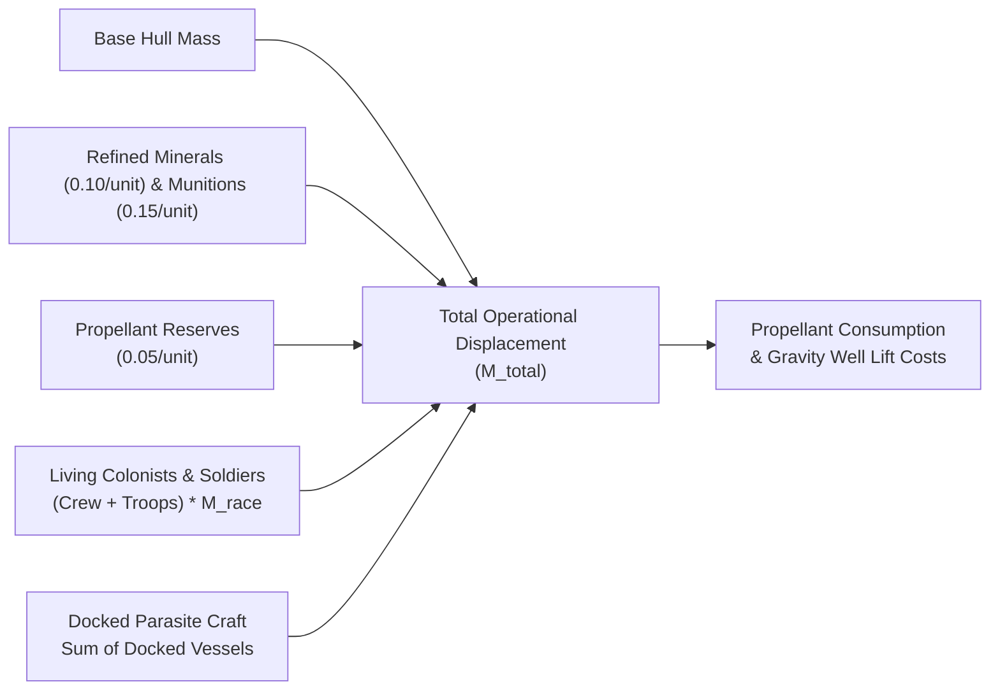
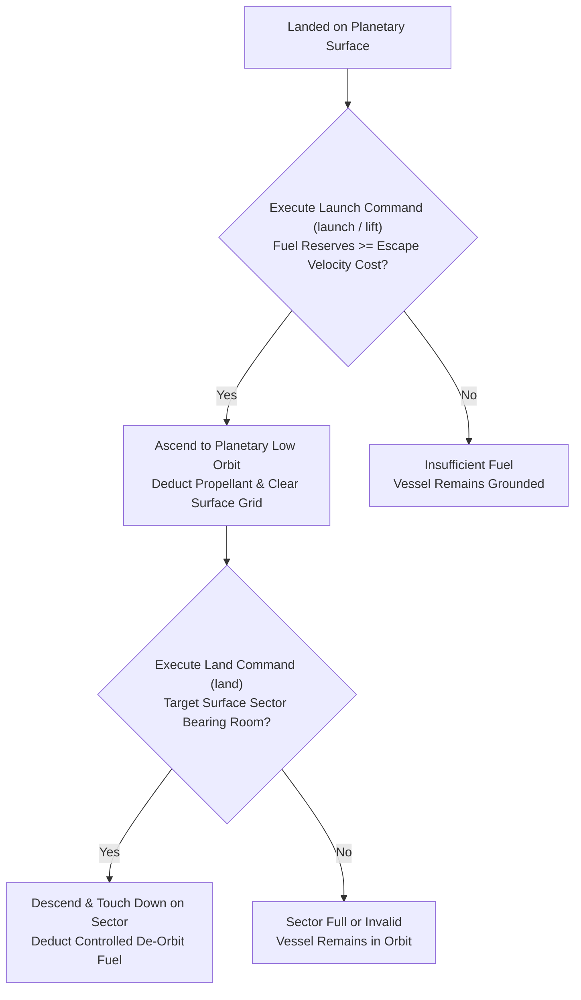
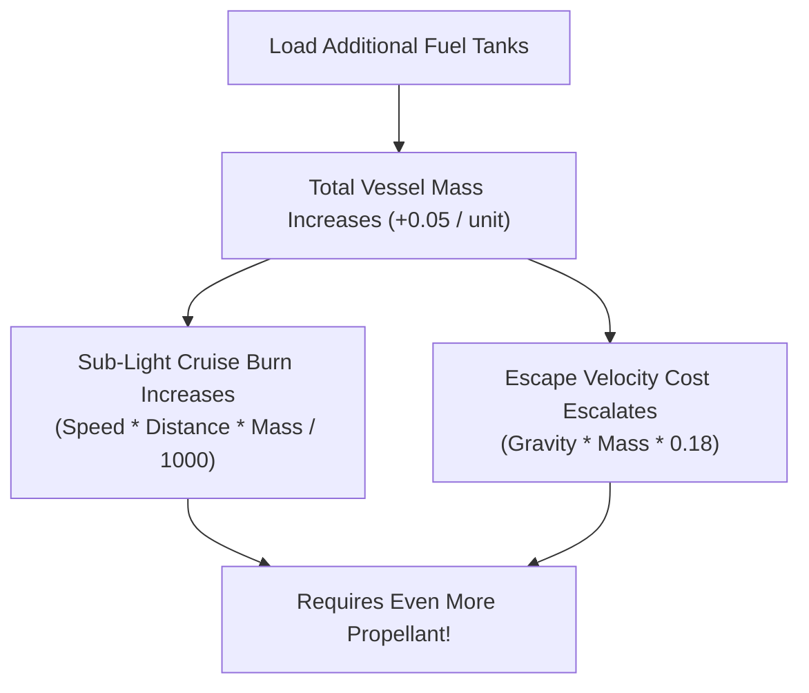
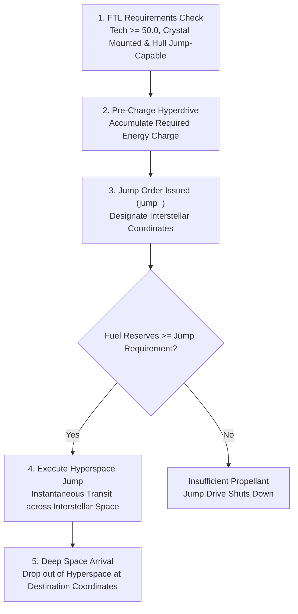

# Interstellar Navigation, Propulsion, and Hyperspace Mechanics

## Overview

In **Galactic Bloodshed**, naval movement and logistics operate across nested spatial coordinate frames ranging from local planetary orbits and heliocentric star systems to interstellar deep space. Navigation encompasses sub-light impulse maneuvers, planetary gravity well launches and descents, parasite carrier transport, and faster-than-light (FTL) hyperspace jumps.

---

## 1. Spatial Reference Frames and Orbital Hierarchy

Starships maneuver across four hierarchical reference frames:

| Reference Frame | Coordinate System | Navigational Scope & Permitted Actions |
| :--- | :--- | :--- |
| **Universe Scope** | Global Cartesian $(X, Y)$ | Interstellar deep-space transits, hyperspace jump corridors, deep-space sensor reconnaissance. |
| **Star System Scope** | Heliocentric coordinates $(x, y)$ | Interplanetary cruising between worlds, orbital patrol staging, solar space mirror alignment. |
| **Planetary Scope** | Low orbit track or surface grid $[x, y]$ | Orbital bombardment runs, ground troop deployments, resource ferrying, surface landings. |
| **Carrier Hangars** | Host ship hangar capacity | Fuel-free parasite transportation, fighter staging, automated probe deployment. |

> [!TIP]
> **Planetary Orbital Entrainment**: Planets move along heliocentric orbits according to Kepler's Third Law ($T^2 \propto r^3$) during each full turn update. Starships stationed in planetary orbit (`LEVEL_PLAN`) are automatically shifted along the orbit with the planet, maintaining orbital lock without expending propellant. See [Planetary Mechanics](planets.md) for Keplerian formulas.

---

## 2. Dynamic Vessel Displacement and Mass Physics

Fuel consumption, launch thrust requirements, and hyperjump energy demands scale with a vessel's **total operational mass** ($`M_{\text{total}}`$):

$$\text{Mass}_{\text{total}} = \text{Base Hull Mass} + (\text{Fuel} \times 0.05) + (\text{Resources} \times 0.10) + (\text{Destruct} \times 0.15) + (\text{Crew} + \text{Troops}) \times M_{\text{race}} + \sum \text{Mass}_{\text{docked}}$$

- **Cargo & Munitions Weight**: Refined minerals add $0.10$ mass units per unit, and destructive munitions add $0.15$ mass units per unit.
- **Propellant Weight**: Liquid fuel reserves contribute $0.05$ mass units per fuel unit.
- **Living Biomass**: Colonist crew and carried soldiers contribute mass based on their biological species weight ($`M_{\text{race}}`$).
- **Single-Hull Mass vs. Fleet Nesting**: A vessel's standalone displacement (excluding docked parasite craft) constitutes its local operational mass. Docked craft carried inside internal hangar bays contribute their entire mass recursively to the carrier flagship.
- **Warp Crystals**: Strategic warp crystals carried in storage or mounted in drive cores possess zero displacement mass.

---

## 3. Sub-Light Impulse Propulsion and Tactical Maneuvers

During discrete movement segments, active vessels traverse tactical space using chemical, ion, or fusion thrusters:

### Impulse Engine Throttle ($0$ to $9$)
Vessels cruise at discrete engine speeds from $0$ (stationary) to $9$ (maximum sub-light velocity):
- Slower vessels resolve movement earlier in the turn sequence, allowing faster interceptors and fighters to adjust trajectories.
- Setting course vectors $(dx, dy)$ with the `course` command directs the vessel along a continuous trajectory across planetary orbits or interplanetary space.

### Propellant Expenditure
Impulse thrusters consume fuel during each movement segment proportional to cruising speed, distance traversed, and total vessel displacement:

$$\text{Fuel Burn} = \left\lfloor \frac{\text{Speed} \times \text{Distance} \times \text{Mass}_{\text{total}}}{1000} \right\rfloor$$

---

## 4. Planetary Gravity Wells, Launch, and Landing

Transitioning between planetary surfaces and orbital tracks requires overcoming planetary gravity:

### Surface Lift-Off and Escape Velocity
Launching a vessel from a planetary surface into low orbit requires expending escape propellant proportional to the world's surface gravity ($g$) and total vessel displacement ($`M_{\text{total}}`$):

$$\text{Launch Fuel Cost} = \left\lceil \text{Gravity} \times \text{Mass}_{\text{total}} \times 0.18 \right\rceil$$

A vessel whose fuel tanks cannot cover this escape threshold cannot achieve orbital velocity and remains grounded.

### Planetary Landing Operations
Vessels equipped with atmospheric landing gear (`Land` capability) can descend from low orbit to land on specific surface sectors $[x, y]$:
- **Controlled De-Orbit Burn**: Touchdown requires firing deceleration thrusters to bleed off orbital velocity without catastrophic impact:

$$\text{Landing Fuel Cost} = \left\lfloor \text{Gravity} \times \text{Mass}_{\text{total}} \times 0.0145 \right\rfloor$$

- **Hostile Touchdowns**: Landing in hostile sectors defended by armed surface batteries triggers retaliatory ground fire before touchdown.
- **Gas Giant Hazards**: Gas giant worlds possess no solid surface; vessels attempting landings on gas giants are crushed by extreme atmospheric pressures. However, orbiting vessels can safely skim gas giant upper atmospheres to harvest free propellant during turn updates.

---

## 5. Trip Planning, Propellant Projections, and the Flight Simulator

The `fuel` command (`fuel <ship> <destination>`) provides navigational projections for prospective interstellar voyages, orbital hops, and surface landings.

### The Rocket Equation Dilemma in Galactic Bloodshed
Navigators face a fundamental trade-off: **propellant has mass** ($0.05\text{ mass/unit}$). Loading excess fuel increases ship displacement, which escalates fuel burn during every sub-light movement segment and inflates surface escape costs:

### Multi-Stage Flight Simulation
When issuing `fuel <ship> <destination>`, the flight computer executes a multi-segment simulation without altering the ship's current operational state:
1. **Lift-Off Stage**: If currently landed, calculates the required surface launch propellant based on local planetary gravity and current vessel mass.
2. **Sub-Light Cruising Stage**: Simulates segment-by-segment thrust, tracking propellant depletion, mass reduction over time, and time-to-destination across continuous Cartesian coordinates.
3. **Deceleration & Insertion Stage**: Evaluates the deceleration required to match destination orbital velocity or system coordinates.
4. **Landing Stage**: If the destination is a planetary surface, computes the final descent propellant cost.
5. **Optimal Fuel Recommendation**: Computes the minimum necessary fuel load required to complete the journey, contrasting it against the vessel's current reserves to warn commanders of impending deep-space stranding.

---

## 6. Faster-Than-Light (FTL) Hyperspace Jump Drives

Interstellar travel between distant star systems is accomplished via crystal-powered **Hyperspace Jump Drives**.

### Hyperspace Capabilities and Prerequisites
A starship can execute FTL jumps only if it satisfies all of the following requirements:
1. **Technological Breakthrough**: The owning empire has achieved **Technology Level $50.0+$** (Hyperdrive Discovery).
2. **Jump-Capable Chassis**: The hull class supports hyperjump engines (e.g. Explorers, Destroyers, Cruisers, Battleships, Dreadnaughts, Carriers, Orbital Assault Platforms).
3. **Mounted Warp Crystal**: The vessel must have an active warp crystal mounted in its drive core (`mounted = true`).
4. **Pre-Charged Drive**: The hyperdrive must be pre-charged and primed before jump initiation.

### Jump Propellant Calculation
The fuel required to rip a portal into hyperspace and traverse interstellar coordinates scales with Cartesian distance ($`D_{\text{jump}}`$) and total vessel displacement:

$$D_{\text{jump}} = \sqrt{(X_{\text{dest}} - X_{\text{origin}})^2 + (Y_{\text{dest}} - Y_{\text{origin}})^2}$$

$$\text{Jump Fuel Cost} = \left\lfloor \frac{D_{\text{jump}} \times \text{Mass}_{\text{total}}}{500} \right\rfloor$$

---

## 7. Tractor-Repulsor Beams and Gravitational Towing

Advanced scientific vessels (such as Tractor-Repulsor Beam Platforms `-`) utilize high-energy graviton projectors to manipulate the trajectories of other vessels:

- **Towing Staging**: Towing beams lock onto friendly or disabled craft, allowing powerful capital ships to tow unpowered hulls, space stations, or mobile factories between orbits.
- **Kinetic Repulsion**: Repulsor beams push incoming hostile craft or drifting space mines away from delicate flagships and orbital platforms.
- **Wormhole Stabilization ($999.0\text{ Tech}$)**: Late-game scientific breakthroughs allow empires to stabilize artificial interstellar wormholes, creating permanent zero-fuel transit corridors between distant star systems.

---

## See Also
- [Starships, Orbital Hierarchies, and Naval Mechanics](ships.md)
- [Ship Classes and Construction Catalog](ship_types.md)
- [Stellar Mechanics, Spectral Classes, and Nova Lifecycles](stars.md)
- [Planetary Mechanics, Colonization, and Surface Topography](planets.md)
- [Planetary Simulation Engine and Sector Dynamics](planetary_simulation.md)
- [Imperial Economy, Planetary Stockpiles, and Technology Investment](economy.md)
- [Tactical Combat, Naval Gunnery, and Planetary Warfare](combat.md)
- [Turn Simulation Lifecycle and Scheduling](turn_cycle.md)
