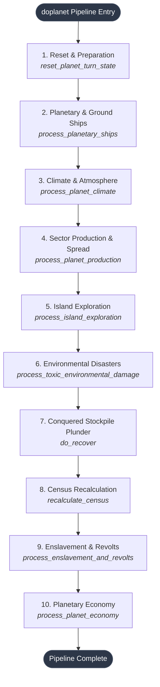

# Planetary Simulation Pipeline

## Overview

Planetary simulation in Galactic Bloodshed occurs during game turns and movement segments via `doplanet()`. During full turn updates (`update = true`), planets simulate ground vehicle operations, atmospheric climate, agricultural and industrial production, population migration, environmental fallout, stockpile plunder, census tallies, enslavement mechanics, taxation, and research.

The simulation is architected as an **n-tier sequential pipeline** where pure domain simulation passes operate over rich domain entities (`Planet`, `SectorMap`, `Sector`, `plinfo`), returning structured result records before decoupled presentation helpers dispatch telegrams.

---

## The 10 Sequential Simulation Passes

### 1. Reset and State Preparation (`reset_planet_turn_state`)
Before simulation starts:
- Cleans transient planetary statistics in `TurnStats` (clearing production accumulators, island discovery flags).
- Resets total planetary population, troops, and mineral deposits on the `Planet` entity.
- Resets per-player colony tallies (`popn = 0`, `troops = 0`, `numsectsowned = 0`, `est_production = 0.0`) across all active races.
- Pre-computes race-to-planet atmospheric compatibility ratings (`stats.Compat[player]`).

### 2. Planetary and Ground Ships (`process_planetary_ships`)
Iterates over all ships in orbit or landed on the planet, skipping dead or irradiated vessels:
- **Von Neumann Probes**: Replicate and build new probes when resource stockpiles suffice.
- **Berserkers**: Execute automated orbital strikes against enemy populations, decrementing target hitlists (`Universe::VN_hitlist`).
- **Terraformers**: Execute ground movement and convert hostile sectors to optimal race habitat (`SectorType::likesbest`).
- **Plows**: Move across arable land and increase agricultural fertility (`s.fert()`), generating minor industrial waste.
- **Domes**: Upgrade infrastructure and increase sector efficiency (`s.efficiency()`).
- **Quarries**: Strip-mine sectors to `SEC_WASTED`, extracting mineral resources into colony stockpiles.
- **Gas Giant Refueling**: Refuels orbiting tankers, habitats, and standard spacecraft from gas giant atmospheres.

### 3. Climate and Atmospheric Dynamics (`process_planet_climate`)
Simulates planetary thermal dynamics:
- Adjusts surface temperature based on focused stellar radiation from space mirrors (`TurnStats::Stinfo.temp_add`).
- Applies natural seasonal and atmospheric temperature drift ($\pm 5^{\circ}\text{C}$) via `Planet::update_climate()`.

### 4. Sector Production and Population Spread (`process_planet_production`)
Simulates economic output, demographic changes, and territorial migration across every sector on the planet:
- **Supernova Sterilization**: If the host star is undergoing a supernova, intense radiation damages agricultural fertility, exposing deep mineral veins or sterilizing sectors entirely into `SEC_WASTED`.
- **Resource & Fuel Extraction (`process_resource_production`)**: Populated sectors extract mineral deposits and petroleum. Gas sectors (`SEC_GAS`) produce double fuel yield ($2\times$). Highly mobilized sectors divert output into destructive ammo stockpiles (`prod_destruct`).
- **Demographic Growth & Starvation Dynamics (`calculate_population_change`)**:
  - *Maximum Support Capacity*: $\text{maxsup} = \text{std::lround}((\text{eff} + 1) \times \text{fert} \times 0.01 \times \text{compat} \times (100 - \text{toxic}) / 100)$.
  - *Sterility Threshold*: If sector population drops below the species' reproductive minimum ($\text{popn} < \text{race.number\_sexes}$), biological reproduction stalls completely ($\Delta \text{popn} = 0$).
  - *Breeding Growth* ($\text{popn} < \text{maxsup}$): $\Delta \text{popn} = \text{round\_rand}((\text{maxsup} - \text{popn}) \times \text{race.birthrate})$.
  - *Overpopulation Starvation* ($\text{popn} > \text{maxsup}$): Severe famine inflicts casualties within the range $[0, \min(2 \times (\text{popn} - \text{maxsup}), \text{popn})]$.
- **Spontaneous Colonist Migration (`spread` & `calculate_migrating_colonists`)**:
  - *Trigger Condition*: When sector population exceeds $10\%$ of maximum capacity ($\text{popn} > 0.1 \times \text{maxsup}$), excess colonists look to expand outwards.
  - *Spatial Adjacency*: Explores valid 8-way neighbors, honoring **toroidal $X$ wrapping** across the planetary meridian while respecting impassable **polar $Y$ boundaries**.
  - *Target Eligibility*: Colonists migrate only into *unowned* sectors (`owner == 0`) with positive environmental affinity ($\text{race.likes}[\text{target.condition}] > 0$).
  - *Migration Volume*:
    $$\Delta \text{migrants} = \text{round\_rand}\left(\text{popn} \times \frac{\text{adventurism}}{50} \times \frac{\text{compat}}{100} \times \frac{\text{race.likes}[\text{target.condition}]}{100}\right)$$
  - *Territorial Claiming*: Migrants immediately claim the new sector for their empire, updating colonized sector tallies in `TurnStats`.
- **Industrial Infrastructure & Plating (`update_efficiency`)**:
  - Unplated sectors improve efficiency with probability $(100 - \text{tax}) \times \text{race.likes}[\text{condition}]$, gaining $\text{round\_rand}(\text{race.metabolism})$ points.
  - When efficiency reaches $100\%$, the sector automatically converts to **Plated** status (`SEC_PLATED`), maximizing defensive protection and structural stability.

### 5. Island Exploration (`process_island_exploration`)
Controls planetary exploration and territorial expansion:
- Ticks down the planetary exploration countdown timer (`planet.expltimer()`).
- When the timer expires, scans for undiscovered islands or landmasses.
- Colonizes discovered sectors, claims territory for exploring races, and logs discovery alerts.

### 6. Environmental Disasters (`process_toxic_environmental_damage`)
Monitors planetary pollution levels:
- When toxicity exceeds the critical environmental threshold (`conditions(TOXIC) > ENVIR_DAMAGE_TOX`), an industrial disaster triggers.
- Atomically devastates a random sector to `SectorType::SEC_WASTED` (`Sector::devastate()`), wiping out population and infrastructure while notifying colonists.

### 7. Conquered Stockpile Plunder (`do_recover`)
When a planet is conquered and previous owners are fully eliminated:
- Evaluates the mutual alliance graph (`check_mutual_alliances`) among all conquering races.
- If all conquerors are mutually allied, calculates proportional plunder shares using `calculate_plunder_distribution()`.
- Guarantees strict commodity conservation ($\sum \text{allocated} = \text{total\_loot}$) with remainder allocation.
- Transfers stockpiles into conqueror inventories and dispatches recovery telegrams.

### 8. Census Recalculation (`recalculate_census`)
Executes a single linear traversal over the `SectorMap`:
- Tallies total mineral resources across all sectors on the world.
- Accumulates population, troops, and maximum population capacity (`maxpopn`) for each player.
- Updates empire-wide power metrics (`stats.Power`) and stellar system population tracking (`stats.starpopns`).

### 9. Enslavement and Slave Revolts (`process_enslavement_and_revolts`)
Manages enslaved planetary populations:
- **Tribute Diversion**: For peaceful slave worlds, diverts all newly produced resources, fuel, destruct, and crystals directly to the master player's colony stockpile.
- **Slave Revolts**: If the master player's garrison drops to or below $0.1\%$ ($1/1000\text{th}$) of the total population, an uprising triggers:
  - Devastates $(1 + \lfloor \text{popn}_{\text{total}} / 1000 \rfloor)$ random sectors.
  - Devastates master-owned sectors in intimidated star systems ($50\%$ chance).
  - Liberates the population (`planet.free_slaves()`) and dispatches revolt bulletins.

### 10. Planetary Economy and Taxation (`process_planet_economy`)
Finalizes the economic turn for each inhabiting colony:
- **Production Deposits**: Moves newly produced commodities into local stockpiles (`plinfo::deposit_production()`).
- **Taxation**: Calculates tax revenue based on population and current tax rate, transferring income to the system governor's treasury. Tax increases are rate-limited to $+5\%$ per turn update.
- **Technology Research**: Deducts tech investment from the governor's treasury and advances racial technology points (`race.tech`).
- **Combat Readiness & Defense Guns**: Updates sector mobilization readiness and calculates ground-based planetary defense guns ($N_{\text{guns}} = \min(20, \lfloor \text{mob} / 1000 \rfloor)$).
- **Automated Toxic Waste Cans**: If pollution exceeds the player's configured `tox_thresh`, automatically constructs a toxic waste can ship (`OTYPE_TOXWC`) to clean up to 20 points of toxicity.

---

## Decoupled Presentation and Telegrams

Simulation passes do not write directly to player communication channels. Instead:
1. Passes return structured value types (`std::optional<Coordinates>`, `RecoveryReport`, `EnslavementResult`, `IslandDiscovery`).
2. Presentation helper `send_planet_turn_telegrams()` formats autoreport bulletins, disaster notices, and economic summaries before routing telegrams through `EntityManager`.

---

## See Also
- [Planets and Colonization](planets.md)
- [Economy and Taxation](economy.md)
- [Governance and Administration](governance.md)
