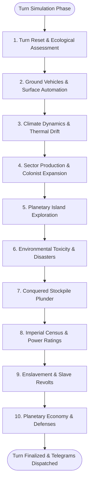
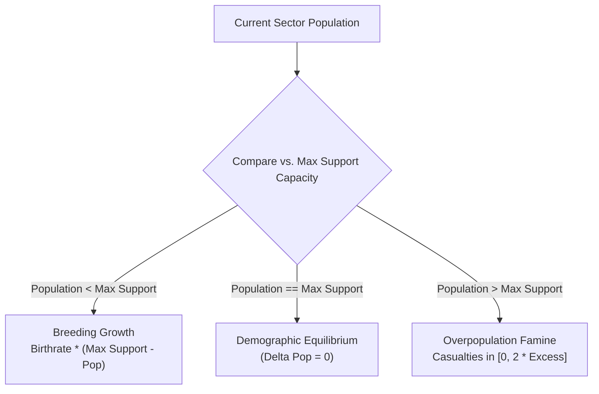
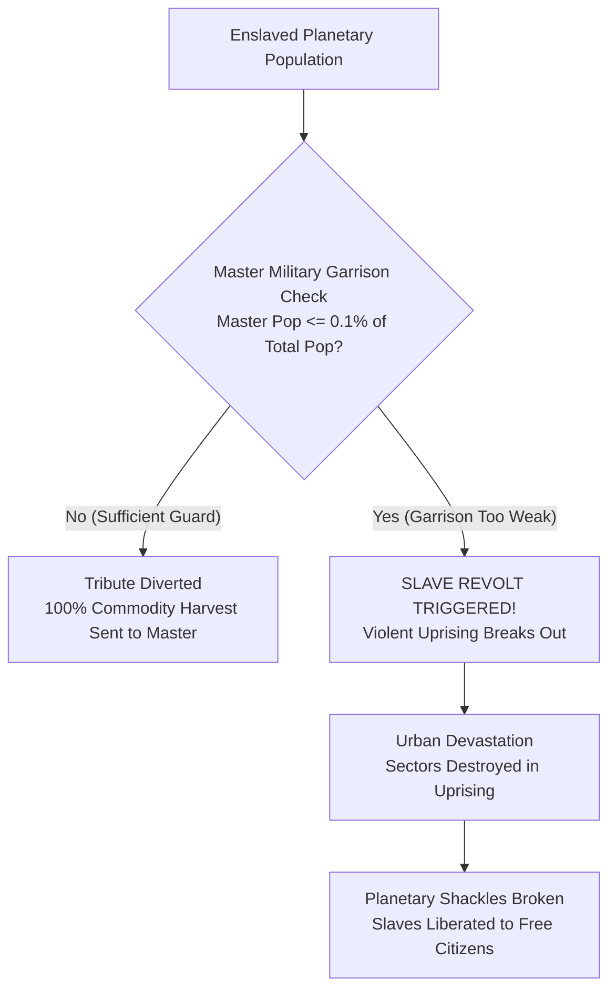

# Planetary Simulation Engine and Sector Dynamics

## Overview

In **Galactic Bloodshed**, settled worlds are dynamic living ecosystems and industrial powerhouses. During full turn updates, the planetary simulation engine processes physical climate dynamics, automated ground vehicles, agricultural and industrial extraction, demographic breeding and starvation, territorial colonist expansion, environmental disasters, colony plunder, imperial census tallies, enslavement mechanics, taxation, and research.

The simulation executes through ten sequential simulation passes across each planet's surface grid:

---

## 1. Turn Reset and Ecological Assessment

Before sector simulation begins, the environment performs foundational baseline setup:
- Clears transient turn production accumulators and discovery flags.
- Re-tallies active planetary populations, stationed ground troops, and available mineral deposits.
- Pre-computes race-to-planet atmospheric compatibility ratings based on temperature, gravity, and atmospheric gas ratios (methane, oxygen, carbon dioxide, helium, nitrogen, sulfur).

---

## 2. Ground Vehicles and Surface Automation

Active surface vehicles, autonomous terraformers, and orbital support craft execute operational orders across the planetary grid:

- **Autonomous Von Neumann Probes (`v`)**: Unmanned machine probes land on mineral-bearing sectors, extract raw resources and propellant, roam adjacent sectors across toroidal grids, and replicate new machines upon reaching construction thresholds ($100\text{ resources}$).
- **Berserker Warships (`V`)**: Orbiting autonomous dreadnoughts identify target colonies on their imperial hit list, check for defensive Planet Defense Nets (PDNs), and execute tactical saturation bombardment against enemy surfaces.
- **Terraform Devices (`T`)**: Mobile surface engineering units navigate across landmasses, conditioning hostile sectors toward species-compatible biospheres by raising fertility and altering terrain classification.
- **Space Plows (`K`)**: Automated agricultural combines move across arable terrain, conditioning topsoil to enhance agricultural fertility while consuming stored propellant and crew staffing.
- **Domes (`Y`)**: Climate-controlled surface bio-domes erected on harsh sectors, upgrading infrastructure efficiency, protecting colonists from hazardous atmospheric conditions, and stabilizing demographic carrying capacity.
- **Quarries (`q`)**: Industrial excavators strip-mine heavy mineral veins, extracting raw industrial materials into colony stockpiles before leaving behind spent wasteland.
- **Weapons Plants (`W`)**: Automated munitions facilities synthesize destructive ordnance (`destruct`) by consuming minerals ($1:1$) and propellant ($0.5:1$) up to available ammunition storage capacity.
- **Gas Giant Atmospheric Skimming**: Starships in low orbit around gas giants automatically harvest atmospheric hydrogen during turn updates:
  - **Tankers (`t`)**: $+100.0\text{ fuel}$ per update
  - **Orbital Habitats (`H`)**: $+200.0\text{ fuel}$ per update
  - **Space Stations (`S`)**: $+100.0\text{ fuel}$ per update
  - **Standard Starships**: $+5.0\text{ fuel}$ per update

---

## 3. Climate Dynamics and Thermal Drift

Planetary surface temperatures evolve based on heliocentric orbital distance, seasonal variations, and orbital engineering:

- **Natural Seasonal Drift**: Planetary surface temperatures experience natural atmospheric fluctuations of $\pm 5^{\circ}\text{C}$ around their stellar baseline.
- **Orbital Space Mirrors (`+`)**: Giant orbital reflector arrays aimed at the host star focus solar energy into the upper atmosphere to warm freezing worlds or shade overheated biospheres:

$$\Delta T = \left\lfloor \frac{\text{Solar Radiation} \times \text{Mirror Efficiency}}{\max(1, \text{Planet Radius})} \right\rfloor$$

Thermal modifications are clamped to a maximum shift of $\pm 100^{\circ}\text{C}$ to preserve thermodynamic stability.

---

## 4. Sector Production, Demographics, and Colonist Spread

The economic and biological heart of the simulation processes every occupied sector on the planet:

### Supernova Impact
If the host star is undergoing a nova collapse, extreme radiation sweeps across the planet, degrading agricultural fertility, stripping surface vegetation, and searing vulnerable terrain into nuclear wasteland.

### Industrial Resource Extraction and Commodity Depletion
Populated sectors extract raw minerals and petroleum:
- **Mineral Yield**: Populated sectors extract mineral ore based on racial metabolism and sector efficiency:

$$\text{Yield} = \min\left(\text{Sector Reserves}, \left\lfloor \text{Metabolism} \times \text{UniformRandom}(1, \text{Efficiency}) \right\rfloor\right)$$

- **Propellant Synthesis**: Extracting minerals simultaneously generates refined fuel. Sectors classified as Gas Fields yield double fuel output ($2 \times \text{Yield}$).
- **Munitions Diversion**: If a sector has undergone military mobilization, extracted minerals are automatically refined into destructive ordnance (`destruct`) rather than raw minerals.
- **Crystal Synthesis**: Advanced empires with crystal discovery extract rare crystalline deposits from mineral-rich sectors.
- **Depletion vs. Accounting Subtraction**: Routine resource extraction and ship loading enforce strict transactional inventory accounting. In contrast, combat damage and orbital bombardment inflict **resource depletion**, which smoothly clamps available sector resources down to zero without disrupting underlying colony transaction queues.

### Demographic Breeding and Overpopulation Famine

- **Maximum Demographic Support Capacity**: The sustainable population cap for a sector depends on infrastructure efficiency, soil fertility, atmospheric compatibility, and environmental toxicity:

$$\text{Max Population} = \left\lfloor (\text{Efficiency} + 1) \times \text{Fertility} \times 0.01 \times \text{Compatibility} \times \frac{100 - \text{Toxicity}}{100} \right\rfloor$$

- **Reproductive Threshold**: If sector population drops below the species' reproductive minimum ($\text{Population} < \text{Reproductive Sexes}$), reproduction ceases entirely.
- **Population Growth**: Below carrying capacity, populations expand according to racial birthrate:

$$\Delta \text{Population} = \left\lfloor (\text{Max Population} - \text{Population}) \times \text{Birthrate} \right\rfloor$$

- **Overpopulation Starvation**: When population exceeds support capacity, severe famine inflicts casualties within the range:

$$\text{Casualties} \in \left[0, \min\big(2 \times (\text{Population} - \text{Max Population}), \text{Population}\big)\right]$$

### Spontaneous Colonist Migration and Territorial Expansion
When a sector becomes crowded ($\text{Population} > 0.10 \times \text{Max Population}$), pioneer colonists look to expand into neighboring wilderness:
- **Migration Pool**: Adventurous colonists form migration parties:

$$\text{Available Migrants} = \left\lfloor \text{Population} \times \text{Adventurism} \times \frac{100 - \text{Fertility}}{100} \right\rfloor - \text{Reproductive Sexes}$$

- **Topological Navigation**: Migrants step into adjacent unowned sectors, honoring **toroidal east/west seam wrapping** across meridians while respecting **polar north/south limits** (5 topological neighbors at poles, 8 across equatorial and temperate latitudes).
- **Settlement Volume**: Migrants settle eligible unowned territory with positive environmental affinity:

$$\Delta \text{Settlers} = \left\lfloor \text{Available Migrants} \times \text{Compatibility} \times \frac{\text{Habitat Preference}}{100} \right\rfloor$$

- **Territorial Claim**: Settlers claim newly occupied sectors, planting imperial colony flags and expanding empire boundaries atomically.

### Infrastructure Development and Plating
- Colonists improve sector efficiency over time at a rate influenced by tax rates, racial metabolism, and habitat preference.
- Upon reaching $100\%$ efficiency, the sector automatically converts to **Plated** status, maximizing structural durability and defensive shielding.

---

## 5. Planetary Island Exploration

For worlds with uncharted island chains or hidden landmasses:
- An exploration countdown timer steadily decrements each turn.
- When the timer reaches zero, imperial survey teams discover new landmasses, automatically colonizing revealed territory and dispatching discovery bulletins.

---

## 6. Environmental Toxicity and Industrial Disasters

Heavy manufacturing, strip-mining, and orbital bombardment generate toxic byproducts:
- **Disaster Threshold**: When planetary pollution exceeds critical environmental safety thresholds ($> 30\%$ Toxicity), an ecological catastrophe triggers.
- **Disaster Impact**: An industrial disaster incinerates a random populated sector into nuclear wasteland, destroying local population and infrastructure while alerting the governing empire.

---

## 7. Conquered Stockpile Plunder

When planetary invaders eradicate the defending garrison and capture a world:
- The system evaluates diplomatic relations among all victorious conquerors.
- If victorious empires share mutual alliances, captured commodity stockpiles (fuel, minerals, destruct, crystals) are divided equitably based on troop participation and sector control.
- Plunder shares are transferred into conqueror inventories and victory recovery telegrams are dispatched.

---

## 8. Imperial Census and Power Ratings

A single comprehensive census traversal audits the planetary grid:
- Aggregates planetary mineral reserves, fuel yields, and crystal deposits.
- Tallies civilian population, military garrisons, and maximum planetary carrying capacity.
- Updates stellar system demographics and empire-wide galactic power scores.

---

## 9. Enslavement and Slave Revolts

Subjugated enemy populations on conquered worlds are managed through enslavement policies:

### Tribute Extraction
On peaceful slave worlds, the entire output of newly harvested commodities (fuel, minerals, destruct, crystals) is diverted directly into the master empire's stockpiles.

### Slave Revolt Triggers and Uprisings
An enslaved population requires an active military presence to maintain order. If the master empire's population drops to or below **$0.1\%$ ($1/1000\text{th}$)** of the total planetary population:
- **Devastation**: Violent uprisings break out across the world, devastating $`N_{\text{devastated}} = \left\lfloor \frac{\text{Total Population}}{1000} \right\rfloor + 1`$ random populated sectors.
- **Intimidation Backlash**: Master-owned sectors in intimidated star systems face a $50\%$ chance of destruction.
- **Liberation**: The shackles of enslavement are broken, fully liberating the planetary population.

---

## 10. Planetary Economy, Taxation, and Defenses

The turn simulation finalizes local economic accounting and defense readiness:

- **Harvest Deposits**: Newly mined mineral resources, petroleum fuel, and extracted crystals are credited directly to local colony stockpiles.
- **Tax Collection & Rate-Limiting**: Civilian income taxes are levied and transferred into the planetary governor's treasury. To prevent destabilizing social unrest and economic collapse, tax rate increases are constrained to a maximum increase of **$+5\%$ per turn update**.
- **Scientific Research & Technology Grants**: Research allocations set by the governor are deducted from imperial revenues and converted into imperial technology advancement points ($`\text{Tech}`$), unlocking advanced ship hulls, warp crystal drives, and weapons.
- **Ground Defense Batteries**: Total sector mobilization points across all owned territory are converted into active ground defense gun batteries:

$$N_{\text{guns}} = \min\left(20, \left\lfloor \frac{\text{Total Mobilization Points}}{1000} \right\rfloor\right)$$

Surface batteries defend against landing assault craft and return counter-battery fire during enemy orbital bombardment.
- **Automated Waste Canisters**: If planetary pollution exceeds the governor's configured toxicity threshold, local shipyards automatically consume mineral resources to fabricate a **Toxic Waste Canister (`w`)** vessel, absorbing up to $20$ points of toxicity from the biosphere.

---

## 11. Automated Telegrams and Communications

Upon completing simulation passes, automated intelligence bulletins and telegrams are dispatched to system governors:
- **Autoreports**: Summarize commodity production totals, newly mined crystals, demographic growth, and temperature shifts.
- **Disaster Notices**: Alert governors to industrial toxicity disasters and sector devastation.
- **Nova Warnings**: Emergency evacuation bulletins warn of stellar nova collapses and boiling seas.
- **Revolt Bulletins**: Urgent war notices signal slave uprisings or planetary liberation events.

---

## See Also
- [Planetary Mechanics, Colonization, and Surface Topography](planets.md)
- [Species Biology, Ecology, and Racial Genetics](races.md)
- [Geoengineering, Terraforming, and Ecological Warfare](geoengineering.md)
- [Imperial Economy, Planetary Stockpiles, and Technology Investment](economy.md)
- [Tactical Combat, Naval Gunnery, and Planetary Warfare](combat.md)
- [Governance, Capitals, and Imperial Administration](governance.md)
- [Interstellar Navigation, Propulsion, and Hyperspace Mechanics](navigation.md)
- [Starships, Orbital Hierarchies, and Naval Mechanics](ships.md)
- [Ship Classes and Construction Catalog](ship_types.md)
- [Turn Simulation Lifecycle and Scheduling](turn_cycle.md)
- [Autonomous Machine AI, Von Neumann Probes, and Berserker Warships](von_neumann.md)
