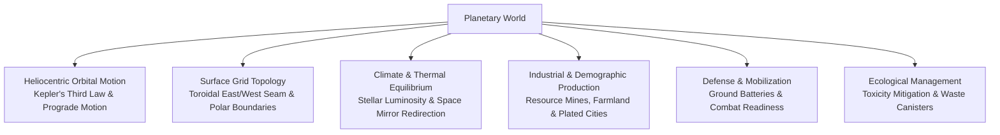
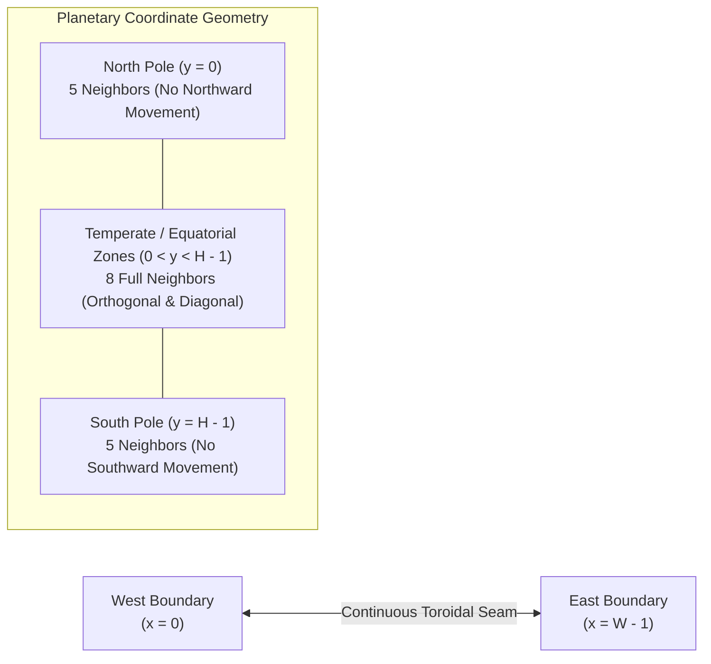
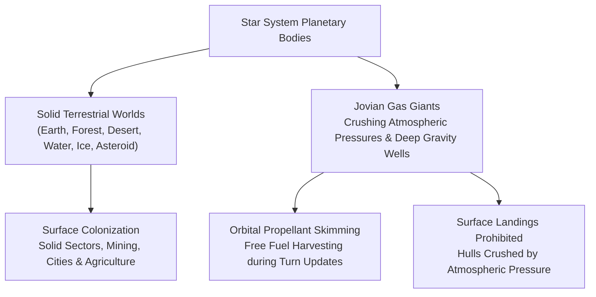
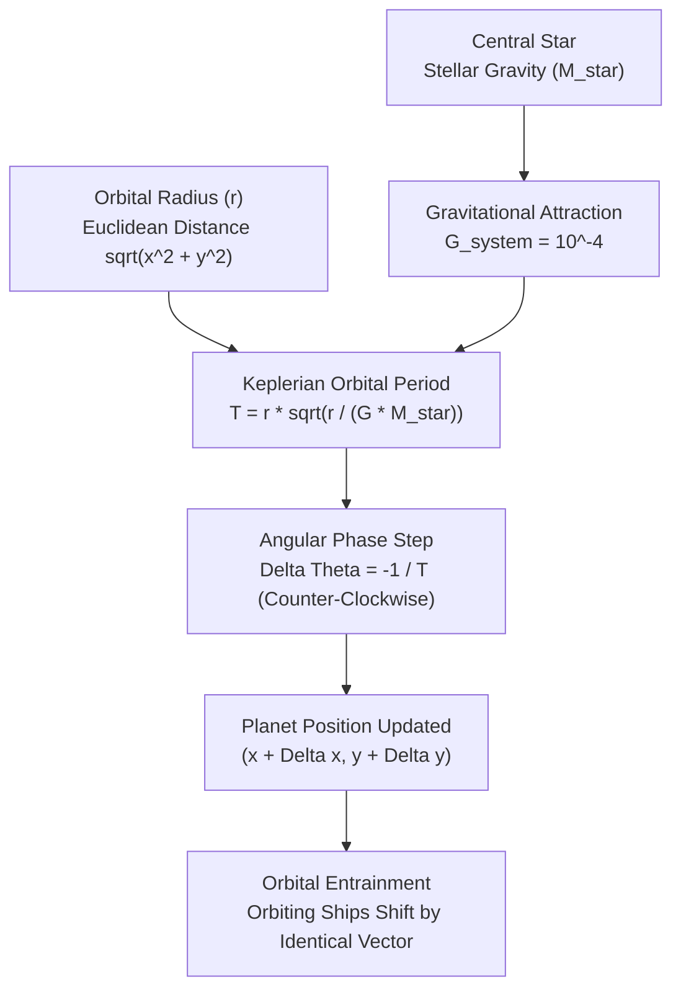
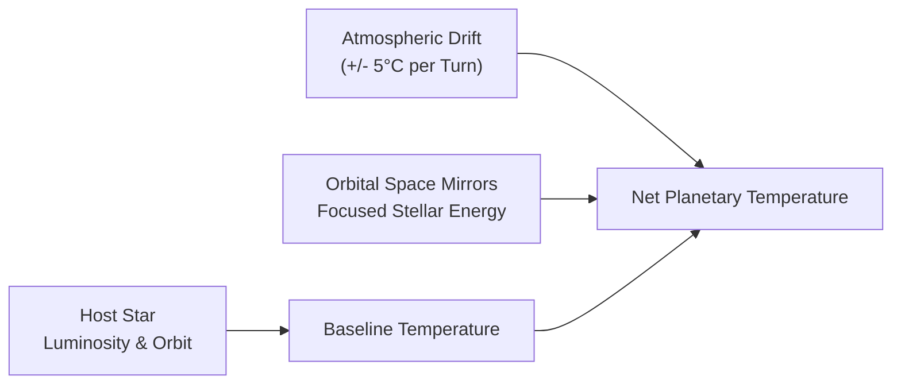
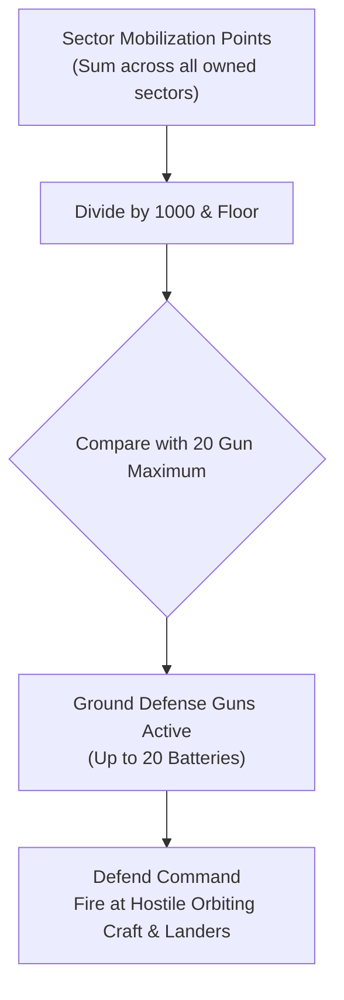
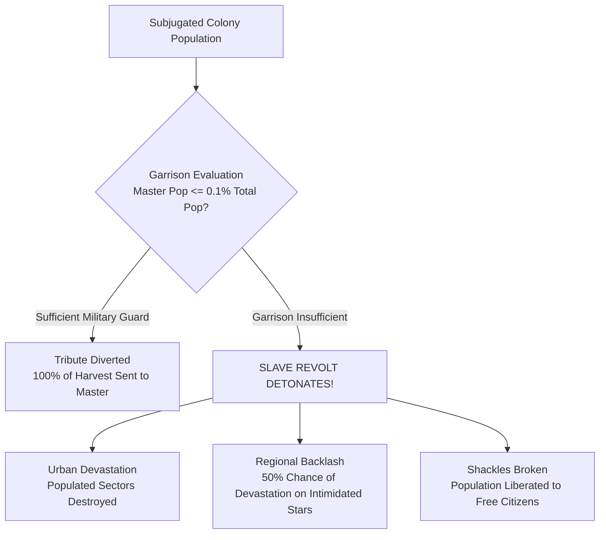

# Planetary Mechanics, Colonization, and Surface Topography

## Overview

Planets form the core sovereign territory, population centers, and industrial engine of empires in **Galactic Bloodshed**. This guide details surface topography, cylindrical grid navigation, Keplerian orbital mechanics, thermal dynamics, military mobilization, ground defense batteries, automated ecological cleanup, and enslavement revolt mechanics.

---

## 1. Planetary Grid Topology and Surface Navigation

Planetary surfaces are modeled as discrete 2D coordinate grids spanning $[0, W - 1] \times [0, H - 1]$, where $W$ is the planet's equatorial width and $H$ is the polar height.

### Surface Geometry & Seam Wrapping
- **East/West Toroidal Wrapping ($X$ Dimension)**: Moving east past the eastern boundary ($x = W - 1$) wraps continuously around to $x = 0$. Moving west past $x = 0$ wraps seamlessly to $x = W - 1$.
- **North/South Polar Boundaries ($Y$ Dimension)**: The vertical axis represents latitude, bounded between the North Pole ($y = 0$) and the South Pole ($y = H - 1$). Ground units cannot step north of the North Pole or south of the South Pole; traversal attempts bounce inward.

### Sector Adjacency and Neighborhood Calculations
- **Equatorial / Temperate Sectors** ($0 < y < H - 1$): Have **8 topological neighbors** (including diagonal moves and wrapped longitudinal seams).
- **Polar Sectors** ($y = 0$ or $y = H - 1$): Have **5 topological neighbors** due to polar boundary clamping.

Autonomous robotic probes and migrating colonists utilize these topological rules to navigate across landmasses without boundary clipping errors.

---

## 2. Planetary Archetypes and Gas Giant Harvesters

Star systems host diverse planetary classes categorized into solid terrestrial worlds and gaseous Jovian giants:

### Terrestrial Worlds vs. Gas Giants
- **Terrestrial Worlds** (Earth-like, Forest, Desert, Water, Mountainous, Ice, Asteroid): Possess solid surface sector grids. Colonists can land, establish cities, extract mineral deposits, plow farmland, and build defense installations.
- **Gas Giants**: Massive, high-gravity worlds composed of compressed light gases and atmospheric storms. They possess no solid surface; ships attempting to land on a gas giant are destroyed by crushing atmospheric pressure.

### Orbital Propellant Harvesting (Gas Giant Skimming)
While uninhabitable on the surface, gas giants serve as strategic orbital refueling stations. During every turn update, starships stationed in low orbit around a gas giant world automatically scoop volatile atmospheric propellant directly into their tanks:

| Vessel Class | Fuel Harvested / Update | Strategic Purpose & Fleet Utility |
| :--- | :---: | :--- |
| **Tanker (`t`)** | **$+100.0\text{ fuel}$** | Rapid fleet replenishment; acts as a mobile offshore gas station. |
| **Orbital Habitat (`H`)** | **$+200.0\text{ fuel}$** | Supports massive population biospheres and orbital manufacturing. |
| **Space Station (`S`)** | **$+100.0\text{ fuel}$** | Permanent system defense staging base and fuel depot. |
| **Standard Starships** | **$+5.0\text{ fuel}$** | Cruisers, freighters, and scouts top off tactical reserves without tanker support. |

Positioning an orbital tanker or space station in orbit around a star's gas giant provides an empire with a permanent, zero-cost refueling waypoint for long-range exploration fleets and battle groups.

---

## 3. Heliocentric Orbital Mechanics and Keplerian Motion

Planets are not static bodies; they travel along circular orbits around their primary star in accordance with **Kepler's Third Law of Planetary Motion** ($T^2 \propto r^3$).

### 1. Keplerian Orbital Period ($T$)
The time required for a world to complete one full revolution around its star depends on its orbital radius ($r$) and the central star's gravitational mass ($M_{\text{star}}$):

$$r = \sqrt{x_{\text{planet}}^2 + y_{\text{planet}}^2}$$

$$T = r \times \sqrt{\frac{r}{G_{\text{system}} \times M_{\text{star}}}}$$

where $G_{\text{system}} = 10^{-4}$ represents the galactic system gravitational constant. Inner planets closer to their parent star traverse their orbits at high angular velocities, while outer worlds and gas giants require dozens or hundreds of turns to complete a revolution.

### 2. Angular Phase Step and Direction of Motion
During each **full turn update**, the orbital engine computes the planet's current angular phase $\theta = \operatorname{atan2}(y, x)$ and advances it by the angular step $\Delta \theta = -\frac{1}{T}$:

$$x_{\text{new}} = r \times \cos\left(\theta - \frac{1}{T}\right)$$

$$y_{\text{new}} = r \times \sin\left(\theta - \frac{1}{T}\right)$$

$$\Delta x = x_{\text{new}} - x_{\text{planet}}, \quad \Delta y = y_{\text{new}} - y_{\text{planet}}$$

> [!NOTE]
> **Left-Handed Coordinate Geometry**: Galactic Bloodshed uses a screen-aligned Cartesian system where $Y$ increases downwards. In this coordinate system, subtracting from the angular phase ($\Delta \theta < 0$) produces **counter-clockwise prograde motion** around the star.

### 3. Orbital Cadence: Turn Updates vs. Movement Segments
- **Planets step once per full turn update**: Unlike starships, which maneuver during each discrete tactical movement segment, planetary bodies advance their orbital position only during macro-economic full turn updates.
- **Interplanetary Navigation Intercepts**: Because planets move between turn updates, long-range interplanetary flights using impulse drives or autopilot orders must lead their target world to achieve orbital insertion rather than plotting courses toward where the planet used to be.

### 4. Orbital Entrainment of Stationed Ships
Whenever a planet shifts along its orbital arc by $(\Delta x, \Delta y)$, the game engine automatically entrains all vessels currently stationed in planetary orbit:
- All starships, orbital habitats, space stations, and fuel tankers in planetary orbit (`whatorbits = LEVEL_PLAN`) have their coordinates adjusted by the exact displacement vector:

$$\mathbf{x}_{\text{ship}} \leftarrow \mathbf{x}_{\text{ship}} + (\Delta x, \Delta y)$$

- Orbiting craft maintain their relative position above the world automatically without expending propulsion fuel.

---

## 4. Climate, Thermal Dynamics, and Space Mirrors

Each world possesses a natural baseline temperature determined by its star's spectral luminosity, stellar radius, and orbital distance.

### Thermal Variance and Environmental Modification
During each full turn update, surface temperature evolves according to:

$$T_{\text{surface}} = T_{\text{base}} + \Delta T_{\text{mirrors}} \pm 5^{\circ}\text{C}$$

- **Seasonal Atmospheric Drift**: Natural stochastic fluctuations of $\pm 5^{\circ}\text{C}$ simulate seasonal weather shifts and atmospheric turbulence.
- **Orbital Space Mirrors**: Giant orbital reflector arrays stationed in orbit focus stellar energy into the upper atmosphere to warm freezing worlds, melt glaciated biospheres, or shade overheated planets: $`\Delta T_{\text{mirrors}} = \left\lfloor \frac{\text{Solar Radiation} \times \text{Mirror Efficiency}}{\max(1, \text{Target Planet Radius})} \right\rfloor`$.

---

## 5. Sector Mobilization and Ground Defense Batteries

Planetary military readiness is built from the ground up through sector-level mobilization.

### Sector Mobilization and Combat Readiness
- Governors mobilize individual sectors ($0\%$ to $100\%$) for military service using the `mobilize` command.
- The average mobilization across all colonized sectors determines the planet's imperial **combat readiness**. Highly mobilized sectors divert industrial mineral extraction directly into munitions synthesis (`destruct`).

### Planetary Defense Batteries
Total mobilization points across all owned sectors translate directly into ground-based planetary defense batteries:

$$N_{\text{guns}} = \min\left(20, \left\lfloor \frac{\text{Total Mobilization Points}}{1000} \right\rfloor\right)$$

- **Operational Role**: Up to $20$ heavy surface batteries can fire on hostile warships in orbit or intercept invading assault landers during descent.
- **Munition Supply**: Firing surface batteries consumes destructive ordnance stored in local colony stockpiles.

---

## 6. Automated Ecological Cleanup and Waste Canisters

Heavy manufacturing, strip-mining, and nuclear bombardment generate toxic industrial contaminants that degrade habitability.

### Automated Waste Canister Fabrication
Governors configure an automated environmental cleanup policy using the `toxicity` command to set a threshold ($0\%$ to $100\%$):
1. **Automated Trigger**: When planetary toxicity meets or exceeds the configured threshold, and the colony maintains sufficient mineral resources, local shipyards automatically fabricate a **Toxic Waste Canister** vessel.
2. **Ecological Purge**: Constructing the canister absorbs up to $20$ points of toxicity from the biosphere, trapping contaminants within the vessel's containment hold for subsequent orbital launch, deep-space disposal, or environmental deployment against hostile worlds.

---

## 7. Enslavement and Slave Revolts

When capturing foreign worlds, conquerors can subjugate the native population using the `enslave` command, compelling them to labor for the master empire.

### Tribute Extraction
On peaceful slave worlds, the entire output of newly harvested commodities (fuel, minerals, destruct, crystals) is automatically diverted directly into the master empire's planetary stockpiles.

### Slave Revolt Triggers
Subjugated populations require an active military garrison to enforce servitude. If the master empire's population drops to or below **$0.1\%$ ($1/1000\text{th}$)** of the total planetary population:

$$\text{Population}_{\text{master}} \le \left\lfloor \frac{\text{Population}_{\text{total}}}{1000} \right\rfloor$$

a planetary **slave revolt** is immediately triggered.

### Consequences of a Slave Revolt
1. **Urban and Ecological Devastation**: Uprisings ignite widespread fighting across the world, completely devastating $`N_{\text{devastated}} = \left\lfloor \frac{\text{Population}_{\text{total}}}{1000} \right\rfloor + 1`$ random populated sectors into ruined wasteland.
2. **Regional Intimidation Backlash**: Master-owned sectors located within intimidated star systems suffer a $50\%$ probability of devastation.
3. **Liberation**: Imperial shackles are broken, immediately restoring the subjugated population to free citizen status.

---

## See Also
- [Planetary Simulation Engine and Sector Dynamics](planetary_simulation.md)
- [Species Biology, Ecology, and Racial Genetics](races.md)
- [Geoengineering, Terraforming, and Ecological Warfare](geoengineering.md)
- [Imperial Economy, Planetary Stockpiles, and Technology Investment](economy.md)
- [Tactical Combat, Naval Gunnery, and Planetary Warfare](combat.md)
- [Governance, Capitals, and Imperial Administration](governance.md)
- [Starships, Orbital Hierarchies, and Naval Mechanics](ships.md)
- [Interstellar Navigation, Propulsion, and Hyperspace Mechanics](navigation.md)
- [Turn Simulation Lifecycle and Scheduling](turn_cycle.md)
- [Autonomous Machine AI, Von Neumann Probes, and Berserker Warships](von_neumann.md)
