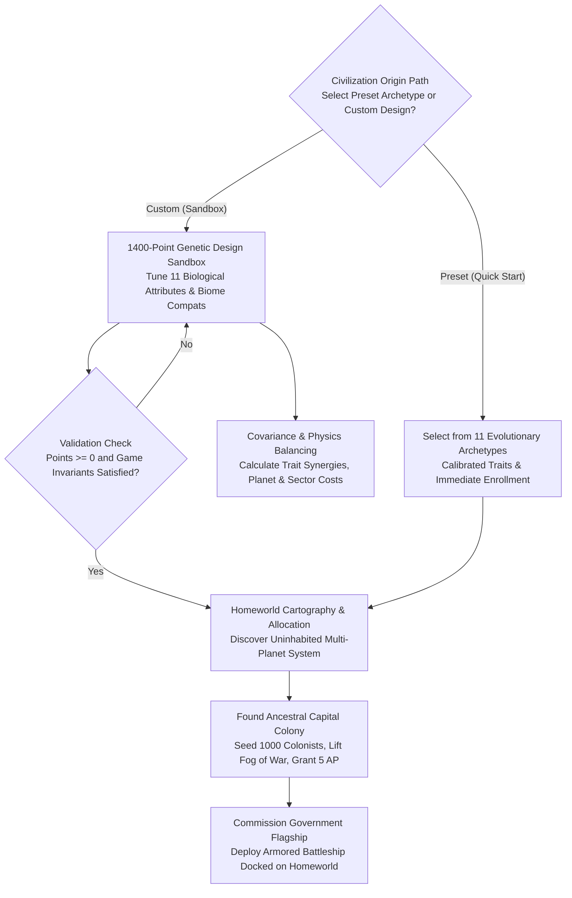

# Race Generation and Imperial Onboarding Guide

## Overview

In **Galactic Bloodshed**, every interstellar empire originates through **race generation**. Players can either inaugurate their civilization by adopting one of eleven calibrated **evolutionary archetypes**, or engineer a custom species from scratch within the **1400-point genetic design sandbox**.

Once biological attributes and environmental tolerances are balanced, the imperial onboarding system discovers an optimal solar system, establishes the ancestral capital colony, and commissions the imperial government flagship.



---

## 1. Physiological Traits and Biological Metrics

A species' physical, intellectual, and reproductive characteristics are governed by **eleven core biological attributes**:

| Attribute | Baseline | Permitted Range | In-Game Mechanics and Strategic Effects |
| :--- | :---: | :---: | :--- |
| **Adventurism** | $0.40$ | $0.05$ – $0.99$ | Colonization drive and willingness to migrate into unsettled sectors. |
| **Birthrate** | $0.60$ | $0.20$ – $1.00$ | Natural population growth velocity per turn update. |
| **Fight** | $4$ | $1$ – $20$ | Tactical combat rating in hand-to-hand planetary surface warfare. |
| **IQ / Limit** | $150$ | $50$ – $220$ | Research capability. Fixed starting IQ for normal species; asymptotic ceiling for collective minds. |
| **Mass** | $1.00$ | $0.10$ – $3.00$ | Biological weight per colonist. Affects troop carrying capacity and combat leverage. |
| **Sexes** | $2$ | $1$ – $53$ | Reproductive complexity. Single-sex species reproduce autonomously; multi-sex species require pairing. |
| **Metabolism** | $1.00$ | $0.10$ – $4.00$ | Food and life-support consumption rate per update. |
| **Fertilize** | $0\%$ | $0\%$ – $100\%$ | Ecological ability to organically fertilize and restore planetary soil quality. |
| **Collective IQ** | No | Yes / No | Shifts intelligence from individual capability to a dynamic network scaling with total population. |
| **Absorb** | No | Yes / No | (*Metamorph only*) Absorbs defeated enemy casualties directly into biological mass during combat. |
| **Pods** | No | Yes / No | (*Metamorph only*) Ability to gestate biological organic pods for orbital space transport. |

---

## 2. The Eleven Preset Evolutionary Archetypes

For players seeking immediate entry into the galaxy without spending time in the genetic point sandbox, the onboarding system provides **eleven balanced archetypes** (ten terrestrial and one Jovian gas giant dweller) with pre-configured homeworld affinities and sector compatibilities:

| # | Archetype Name | Homeworld | Biology | Mass | Birth | Fight | IQ / Ceiling | Advent | Sexes | Metab | Strategic Profile |
| :-: | :--- | :--- | :--- | :-: | :-: | :-: | :-: | :-: | :-: | :-: | :--- |
| **1** | **Metamorphic Predator** | Forest | Metamorph | 0.30 | 0.80 | 8 | 135 (Col) | 0.70 | 1 | 1.00 | Fast-reproducing solitary asexual hunter; pods and absorption. |
| **2** | **Metamorphic Heavyweight** | Desert | Metamorph | 1.60 | 0.70 | 10 | 130 (Col) | 0.60 | 1 | 1.15 | High physical mass with strong planetary surface assault leverage. |
| **3** | **Metamorphic Colossus** | Airless | Metamorph | 2.50 | 0.65 | 12 | 125 (Col) | 0.55 | 1 | 1.20 | Heavy-gravity biological juggernaut; high ground combat rating. |
| **4** | **Cerebral Researcher** | Class M | Normal | 0.50 | 0.60 | 2 | 190 | 0.50 | 2 | 1.00 | Scientific prodigy; accelerated tech research; fragile infantry. |
| **5** | **High IQ Scholar** | Waterball | Normal | 0.65 | 0.60 | 4 | 185 | 0.50 | 2 | 1.05 | High scientific output with oceanic and continental adaptability. |
| **6** | **Progressive Technocrat** | Class M | Normal | 0.75 | 0.65 | 6 | 175 | 0.65 | 2–4 | 1.10 | Flexible multi-sex genetics; balanced technological expansion. |
| **7** | **Balanced Expansionist** | Class M | Normal | 0.85 | 0.70 | 7 | 160 | 0.70 | 2–4 | 1.20 | Balanced demographic growth, military defense, and science. |
| **8** | **Adaptive Explorer** | Iceball | Normal | 0.75 | 0.70 | 7 | 150 | 0.85 | 2–4 | 1.40 | Cryogenic explorer; high adventurism drive and boundary expansion. |
| **9** | **Aggressive Colonizer** | Forest | Normal | 0.85 | 0.85 | 8 | 145 | 0.75 | 2–4 | 1.15 | Vigorous demographic reproduction; rapid industrial mobilization. |
| **10** | **Militaristic Legionnaire** | Airless | Normal | 1.20 | 0.70 | 12 | 140 | 0.65 | 2–4 | 1.20 | Conventional military superpower; hardy soldiers and high drive. |
| **11** | **Jovian Gas Floater** | Jovian | Normal | 0.40 | 0.60 | 5 | 165 | 0.70 | 2 | 1.00 | Buoyant gas-giant organism; dense Jovian atmospheric mastery. |

### Pre-Loading Archetypes in `racegen`
In addition to direct quick-start enrollment via `enrol`, any of these eleven archetypes can be loaded into `racegen` as a starting template to customize:
- **Interactive Sandbox Command**: Type `archetype` (or `preset`) at the `racegen>` prompt to display the preset table, or `archetype <1-11|name>` (e.g., `archetype 3` or `archetype colossus`) to load its deterministic base traits while preserving any already-configured empire name, passwords, and credentials. Append `random` (e.g., `archetype 3 random`) to sample randomized variance.
- **CLI Option**: Launch `racegen -a <1-11|name>` (or `--archetype <1-11|name>`) to open the interactive sandbox pre-loaded with that preset.

---

## 3. The 1400-Point Genetic Design Sandbox

Players designing custom species receive a budget of **$1\,400$ creation points**. Point expenditures are non-linear: baseline traits cost $0$ points, while pushing an attribute toward extreme biological limits escalates exponentially.

### The Non-Linear Attribute Cost Formula

The cost of each biological attribute $a$ is determined by a hybrid exponential-linear curve:

$$\text{Cost}(a) = \left\lfloor \exp\left(e_\text{fudge} \cdot (a - e_\text{hinge})\right) \cdot e_\text{factor} + a \cdot l_\text{factor} + l_\text{fudge} \right\rfloor$$

where $e_\text{factor}, e_\text{fudge}, e_\text{hinge}, l_\text{factor}$, and $l_\text{fudge}$ are mathematically tuned parameters ensuring that default racial traits sum to exactly $0$ attribute points.

### Biological Covariance and Synergies
Attributes do not exist in isolation; physical and evolutionary tradeoffs alter point costs:

- **Normal Civilizations**:
  - **Brain Volume & Mass**: High mass provides greater cranial capacity, reducing the marginal point cost of high intelligence ($`\text{Cov}(\text{IQ}, \text{Mass}) = -0.25`$).
  - **Intellect & Adventurism**: Highly intelligent species demand greater justification to migrate, reducing adventurism synergy.
  - **Reproduction & Physical Overhead**: Rapid birthrates are substantially cheaper for low-mass, high-metabolism species.
- **Metamorphic Civilizations**:
  - Metamorphs hatch from organic clutches rather than gestating live young, substantially dampening mass penalties on reproduction.
  - Pod construction ($+200$ pts), organic absorption ($+200$ pts), and collective intelligence ($-351$ pts) adjust baseline point pools.
  - Individual IQ is replaced with a population-wide collective intelligence ceiling, decoupling physical brain mass from technological aptitude.

---

## 4. Environmental and Sector Compatibility Costs

A custom species must define its ecological affinity for planetary biomes ($0\%$ to $100\%$ compatibility):

### Settleable Biomes
1. **Water (Sea)**: Aquatic oceans and hydrological basins.
2. **Land**: Fertile continental terrain and plains.
3. **Mountain**: High-altitude ridges and mineral crags.
4. **Gas**: Dense Jovian atmospheres (exclusive to Jovian floaters).
5. **Ice**: Glacial shelves and sub-zero tundras.
6. **Forest**: Heavy canopy biomes and woodlands.
7. **Desert**: Arid dunes and heat-blasted rock.
8. **Plated**: Tectonic bedrock complexes (**mandatory $100\%$** for all non-Jovian species).

### Base Compatibility Cost
For each settleable biome $i$ with compatibility percentage $c_i \in [0, 100\%]$:

$$\text{Cost}(c_i) = \left\lfloor c_i \times 0.5 + 10.8 \times \ln(1.0 + c_i) \right\rfloor$$

A full $100\%$ compatibility in a single biome costs exactly **$100$ points**.

### Inter-Sector Covariance and Diversity Penalties
Adapting to divergent environments incurs steep evolutionary overhead:

1. **Cross-Biome Covariance**: Simultaneously adapting to antithetical biomes (e.g. Desert and Glacial Ice, or Ocean and Desert) applies positive covariance multipliers that amplify both sector costs.
2. **Homeworld Incompatibility**: Defining compatibility with a biome that is unnatural on your chosen home world type (e.g. Desert affinity on an oceanic Water world) multiplies that sector's cost by up to **$3\times$**.
3. **Multi-Biome Generalist Surcharge**: Specializing in a single biome is free ($0$ penalty). Becoming an ecological generalist capable of thriving across multiple diverse sector types assesses a progressive diversity surcharge:

| Settleable Biome Types | Diversity Point Surcharge |
| :---: | :---: |
| **1 Biome** (e.g. Plated only) | $0$ pts |
| **2 Biomes** | $+50$ pts |
| **3 Biomes** | $+100$ pts |
| **4 Biomes** | $+200$ pts |
| **5 Biomes** | $+300$ pts |
| **6 Biomes** | $+400$ pts |
| **7 Biomes** | $+500$ pts |
| **8 Biomes** (Omni-Compatible) | $+600$ pts |

---

## 5. Home Planet Archetype Costs

Your ancestral homeworld environment provides natural advantages and point subsidies:

| Home World Archetype | Point Cost | Ecological & Strategic Trade-offs |
| :--- | :---: | :--- |
| **Earth** | $+75$ pts | High natural land and water abundance; optimal starting balance. |
| **Forest** | $+50$ pts | Rich organic biomass; moderate land/water availability. |
| **Desert** | $+50$ pts | Abundant mineral extraction; limited agricultural zones. |
| **Water** | $+50$ pts | Vast aquatic surface area; restricted dry construction space. |
| **Airless (Mars)** | $-25$ pts | Harsh vacuum regolith; subsidized with $+25$ bonus points to spend on traits. |
| **Iceball** | $-25$ pts | Sub-zero cryogenic glaciers; subsidized with $+25$ bonus points. |
| **Gas Giant (Jovian)** | $+600$ pts | Complete immunity to terrestrial ground invasion; floating atmospheric cities. |
| **Asteroid** | *N/A* | **Invalid homeworld.** Asteroids cannot support capital founding. |

---

## 6. Homeworld Discovery and Capital Founding

Once a species is validated and points remaining $\ge 0$, the imperial onboarding system conducts stellar cartography:

1. **Territorial Search Invariants**:
   - The star system must be completely **uninhabited** by other empires.
   - The system must contain at least **two planets**, ensuring immediate local sub-light expansion.
   - The system must host an uncolonized world matching the selected **home world archetype**.
2. **Capital Colony Seeding**:
   - Locates a surface sector matching the species' primary compatibility preference.
   - Lands an ancestral founding population of **$1\,000$ colonists**.
   - Permanently clears fog of war over the capital and star system.
   - Grants **$5$ initial Action Points (AP)** for immediate fleet and economic orders.
3. **Government Flagship Commissioning**:
   - Automatically constructs a heavily armored, high-tech **Battleship** docked at the capital sector coordinates.
   - Designates the vessel as the **Imperial Government Center**, the indispensable command hub of the empire.

---

## 7. Interactive Onboarding Utilities

Players and game operators access race generation through two dedicated command-line tools that share a unified `racegen.json` specification format:

- **`enrol` (Quick-Start Registration Wizard & JSON Enrollment)**:
  - Designed for players joining an active game quickly without micromanaging sector covariance matrices.
  - Interactive mode presents imperial credentials, preset archetype selection (`1-10`), and homeworld choice, automatically generating pre-rolled sector compatibilities and saving the finalized specification to `racegen.json`.
  - Non-interactive mode (`-f, --file [path]`, defaulting to `racegen.json`) loads a saved Glaze JSON race specification and enrolls the empire directly into the universe database:
  ```bash
  # Interactive quick-start wizard (saves racegen.json and enrolls)
  ./build/gb/enrol -d /var/games/gb/galaxy.db

  # Non-interactive enrollment from racegen.json (or custom file)
  ./build/gb/enrol -d /var/games/gb/galaxy.db -f racegen.json
  ```
- **`racegen` (Genetic Design Sandbox)**:
  - Designed for custom species engineering and granular point budgeting.
  - Allows players to inspect mathematical point costs, adjust individual traits, test covariance impacts, and save/load species profiles (`racegen.json` by default) or enroll directly from the interactive shell.
  ```bash
  # Launch interactive race designer
  ./build/gb/racegen -d /var/games/gb/galaxy.db

  # Pre-load an existing racegen.json specification into the designer
  ./build/gb/racegen -d /var/games/gb/galaxy.db -f racegen.json
  ```

---

## See Also

- [Planets and Biomes Guide](planets.md) — Comprehensive technical reference on planetary environments, sector types, and habitability formulas.
- [Universe Creation Guide](universe_creation.md) — Procedural galaxy creation, star placement, and temperature gradients.
- [Races and Biology Guide](races.md) — Physiological traits, collective intelligence, and metabolic formulas.
- [Governance and Empires Guide](governance.md) — Imperial administration, governors, taxation, and treasury management.
