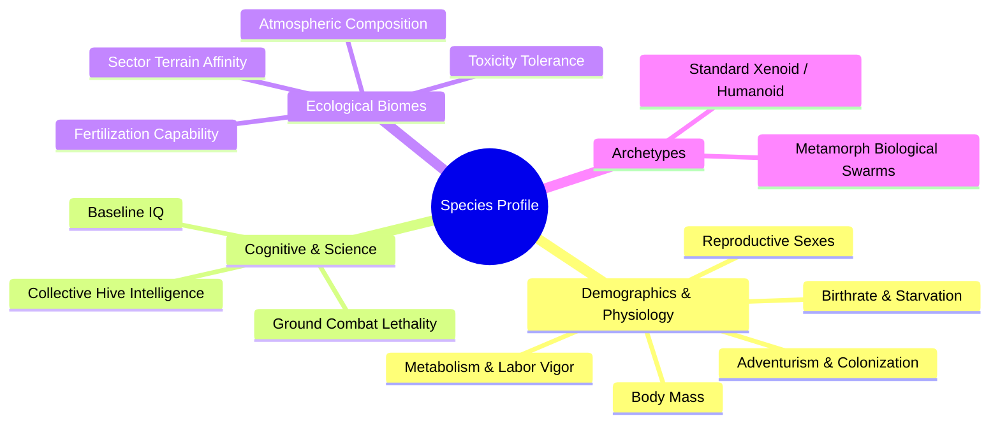
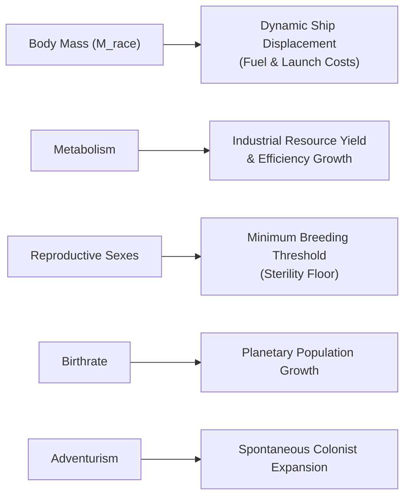
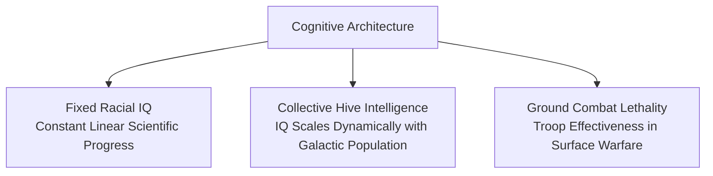
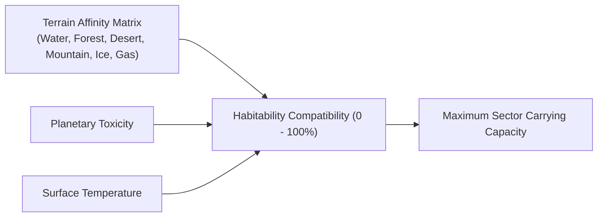
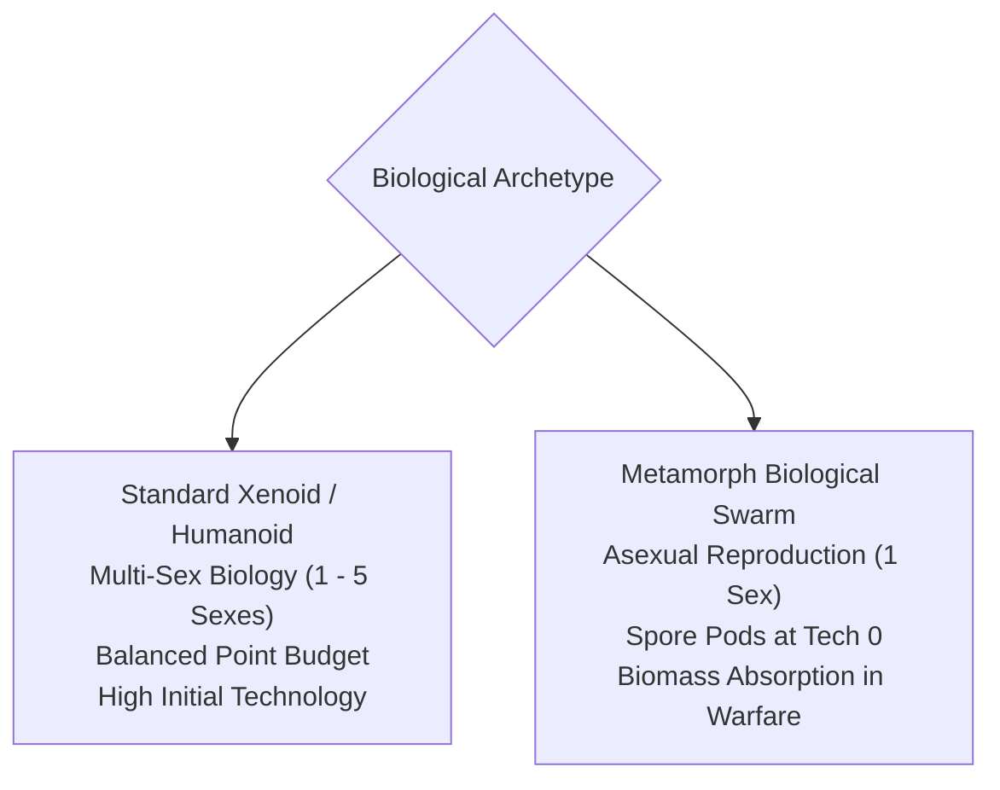

# Species Biology, Ecology, and Racial Genetics

## Overview

In **Galactic Bloodshed**, every empire represents a unique biological or xenomorphic species engineered with custom genetic, ecological, and physiological traits. A species' biological profile governs how rapidly its colonies reproduce, how efficiently its citizens extract minerals and refine fuels, how much mass its soldiers add to naval hulls, and which planetary biospheres it can inhabit.

---

## 1. Physiological and Demographic Attributes

A species' physical biology dictates individual resource consumption, reproductive speed, and logistical transport requirements:

### Metabolism ($M$)
Metabolism represents the biological vigor, industriousness, and physical energy of the species:
- **Industrial Extraction**: Higher metabolism yields higher mineral extraction and fuel refining per sector: $\text{Yield} = \min\left(\text{Reserves}, \left\lfloor \text{Metabolism} \times \text{UniformRandom}(1, \text{Efficiency}) \right\rfloor\right)$.
- **Infrastructure Development**: Increases the rate at which colonists upgrade sector efficiency toward $100\%$ (plated status).
- **Tax Strain**: High taxation depresses effective metabolism: $\text{Metabolism}_{\text{effective}} = \text{Metabolism}_{\text{base}} \times \left(1 - \frac{\text{Tax Rate}}{100}\right)$.

### Individual Body Mass ($M_{\text{race}}$)
Individual body mass defines the physical weight per citizen or soldier:
- **Logistical Displacement**: Civilian colonists and military troops add physical weight to starship hulls: $\Delta \text{Mass}_{\text{ship}} = (\text{Crew} + \text{Troops}) \times M_{\text{race}}$.
- **Propellant Costs**: Heavier species expend significantly more fuel during surface lift-offs, orbital maneuvers, and hyperspace jumps. Light species excel at rapid naval troop mobilization.

### Reproductive Sexes ($N_{\text{sexes}}$)
Reproductive sexes defines the minimum number of individuals required to form a fertile breeding family unit:
- **Sterility Threshold**: If a sector's population falls below $N_{\text{sexes}}$, biological reproduction stalls completely ($\Delta \text{Population} = 0$).
- **Colonization Resilience**: Species with $N_{\text{sexes}} = 1$ (such as Metamorphs) can colonize worlds from a single pioneer colonist, whereas species with $N_{\text{sexes}} = 3+$ require larger initial landing parties.

### Birthrate ($B$)
Birthrate determines how rapidly a colony's population expands toward environmental carrying capacity:

$$\Delta \text{Population} = \left\lfloor (\text{Max Supported Population} - \text{Current Population}) \times \text{Birthrate} \right\rfloor$$

### Adventurism ($A$)
Adventurism governs the urge of pioneering citizens to spontaneously migrate from crowded sectors into neighboring unowned territory:

$$\Delta \text{Migrants} = \left\lfloor \text{Population} \times \text{Adventurism} \times \frac{100 - \text{Fertility}}{100} \right\rfloor - N_{\text{sexes}}$$

---

## 2. Cognitive Profile, Intelligence, and Scientific Evolution

An empire's scientific research throughput and combat ferocity are determined by its cognitive architecture:

### Baseline Racial IQ
Species with standard cognitive structures progress scientifically at a constant baseline rate during each turn update:

$$\Delta \text{Tech} = \frac{\text{IQ}}{100.0}$$

### Collective Hive Intelligence
Species endowed with Collective Intelligence operate as a unified psychic hive mind. Their effective intelligence scales dynamically with their total galaxy-wide population ($P_{\text{total}}$):

$$IQ_{\text{effective}} = IQ_{\text{limit}} \times \left(\frac{2}{\pi} \arctan\left(\frac{P_{\text{total}}}{10^6}\right)\right)^2$$

- **Early-Game Vulnerability**: Small pioneer populations possess low initial IQ, requiring rapid demographic expansion.
- **Late-Game Supremacy**: As galactic population reaches millions of citizens, effective IQ approaches $IQ_{\text{limit}}$, unleashing explosive scientific breakthroughs.

### Ground Combat Lethality
Combat ability represents individual martial lethality, physical ferocity, and close-quarters combat skill. In planetary surface battles and starship boarding actions, higher combat ratings dramatically increase casualty infliction rates against foreign soldiers and defending militias.

---

## 3. Ecological Biomes and Environmental Compatibility

Every species possesses a distinctive environmental affinity matrix defining its comfort across different planetary biomes:

### Terrain Affinity Vectors
Species assign preference ratings ($0\%$ to $100\%$) across nine distinct sector classifications:

| Sector Classification | Natural Biosphere Traits | Optimal Species Pairings |
| :--- | :--- | :--- |
| **Land / Plains** | Moderate fertility, standard mineral deposits. | Universal terrestrial species. |
| **Forest** | High agricultural fertility, balanced resources. | Woodland and arboreal races. |
| **Water / Oceanic** | High fertility, moderate mineral wealth. | Aquatic and amphibious species. |
| **Desert** | Low fertility, rich mineral and petroleum veins. | Arid and subterranean extremophiles. |
| **Mountain** | Low fertility, dense mineral veins, high defense. | Lithoid and subterranean species. |
| **Ice / Glacial** | Glaciated sub-zero terrain, specialized resources. | Cryophilic species. |
| **Gas Fields** | Volatile hydrocarbon fields, double fuel yield. | Energy-harvesting species. |
| **Wasteland** | Radioactive wasteland, zero fertility. | Decontamination and terraforming targets. |
| **Plated** | Heavy urban / industrial infrastructure plating. | Industrial manufacturing centers. |

### Sector Demographic Carrying Capacity
The maximum sustainable population of any planetary sector is calculated from local infrastructure, fertility, species compatibility, and environmental toxicity:

$$\text{Max Population} = \left\lfloor (\text{Efficiency} + 1) \times \text{Fertility} \times 0.01 \times \text{Compatibility} \times \frac{100 - \text{Toxicity}}{100} \right\rfloor$$

### Natural Fertilization
Races with the natural fertilization trait possess a turn-by-turn probability of conditioning their occupied sectors, gradually increasing agricultural fertility up to $100\%$ without requiring mechanical space plows.

---

## 4. Species Archetypes: Standard Xenoids vs. Metamorphs

Empires in Galactic Bloodshed broadly divide into two major biological archetypes:

### 1. Standard Xenoids / Humanoids
- **Reproduction**: Multi-sex breeding ($1$ to $5$ sexes).
- **Technological Focus**: High starting technology options and balanced demographic traits.
- **Expansion**: Relies on constructed starships, freighters, and assault landers for colonization and conquest.

### 2. Metamorphs (Biological Swarms)
- **Asexual Unity**: Strict single-sex reproduction ($N_{\text{sexes}} = 1$).
- **Spore Pod Colonization (`p`)**: Can construct biological Spore Pods at Technology Level 0 instantly on planetary surfaces. Spore pods enter deep-space hibernation and burst upon reaching foreign star systems, seeding biospheres with pioneer biomass.
- **Biomass Absorption**: In ground combat, victorious Metamorph forces absorb defeated enemy populations directly into their own biomass, transforming conquered colonists into Metamorph population.

---

## 5. Genetic Design Trade-offs and Strategy

When engineering a custom species during race generation, players balance finite evolutionary points across competing attributes:

| Design Archetype | Key Genetic Allocations | Strategic Advantages | Critical Vulnerabilities |
| :--- | :--- | :--- | :--- |
| **Industrial Powerhouse** | Max Metabolism ($2.0$), Low Mass, Land/Mountain Affinity. | Massive early resource and fuel yields; rapid plating. | Susceptible to high tax unrest. |
| **Rapid Swarm Breeder** | High Birthrate ($0.50$), $1$ Sex, High Adventurism. | Rapid territorial spread and population recovery. | Vulnerable to overpopulation famine. |
| **Technological Ascendant** | High IQ ($150+$) or Collective Intelligence, Low Mass. | Rapid breakthrough to hyperdrives, lasers, and dreadnoughts. | Weak ground fighting and slower early production. |
| **Extremophile Colonizer** | High Toxic Tolerance, Desert/Ice/Water Affinity. | Able to settle hostile planets ignored by other empires. | Slower growth on standard Earth-like worlds. |

---

## See Also
- [Planetary Mechanics, Colonization, and Surface Topography](planets.md)
- [Planetary Simulation Engine and Sector Dynamics](planetary_simulation.md)
- [Imperial Economy, Planetary Stockpiles, and Technology Investment](economy.md)
- [Tactical Combat, Naval Gunnery, and Planetary Warfare](combat.md)
- [Starships, Orbital Hierarchies, and Naval Mechanics](ships.md)
- [Turn Simulation Lifecycle and Scheduling](turn_cycle.md)
