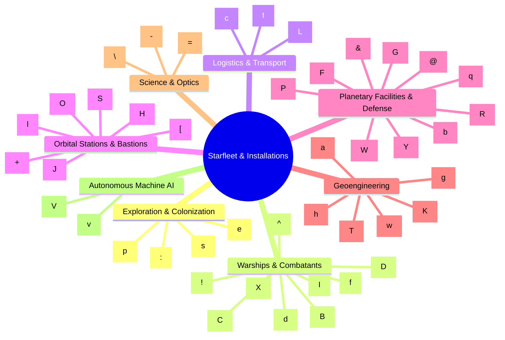
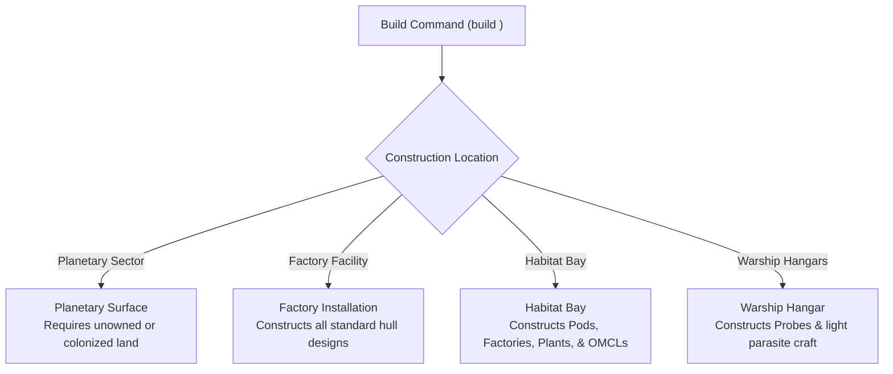

# Ship Classes, Technical Specifications, and Construction Catalog

## Overview

In **Galactic Bloodshed**, an empire's starfleet encompasses 47 distinct vessel and installation classes, ranging from light exploratory probes and planetary terraformers to massive fleet carriers, mobile factories, orbital fortresses, and ground defense fortifications.

Each vessel class is defined by standard baseline characteristics:
- **Classification Letter**: A unique single-character symbol identifying the vessel on tactical maps, system sensor sweeps, and order rosters.
- **Technology Requirement**: The minimum imperial scientific technology level ($\text{tech}$) required to design and manufacture baseline vessels of that class.
- **Construction Cost**: The base currency expenditure required to commission the hull.
- **Builder Capabilities & Shipyard Requirements**: Where the vessel can be constructed (planetary surface, mobile orbital factories, habitat bays, warship hangars).
- **Physical Specifications**: Structural hull armor, impulse engine throttle, propellant capacity, resource cargo hold, destructive munition storage, crew complement, and kinetic/laser gun batteries.
- **Operational Capabilities**: Atmospheric landing, hyperjump drives, warp crystal mounting, starport trade hubs, self/fleet repair, and economic maintenance costs.

---

## 1. Classification & Fleet Summary

---

## 2. Reconnaissance, Exploration & Colonization

These vessels form the vanguard of imperial expansion, establishing initial orbital presence and mapping uncharted star systems.

| Class | Letter | Tech Req | Cost | Armor | Speed | Fuel | Cargo | Destruct | Crew | Guns | Laser Mount | Capabilities |
| :--- | :---: | :---: | :---: | :---: | :---: | :---: | :---: | :---: | :---: | :---: | :---: | :--- |
| **Spore Pod** | `p` | 0 | 1 | 0 | 2 | 20 | 0 | 0 | 1 | 0 | No | Land, Repair, No Maint |
| **Shuttle** | `s` | 10 | 2 | 0 | 4 | 20 | 25 | 2 | 10 | 1 (L) | No | Land, Mod, Maint |
| **Explorer** | `e` | 40 | 2 | 1 | 6 | 35 | 10 | 15 | 5 | 5 (M) | Yes | Land, Hyper, Crystal, Mod, Maint |
| **Space Probe** | `:` | 150 | 10 | 0 | 9 | 20 | 0 | 0 | 0 | 0 | No | Land, Unmanned, Built in Warships/Stations |

### Tactical Notes
- **Spore Pod (`p`)**: Inexpensive, self-repairing colony seed craft. Requires zero technology and incurs no maintenance. Ideal for early-game expansion and depositing pioneer populations on habitable worlds.
- **Shuttle (`s`)**: Light, general-purpose utility craft for ferrying initial colonists and small resource packages between orbital stations and planetary surfaces.
- **Explorer (`e`)**: Premier long-range interstellar scout. Equipped with hyperjump drives, crystal mounting racks, and high sub-light speed to rapidly survey distant systems.
- **Space Probe (`:`)**: Fast, automated robotic reconnaissance vehicle. Uncrewed yet exploration-capable; built inside warship hangars or space stations for deep space telemetry sweeps.

---

## 3. Warships and Fleet Combatants

The primary combat arm of the navy, ranging from swarm strike craft to super-capital battle line flagships.

| Class | Letter | Tech Req | Cost | Armor | Speed | Fuel | Cargo | Destruct | Crew | Guns | Caliber | Laser Mount | Capabilities |
| :--- | :---: | :---: | :---: | :---: | :---: | :---: | :---: | :---: | :---: | :---: | :---: | :---: | :--- |
| **Fighter Group** | `f` | 100 | 1 | 2 | 9 | 10 | 0 | 40 | 1 | 20 | M / L | Yes | Hyper, Crystal, CEW, Mod, Maint |
| **Destroyer** | `d` | 100 | 5 | 3 | 6 | 80 | 110 | 120 | 15 | 15 | M / M | Yes | Hyper, Crystal, CEW, Mod, Maint |
| **Cruiser** | `C` | 150 | 10 | 5 | 6 | 120 | 165 | 300 | 20 | 20 | H / M | Yes | Hyper, Crystal, CEW, Mod, Maint |
| **Interceptor** | `I` | 150 | 15 | 3 | 6 | 200 | 110 | 120 | 20 | 20 | M / M | Yes | Hyper, Crystal, CEW, Mod, Maint |
| **Battleship** | `B` | 200 | 20 | 7 | 6 | 200 | 235 | 400 | 30 | 30 | H / M | Yes | Hyper, Crystal, CEW, Mod, Maint |
| **Dreadnaught** | `D` | 300 | 40 | 10 | 6 | 500 | 500 | 500 | 60 | 60 | H / M | Yes | Hyper, Crystal, CEW, Mod, Maint |
| **Carrier** | `X` | 250 | 30 | 5 | 4 | 1000 | 600 | 800 | 30 | 30 | H / M | Yes | 200 Hangar, Hyper, Crystal, Repair, Maint |
| **Space Mine** | `!` | 50 | 30 | 1 | 2 | 20 | 0 | 25 | 0 | 0 | — | No | Switch, Proximity Detonation, No Maint |
| **Missile** | `^` | 50 | 5 | 0 | 6 | 5 | 0 | 10 | 0 | 0 | — | No | Switch, Guided Kinetic Ordnance, No Maint |

### Tactical Notes
- **Gun Calibers**: Heavy ($H=3$), Medium ($M=2$), Light ($L=1$). Combat damage scales directly with gun caliber and active battery power.
- **Fighter Group (`f`)**: Fast, carrier-borne strike craft with high sub-light velocity ($9$) and heavy concentrated firepower relative to hull displacement.
- **Carrier (`X`)**: Mobile naval base boasting a $200$-capacity parasite craft hangar. Carries extensive fuel/ammo reserves and provides fleet repair capabilities.
- **Battleship (`B`) & Dreadnaught (`D`)**: Heavy armored battle line vessels designed for fleet-to-fleet slugfests and planetary siege operations.
- **Space Mine (`!`)**: Deployable perimeter area-denial munition that triggers on unallied ships entering proximity.

---

## 4. Logistics, Cargo & Planetary Assault

Logistical vessels sustain distant colonies, supply combat fleets with fuel and ammunition, and spearhead surface invasions.

| Class | Letter | Tech Req | Cost | Armor | Speed | Fuel | Cargo | Destruct | Crew | Guns | Capabilities |
| :--- | :---: | :---: | :---: | :---: | :---: | :---: | :---: | :---: | :---: | :---: | :--- |
| **Cargo Ship** | `c` | 100 | 10 | 2 | 4 | 1000 | 1000 | 1000 | 100 | 10 (L) | Land, Hyper, Crystal, Mod, Maint |
| **Tanker** | `t` | 100 | 10 | 2 | 4 | 5000 | 200 | 200 | 10 | 10 (L) | Land, Hyper, Crystal, Mod, Maint |
| **Lander** | `L` | 150 | 50 | 7 | 2 | 100 | 100 | 200 | 500 | 10 (H) | Land, Hyper, Crystal, 500 Troops, Mod, Maint |

### Tactical Notes
- **Cargo Ship (`c`)**: Standard bulk freighter carrying $1000$ mineral resources for planetary development and shipyard construction.
- **Tanker (`t`)**: Dedicated liquid propellant transport holding up to $5000$ fuel units for fleet refueling and deep-space staging depots.
- **Lander (`L`)**: Heavily armored planetary assault transport capable of landing $500$ ground soldiers directly onto enemy sectors under heavy defensive fire.

---

## 5. Space Stations & Orbital Bastions

Large orbital structures acting as regional command centers, industrial shipyards, trade hubs, and planetary defenses.

| Class | Letter | Tech Req | Cost | Armor | Speed | Fuel | Cargo | Destruct | Crew | Guns | Capabilities |
| :--- | :---: | :---: | :---: | :---: | :---: | :---: | :---: | :---: | :---: | :---: | :--- |
| **Habitat** | `H` | 100 | 50 | 3 | 4 | 2000 | 5000 | 500 | 2000 | 20 (M/L) | Starport, Repair, Switch, 2000 Popn, Shipyard |
| **Station** | `S` | 100 | 10 | 1 | 4 | 2000 | 5000 | 250 | 50 | 20 (M) | Starport, Repair, Defense Depot |
| **Ob Asst Pltfrm** | `O` | 200 | 40 | 5 | 4 | 2000 | 1400 | 1000 | 200 | 50 (H/M) | Hyper, Crystal, CEW, Laser Mount, Repair |
| **Space Port** | `J` | 0 | 50 | 3 | 0 | 0 | 0 | 0 | 100 | 0 | Starport, Trade & Commerce Hub, Maint |
| **Space Mirror** | `+` | 100 | 100 | 0 | 2 | 20 | 200 | 10 | 5 | 1 (L) | Focused Solar Beam / Terraforming |
| **Mind Control Lsr** | `l` | 350 | 50 | 1 | 4 | 100 | 25 | 0 | 2 | 0 | Switch, Planetary Enslavement Laser |
| **AVPM Transporter** | `[` | 200 | 300 | 0 | 0 | 1000 | 1000 | 1000 | 100 | 0 | Switch, Anti-Matter Mass Transporter |

### Tactical Notes
- **Habitat (`H`)**: Massive space colony housing up to $2000$ colonists in orbit. Acts as an operational starport and internal shipyard capable of manufacturing factories, pods, and light craft.
- **Space Port (`J`)**: Essential planetary infrastructure for market bidding, merchant shipping, commodity trading, and off-world exports.
- **Space Mirror (`+`)**: Orbiting solar reflector used to warm planets, melt ice sheets, or focus concentrated solar radiation against hostile ground targets.
- **Orbital Assault Platform (`O`)**: Formidable defense station armed with $50$ heavy guns and concentrated energy weapons to repel invading fleets.

---

## 6. Planetary Facilities & Surface Fortifications

Fixed surface installations constructed on planetary sectors to govern populations, extract resources, fabricate weapons, and repel ground invasions.

| Class | Letter | Tech Req | Cost | Armor | Cargo | Fuel | Crew | Guns | Capabilities |
| :--- | :---: | :---: | :---: | :---: | :---: | :---: | :---: | :---: | :--- |
| **Factory** | `F` | 0 | 20 | 0 | 50 | 0 | 20 | 0 | Ship Construction Shipyard, Switch, Repair |
| **Weapons Plant** | `W` | 0 | 20 | 5 | 500 | 500 | 20 | 0 | Munitions Fabrication, Ammo Depot |
| **Govrnmnt. Center** | `@` | 0 | 500 | 20 | 500 | 1000 | 10 | 10 (L) | Imperial Capital, Starport, Governance, 20 Armor |
| **Quarry** | `q` | 0 | 10 | 1 | 0 | 200 | 50 | 0 | Automated Mineral Extraction |
| **Dome** | `Y` | 10 | 10 | 1 | 100 | 0 | 20 | 0 | Colonist Atmospheric Shelter |
| **Bunker** | `b` | 10 | 100 | 15 | 100 | 100 | 100 | 0 | Heavy Ground Fortification, 100 Troops, 20 Hangar |
| **Gamma Ray Laser** | `G` | 100 | 30 | 3 | 50 | 0 | 40 | 20 (L) | Surface-to-Orbit Defensive Battery, CEW |
| **Planet Def Net** | `P` | 200 | 100 | 10 | 50 | 0 | 50 | 20 (H) | Automated Orbital Defense Shield / Berserker Deterrent |
| **ABM Battery** | `&` | 100 | 50 | 5 | 5 | 0 | 5 | 5 (L) | Anti-Ballistic Missile Interception |
| **Mech AFV** | `R` | 50 | 20 | 2 | 5 | 20 | 1 | 2 (L) | Armored Fighting Vehicle for Ground Assault |

### Tactical Notes
- **Government Center (`@`)**: Administrative capital of a world. Required to establish governors, collect taxation, and coordinate sector development. Boasts heavy $20$ armor.
- **Factory (`F`) & Weapons Plant (`W`)**: Industrial foundation of naval power. Factories build and repair vessels; Weapons Plants manufacture destruct crystals and missiles.
- **Planet Defense Net (`P`)**: Critical late-game defense network. Protects surface colonies and acts as an absolute strategic deterrent against automated Berserker orbital strikes.
- **ABM Battery (`&`)**: Intercepts incoming hostile space missiles and proximity mines before impact.

---

## 7. Geoengineering & Environmental Modification

Specialized terraforming equipment used to alter planetary atmospheres, adjust temperatures, and convert hostile wastelands into thriving biospheres.

| Class | Letter | Tech Req | Cost | Speed | Fuel | Cargo | Crew | Capabilities & Environmental Effects |
| :--- | :---: | :---: | :---: | :---: | :---: | :---: | :---: | :--- |
| **Terraform Device** | `T` | 50 | 20 | 4 | 200 | 40 | 20 | General planetary terraforming & sector conditioning |
| **Atmosph Processor** | `a` | 80 | 20 | 0 | 200 | 0 | 10 | Neutralizes surface toxicity into breathable atmosphere |
| **Dust Canister** | `g` | 40 | 10 | 1 | 1 | 0 | 0 | Atmospheric aerosol release to lower global temperatures |
| **Greenhouse Gases** | `h` | 40 | 10 | 1 | 1 | 0 | 0 | Injects greenhouse agents to increase global temperatures |
| **Tox Waste Canistr** | `w` | 0 | 5 | 4 | 20 | 0 | 0 | Injects toxic contaminants (environmental warfare) |
| **Space Plow** | `K` | 5 | 10 | 0 | 200 | 0 | 10 | Cleans orbital debris and purges lingering radiation |

---

## 8. Scientific & Optical Instruments

| Class | Letter | Tech Req | Cost | Speed | Fuel | Crew | Operational Function |
| :--- | :---: | :---: | :---: | :---: | :---: | :---: | :--- |
| **Space Telescope** | `=` | 50 | 20 | 4 | 20 | 2 | Long-range orbital astronomy and sector reconnaissance |
| **Ground Telescope** | `\\` | 5 | 2 | 0 | 0 | 2 | Surface astronomical observatory |
| **T-R Beam** | `-` | 200 | 20 | 2 | 1000 | 5 | High-energy Tractor-Repulsor beam for orbital course alterations |

---

## 9. Autonomous Machine AI & Berserkers

Autonomous self-replicating robotic units and automated combat machines.

| Class | Letter | Tech Req | Cost | Armor | Speed | Fuel | Destruct | Guns | Operational Role |
| :--- | :---: | :---: | :---: | :---: | :---: | :---: | :---: | :---: | :--- |
| **V.Neumann Machine** | `v` | 80 | 100 | 1 | 4 | 50 | 0 | 0 | Autonomous robotic surface miner & self-replicator |
| **Berserker** | `V` | 999 | 100 | 15 | 6 | 1000 | 500 | 40 (H/M) | Automated planetary saturation bombardment warship |
| **Bers Cntrl Center** | `;` | 9999 | 3 | 10 | 0 | 0 | 50 | 0 | Deity/admin automated machine AI command center |
| **Bers Autofac** | `Z` | 9999 | 8 | 10 | 0 | 1000 | 1000 | 0 | Deity/admin automated berserker fabrication shipyard |
| **GODSHIP** | `!` | 9999 | 10 | 100 | 9 | 20000 | 20000 | 1000 | Omnipotent deity administrative vessel |

---

## 10. Construction Locations & Shipyard Hierarchy

Vessels can only be constructed in facilities equipped with matching shipyard capabilities:

| Builder Type | Eligible Ship Classes Built Here |
| :--- | :--- |
| **Planetary Surface** | Spore Pods, Shuttles, Government Centers, Factories, Weapons Plants, Quarries, Domes, Space Ports, Ground Telescopes, ABM Batteries, Gamma Ray Lasers, Planet Defense Nets, Bunkers. |
| **Factory (`F`)** | All standard space combatants (Fighters, Destroyers, Cruisers, Battleships, Dreadnaughts, Carriers), Freighters, Tankers, Landers, Explorers, Stations, Habitats, Terraformers. |
| **Habitat (`H`)** | Spore Pods, Factories, Weapons Plants, Terraform Devices, Mind Control Lasers, Government Centers, Space Probes. |
| **Warship Hangars (`B`, `D`, `C`, `X`)** | Dedicated Space Probes (`:`). |

---

## See Also

- [Starships, Orbital Hierarchies, and Naval Mechanics](ships.md)
- [Planetary Simulation Engine & Sector Dynamics](planetary_simulation.md)
- [Turn Simulation Lifecycle & Economic Accounting](turn_cycle.md)
- [Governance, Colonies, and Empire Management](governance.md)
- [Galactic Economic Model & Commodity Trading](economy.md)
- [Von Neumann Machine AI & Berserker Simulation](von_neumann.md)
