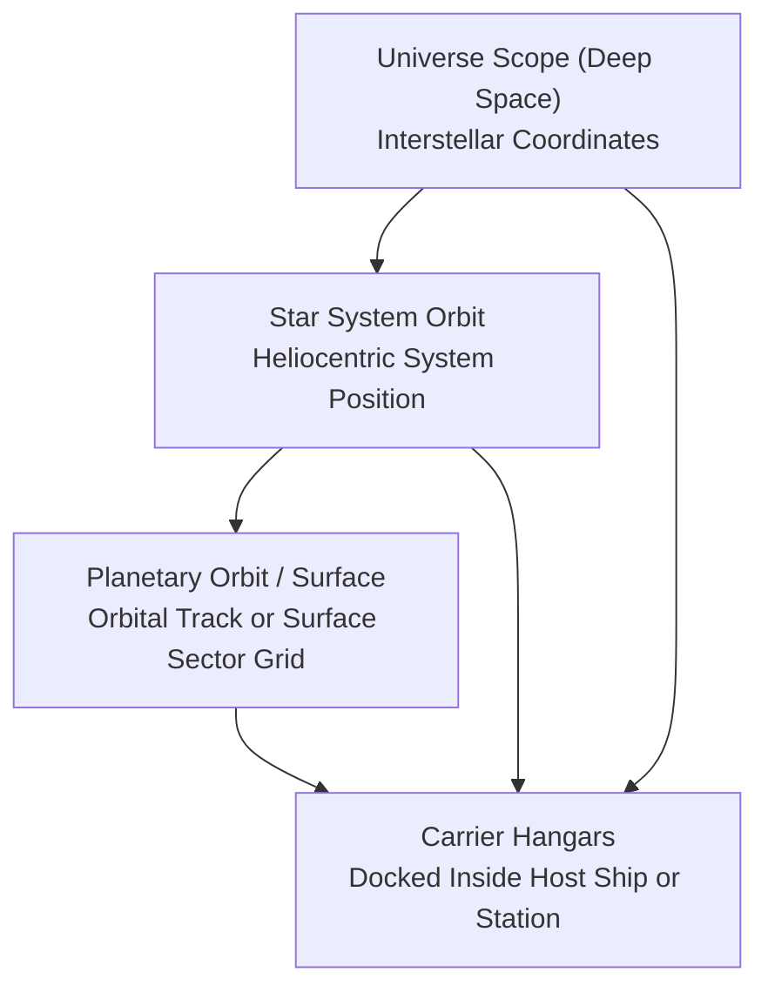
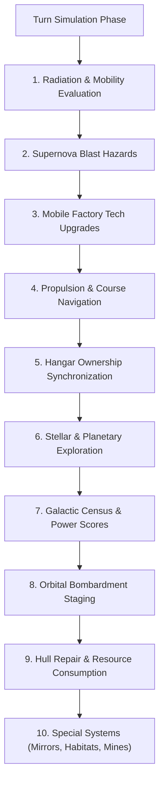
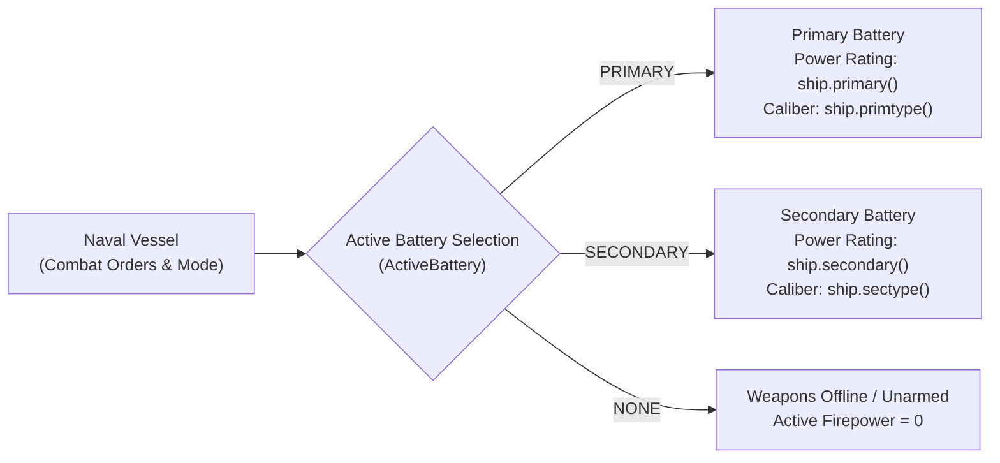
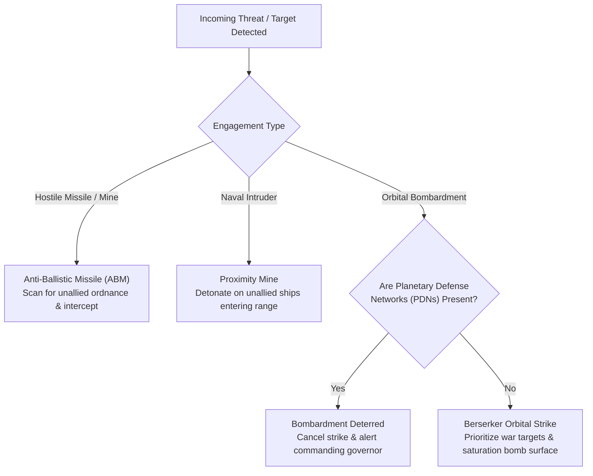

# Starships, Orbital Hierarchies, and Naval Mechanics

## Overview

Starships in **Galactic Bloodshed** represent an empire's primary instruments of interstellar exploration, orbital transport, colonization, planetary bombardment, and space warfare. Vessels range from unmanned sensor probes and atmospheric terraformers to massive carrier flagships, mobile factory ships, and crystal-mounted dreadnoughts.

This guide details naval operations, orbital reference frames, carrier docking hierarchies, environmental hazards (radiation, supernovae), hull maintenance, and turn update mechanics.

---

## 1. Orbital Reference Frames and Spatial Positioning

A vessel in Galactic Bloodshed operates within one of four spatial reference frames:



| Reference Frame | Operational Context | Navigation & Orders |
| :--- | :--- | :--- |
| **Universe Scope** | Deep space between star systems | Long-range interstellar transit, hyperspace jump routes, deep space sensor reconnaissance |
| **Star System Orbit** | In orbit around a star | Interplanetary patrols, space mirror positioning, system defense, system interception |
| **Planetary Scope** | In low orbit around a world or landed on the planetary surface | Planetary bombardment, cargo loading/unloading, ground troop deployment, surface mining |
| **Carrier Hangars** | Docked inside a host carrier or space station | Parasite craft transport, carrier protection, hangar bay maintenance |

---

## 2. Carrier Docking and Fleet Ownership

Capital vessels and space stations (such as Fleet Carriers, Mobile Factories, and Orbital Stations) are equipped with internal hangar bays capable of docking smaller parasite craft (such as Fighters, Shuttles, and Probes).

### Hangar Operations
- **Docking**: Smaller vessels can dock with friendly carriers or stations to be transported across interstellar distances without expending their own fuel.
- **Fleet Allegiance**: Docked craft operate under the direct command of the host carrier. Whenever a vessel is docked inside a carrier, the carrier's commanding empire and governor maintain operational control of all carried craft. If a carrier changes allegiance, all docked craft within its hangars transition with the carrier.

### Dynamic Operational Mass
A carrier's total displacement includes its baseline structure, stored consumables, transported populations, and all docked parasite craft:

$$\text{Mass}_{\text{total}} = \text{Base Hull Mass} + (\text{Fuel} \times 0.01) + (\text{Resources} \times 0.1) + (\text{Destruct} \times 0.1) + (\text{Crew} + \text{Troops}) \times M_{\text{race}} + \sum \text{Mass}_{\text{docked}}$$

where $M_{\text{race}}$ is the physical body mass per individual colonist or soldier of the carried species.

---

## 3. Planetary and Stellar Exploration

An empire expands its galactic awareness through exploration-capable starships.

### Exploration Criteria
A starship can survey star systems and map planetary biospheres if it meets either of the following requirements:
1. **Living Crew**: Any starship carrying living colonists or crew members ($\text{Colonists} > 0$).
2. **Dedicated Sensor Probes**: Automated reconnaissance probes specially engineered for unmanned exploration and deep space telemetry.

Uncrewed freighters, unmanned cargo pods, and empty hulls cannot map worlds or discover star systems.

### Discovery Mechanics
- **Star Systems**: Entering a star system with an exploration-capable vessel surveys the system for the empire, revealing all orbited planets, orbital distances, and stellar classifications.
- **Planetary Biospheres**: Establishing planetary orbit or landing on a world surveys the planet, uncovering surface terrain composition, atmospheric toxicity, temperature, and colony presence.

---

## 4. Naval Turn Lifecycle

During each simulation segment and turn update, all active vessels in the galaxy are processed through sequential naval subsystems:



### 1. Radiation Hazards and Crew Sickness
Ships contaminated by nuclear fallout, stellar flares, or weapon detonations ($\text{Radiation} > 0$) experience system failures and crew casualties:
- **Mobility Gating**: Guidance and engine systems have a probability of failing proportional to radiation intensity:
  $$P(\text{Immobilized}) = \frac{\text{Radiation Level}}{100}$$
- **Crew Attrition**: On full turn updates, radiation sickness claims $20\%$ of living crew and carried military troops:
  $$\text{Crew}_{\text{new}} = \left\lfloor \text{Crew}_{\text{old}} \times 0.80 \right\rfloor, \quad \text{Troops}_{\text{new}} = \left\lfloor \text{Troops}_{\text{old}} \times 0.80 \right\rfloor$$
- **Natural Decontamination**: Radiation dissipates over time during update passes:
  $$\Delta \text{Radiation} = -\text{UniformRandom}\Big(0, \min\big(\text{Radiation}, \text{Base Decontamination Rate}\big)\Big)$$

### 2. Supernova Blast Waves
Vessels caught in a star system undergoing a nova collapse suffer extreme radiant heat and physical shockwave damage:
$$\Delta \text{Damage} = \left\lfloor \frac{5 \times \text{Nova Stage}}{(\text{Effective Armor} + 1) \times S} \right\rfloor$$

where $S$ is the number of simulation segments per update pass. If cumulative structural damage reaches or exceeds $100\%$, the vessel is destroyed by the blast.

### 3. Mobile Factory Technology Upgrades
Offline Mobile Factories automatically modernize their internal manufacturing tooling to match the owning empire's current imperial technology level ($\text{Tech}_{\text{factory}} \leftarrow \text{Tech}_{\text{empire}}$). Powering down a factory allows it to absorb the latest technological breakthroughs before resuming production.

### 4. Hull Maintenance and Resource Consumption
Damaged vessels ($\text{Damage} > 0$) attempt structural repairs during turn updates:
- **Free Station Maintenance**: Orbital repair stations and vessels docked with them perform hull repairs without consuming stored resources.
- **Crew Repair Scaling**: The effective repair output scales with available crew staffing:
  $$r_{\text{crew}} = \frac{\text{Current Crew}}{\text{Maximum Crew Capacity}}$$
  $$\text{Max Repair} = \text{Base Repair Rate} \times r_{\text{crew}}$$
- **Resource Cost**: Repairing hull damage consumes refined minerals:
  $$\text{Resource Cost} = \left\lfloor 0.005 \times \text{Max Repair} \times \text{Ship Construction Cost} \right\rfloor$$
- **Partial Maintenance**: If stored resources are insufficient to cover full maintenance, all available resources are expended for proportional partial repairs:
  $$\text{Damage Repaired} = \left\lfloor \text{Max Repair} \times \left(\frac{\text{Stored Resources}}{\text{Resource Cost}}\right) \right\rfloor$$
  Unmanned sensor probes safely bypass crewed maintenance formulas.

---

## 5. Specialized Naval Equipment and Planetary Geoengineering

Certain starship classes are equipped with advanced scientific, industrial, or biological subsystems that alter planetary environments, manufacture munitions, or incubate populations during turn updates.

### Space Mirrors and Solar Redirection
Space Mirrors are massive orbital reflector arrays designed to redirect stellar radiation onto planetary biospheres for terraforming, heating, or climate stabilization:
- **Stellar Alignment**: A space mirror must be actively aimed at its host star to function. Mirrors in an unaimed standby mode do not redirect energy.
- **Planetary Thermal Modification**: When stationed in planetary orbit, the mirror focuses stellar energy into the target world's upper atmosphere:
  $$\Delta T = \left\lfloor \frac{\text{Solar Radiation} \times \text{Mirror Efficiency}}{\max(1, \text{Target Planet Radius})} \right\rfloor$$
  Mirrors can be configured to heat freezing worlds or shaded to cool overheated greenhouse planets toward species-compatible equilibrium temperatures.

### Atmosphere Processors
Atmosphere Processors perform large-scale planetary geoengineering by converting ambient gases into breathable atmosphere:
- **Atmospheric Modification**: Active processors operating on planetary surfaces modify local atmospheric gas concentrations (methane, oxygen, carbon dioxide, helium, nitrogen, sulfur) by calibrated per-segment increments.
- **Safety Clamping**: Planetary atmospheric concentrations and toxicity ratings are strictly bounded within $[0\%, 100\%]$ to prevent ecological collapse or unphysical gas densities.

### Orbital Habitats and Population Incubators
Orbital Habitats function as specialized bioship incubators capable of generating civilian population in deep space or orbit:
- **Incubator Operations**: Active habitats consume stored fuel and raw minerals to synthesize life-support biomass and incubate new colonists:
  $$\Delta \text{Population} = \left\lfloor \text{Incubation Rate} \times \frac{\text{Current Population}}{\text{Maximum Crew Capacity}} \right\rfloor$$
- **Dynamic Displacement**: As new colonists are generated, the ship's operational mass increases proportionally based on the biological body mass of the incubated species ($M_{\text{race}}$).

### Weapon Plants and Munitions Manufacturing
Weapon Plants are automated manufacturing modules that convert raw industrial resources into destructive ordnance (`destruct`):
- **Munitions Synthesis**: Each turn segment, operational weapon plants produce new destructive ordnance:
  $$\Delta \text{Destruct} = \min\Big(\text{Available Crew Staffing}, \text{Stored Resources}, \text{Stored Fuel} \times 2, \text{Unallocated Ammo Capacity}\Big)$$
- **Resource Depletion**: Synthesizing ammo consumes resources and fuel at a $1:1$ resource and $0.5:1$ fuel ratio, dynamically adjusting total vessel mass.

### Biological Spore Pods and Climate Modifiers
- **Spore Pods**: Bio-seeding craft capable of dispersing alien spores across planetary sectors. In multi-planet star systems, unmanned biological pods select target worlds across the system to initiate planetary seeding.
- **Canisters and Greenhouses**: Specialized payload canisters and greenhouse modules release dense greenhouse agents to raise planetary temperatures or stabilize atmospheric pressure.

---

## 6. Naval Weapon Systems, Battery Calibers, and Tactical Fire Control

Starships engage in tactical naval combat through modular kinetic gun batteries, directed-energy beam weapons, and stored destructive munitions.

### Dual Battery Architecture

Warships support up to two distinct weapon installations: a **Primary Battery** and a **Secondary Battery**. Each battery operates with independent mount capacity (`primary`, `secondary`) and an assigned weapon **Caliber** (`primtype`, `sectype`):



### Weapon Calibers

Gun calibers dictate effective engagement range, damage output per volley, penetration capability, and munition consumption:

| Caliber Designation | Tactical Characteristics & Fleet Role | Munition Profile |
| :--- | :--- | :--- |
| **None / Unarmed** | Unarmed battery mount or disabled weapon slot. | 0 destruct / volley |
| **Light Guns** | High tracking velocity and rapid cyclic fire; optimized for anti-fighter screening and point defense. | Low ammo draw |
| **Medium Guns** | General-purpose fleet battery; balanced range and damage against cruisers and destroyers. | Standard ammo draw |
| **Heavy Guns** | Heavy capital ship spinal mounts and planetary siege cannons; devastating kinetic strike against battleships and surface installations. | High ammo draw |

### Active Battery Selection

During combat encounters, a vessel's tactical fire control directs fire through the currently selected battery mode:
- **Primary Battery**: Fire control is routed through the primary battery mount.
- **Secondary Battery**: Fire control is routed through the secondary battery mount.
- **Standby / Disarmed**: All batteries remain on standby with zero offensive output (useful for non-combat ships, factory vessels during retooling, or stealth operations).

Captains select the active battery using the `order` command:
```text
order <ship> primary     # Directs weapons to primary battery
order <ship> secondary   # Switches fire control to secondary battery
order <ship> none        # Places weapons on standby
```

### Automated Retaliation Thresholds

Starships can be programmed with an automated retaliation threshold (`retaliate`), configuring the vessel to return defensive counter-fire immediately when fired upon by hostile craft:
$$\text{Effective Counter-Fire} = \min\Big(\text{Programmed Retaliation Level}, \text{Active Battery Power}, \text{Stored Destruct Ammo}\Big)$$
This ensures defensive perimeter vessels and patrols automatically respond to hostile incursions without requiring real-time player intervention.

### Directed Energy Weapons and Munitions

In addition to kinetic gun batteries, vessels can mount specialized energy projection systems:
- **Combat Lasers**: Direct-fire optical beam weapons providing instantaneous, armor-piercing point defense and short-range interception.
- **Concentrated Energy Weapons (CEW)**: High-yield particle and plasma projectors with dedicated beam ratings and tunable focus ranges.
- **Destructive Munitions (Destruct)**: Physical kinetic warheads and explosive ordnance stored in cargo bays, consumed proportionally with each kinetic battery salvo and planetary bombardment strike.

### Naval Batteries vs. Planetary Defense Installations

A critical distinction in empire defense architectures is the separation between mobile naval systems and fixed planetary installations:
- **Naval Batteries**: Mobile ship-mounted weapon systems utilizing active battery switching and vessel-stored destruct munitions.
- **Planetary Defense Batteries**: Ground-based surface defensive installations permanently mounted across planetary sectors, defending colonies from landing assaults and returning retaliatory fire during orbital bombardment runs.

---

## 7. Point Defense, Interception, and Autonomous Combat

Planetary and naval engagements feature autonomous defensive networks, interceptor batteries, and automated orbital bombardment systems.



### Point Defense Networks (PDNs) and Bombardment Deterrence
Point Defense Networks (PDNs) are specialized heavy defense installations stationed on planetary surfaces or in low orbit:
- **Strategic Deterrence**: The presence of any operational, unallied PDN on a planet acts as an absolute strategic deterrent against automated Berserker saturation bombing. Automated bombardment runs are immediately aborted upon detecting active foreign PDNs.

### Autonomous Berserker Saturation Bombardment
Automated Berserker warships orbiting foreign planets execute tactical saturation bombardment against surface colonies:
- **Targeting Priority**:
  1. Active colonies belonging to empires with which the ship's empire is **at war**.
  2. Colonies belonging to a **specifically programmed target species**.
  3. Any unallied foreign colony on the planetary surface.
- **Bombardment Firepower**: Effective orbital strike power is determined by operational gun mounts, structural damage, and available destructive ordnance:
  $$\text{Strike Power} = \min\left(\left\lfloor \text{Template Gun Mounts} \times \frac{100 - \text{Damage}}{100} \right\rfloor, \text{Stored Destruct Ammo}\right)$$
- **Sector Devastation & Retaliation**: The bombardment converts target sectors into nuclear wasteland, reduces planetary population, and expends destruct ammo. Defending surface batteries return retaliatory ground fire, and automated alert bulletins are dispatched to the planetary governors of all affected empires.

### Proximity Minefields
Proximity Mines are stationary spatial munitions deployed in star systems or planetary orbits:
- **Autonomous Detonation**: Mines continuously monitor local space for moving vessels. When an unallied vessel enters triggering range, the mine detonates its full destructive payload.
- **Alliance Safety**: Allied and coalition fleets sharing friendly diplomatic relations safely navigate through friendly minefields without triggering detonations.

### Anti-Ballistic Missile (ABM) Interception
ABM platforms provide automated point defense against incoming space-to-space ordnance:
- **Threat Identification**: ABM batteries continuously scan local orbital tracks for incoming missiles and drifting mines belonging to hostile or unallied empires.
- **Precision Interception**: Upon detecting hostile ordnance, the ABM fires interceptor rounds to neutralize the threat before it reaches target vessels, while sparing friendly missiles and allied torpedoes.

---

## 8. Imperial Power and the Galactic Census

During turn updates, active ships report their operational readiness to Imperial Intelligence and the Galactic Census:
- **Empire Power Ratings**: Active starships contribute directly to an empire's global strength rating based on hull count, propellant reserves, mineral stockpiles, carried destructive ordnance, colonist populations, and military troop strength.
- **Demographic Distribution**: Census reports aggregate vessel counts and carried populations across deep space corridors and localized star systems, reflecting imperial expansion across the galaxy.

---

## See Also
- [Ship Classes and Construction Catalog](ship_types.md)
- [Tactical Combat, Naval Gunnery, and Planetary Warfare](combat.md)
- [Interstellar Navigation, Propulsion, and Hyperspace Mechanics](navigation.md)
- [Stellar Mechanics, Spectral Classes, and Nova Lifecycles](stars.md)
- [Planetary Mechanics, Colonization, and Surface Topography](planets.md)
- [Planetary Simulation Engine and Sector Dynamics](planetary_simulation.md)
- [Governance, Capitals, and Imperial Administration](governance.md)
- [Imperial Economy, Planetary Stockpiles, and Technology Investment](economy.md)
- [Turn Simulation Lifecycle and Scheduling](turn_cycle.md)
- [Autonomous Machine AI, Von Neumann Probes, and Berserker Warships](von_neumann.md)
