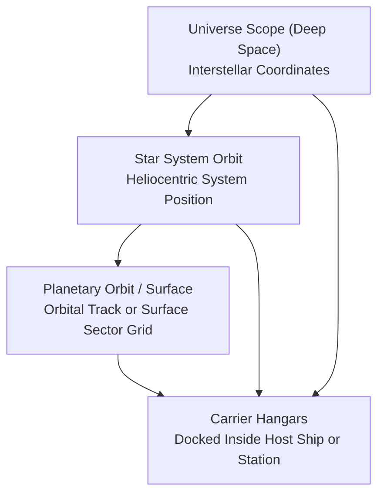
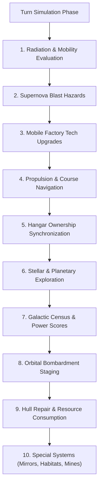

# Starships, Orbital Hierarchies, and Naval Mechanics

## Overview

Starships in **Galactic Bloodshed** represent an empire's primary instruments of interstellar exploration, orbital transport, colonization, planetary bombardment, and space warfare. Vessels range from unmanned sensor probes and atmospheric terraformers to massive carrier flagships, mobile factory ships, and crystal-mounted dreadnoughts.

This guide details naval operations, orbital reference frames, carrier docking hierarchies, environmental hazards (radiation, supernovae), hull maintenance, and turn update mechanics.

---

## 1. Orbital Reference Frames and Spatial Positioning

A vessel in Galactic Bloodshed operates within one of four spatial reference frames:

| Reference Frame | Operational Context | Navigation & Orders |
| :--- | :--- | :--- |
| **Universe Scope** | Deep space between star systems | Long-range interstellar transit, hyperspace jump routes, deep space sensor reconnaissance |
| **Star System Orbit** | In orbit around a star | Interplanetary patrols, space mirror positioning, system defense, system interception |
| **Planetary Scope** | In low orbit around a world or landed on the planetary surface | Planetary bombardment, cargo loading/unloading, ground troop deployment, surface mining |
| **Carrier Hangars** | Docked inside a host carrier or space station | Parasite craft transport, carrier protection, hangar bay maintenance |

---

## 2. Carrier Docking and Fleet Ownership

Capital vessels and space stations (such as Fleet Carriers, Mobile Factories, and Orbital Stations) are equipped with internal hangar bays capable of docking smaller parasite craft (such as Fighters, Shuttles, and Probes).

### Hangar Operations
- **Docking**: Smaller vessels can dock with friendly carriers or stations to be transported across interstellar distances without expending their own fuel.
- **Fleet Allegiance**: Docked craft operate under the direct command of the host carrier. Whenever a vessel is docked inside a carrier, the carrier's commanding empire and governor maintain operational control of all carried craft. If a carrier changes allegiance, all docked craft within its hangars transition with the carrier.

### Dynamic Operational Mass
A carrier's total displacement includes its baseline structure, stored consumables, transported populations, and all docked parasite craft:

$$\text{Mass}_{\text{total}} = \text{Base Hull Mass} + (\text{Fuel} \times 0.01) + (\text{Resources} \times 0.1) + (\text{Destruct} \times 0.1) + (\text{Crew} + \text{Troops}) \times M_{\text{race}} + \sum \text{Mass}_{\text{docked}}$$

where $M_{\text{race}}$ is the physical body mass per individual colonist or soldier of the carried species.

---

## 3. Planetary and Stellar Exploration

An empire expands its galactic awareness through exploration-capable starships.

### Exploration Criteria
A starship can survey star systems and map planetary biospheres if it meets either of the following requirements:
1. **Living Crew**: Any starship carrying living colonists or crew members ($\text{Colonists} > 0$).
2. **Dedicated Sensor Probes**: Automated reconnaissance probes specially engineered for unmanned exploration and deep space telemetry.

Uncrewed freighters, unmanned cargo pods, and empty hulls cannot map worlds or discover star systems.

### Discovery Mechanics
- **Star Systems**: Entering a star system with an exploration-capable vessel surveys the system for the empire, revealing all orbited planets, orbital distances, and stellar classifications.
- **Planetary Biospheres**: Establishing planetary orbit or landing on a world surveys the planet, uncovering surface terrain composition, atmospheric toxicity, temperature, and colony presence.

---

## 4. Naval Turn Lifecycle

During each simulation segment and turn update, all active vessels in the galaxy are processed through sequential naval subsystems:

### 1. Radiation Hazards and Crew Sickness
Ships contaminated by nuclear fallout, stellar flares, or weapon detonations ($\text{Radiation} > 0$) experience system failures and crew casualties:
- **Mobility Gating**: Guidance and engine systems have a probability of failing proportional to radiation intensity:
  $$P(\text{Immobilized}) = \frac{\text{Radiation Level}}{100}$$
- **Crew Attrition**: On full turn updates, radiation sickness claims $20\%$ of living crew and carried military troops:
  $$\text{Crew}_{\text{new}} = \left\lfloor \text{Crew}_{\text{old}} \times 0.80 \right\rfloor, \quad \text{Troops}_{\text{new}} = \left\lfloor \text{Troops}_{\text{old}} \times 0.80 \right\rfloor$$
- **Natural Decontamination**: Radiation dissipates over time during update passes:
  $$\Delta \text{Radiation} = -\text{UniformRandom}\Big(0, \min\big(\text{Radiation}, \text{Base Decontamination Rate}\big)\Big)$$

### 2. Supernova Blast Waves
Vessels caught in a star system undergoing a nova collapse suffer extreme radiant heat and physical shockwave damage:
$$\Delta \text{Damage} = \left\lfloor \frac{5 \times \text{Nova Stage}}{(\text{Effective Armor} + 1) \times S} \right\rfloor$$

where $S$ is the number of simulation segments per update pass. If cumulative structural damage reaches or exceeds $100\%$, the vessel is destroyed by the blast.

### 3. Mobile Factory Technology Upgrades
Offline Mobile Factories automatically modernize their internal manufacturing tooling to match the owning empire's current imperial technology level ($\text{Tech}_{\text{factory}} \leftarrow \text{Tech}_{\text{empire}}$). Powering down a factory allows it to absorb the latest technological breakthroughs before resuming production.

### 4. Hull Maintenance and Resource Consumption
Damaged vessels ($\text{Damage} > 0$) attempt structural repairs during turn updates:
- **Free Station Maintenance**: Orbital repair stations and vessels docked with them perform hull repairs without consuming stored resources.
- **Crew Repair Scaling**: The effective repair output scales with available crew staffing:
  $$r_{\text{crew}} = \frac{\text{Current Crew}}{\text{Maximum Crew Capacity}}$$
  $$\text{Max Repair} = \text{Base Repair Rate} \times r_{\text{crew}}$$
- **Resource Cost**: Repairing hull damage consumes refined minerals:
  $$\text{Resource Cost} = \left\lfloor 0.005 \times \text{Max Repair} \times \text{Ship Construction Cost} \right\rfloor$$
- **Partial Maintenance**: If stored resources are insufficient to cover full maintenance, all available resources are expended for proportional partial repairs:
  $$\text{Damage Repaired} = \left\lfloor \text{Max Repair} \times \left(\frac{\text{Stored Resources}}{\text{Resource Cost}}\right) \right\rfloor$$
  Unmanned sensor probes safely bypass crewed maintenance formulas.

---

## 5. Imperial Power and the Galactic Census

During turn updates, active ships report their operational readiness to Imperial Intelligence and the Galactic Census:
- **Empire Power Ratings**: Active starships contribute directly to an empire's global strength rating based on hull count, propellant reserves, mineral stockpiles, carried destructive ordnance, colonist populations, and military troop strength.
- **Demographic Distribution**: Census reports aggregate vessel counts and carried populations across deep space corridors and localized star systems, reflecting imperial expansion across the galaxy.

---

## See Also
- [Stellar Mechanics and Star Systems](stars.md)
- [Planetary Mechanics and Colonization](planets.md)
- [Planetary Simulation Engine](planetary_simulation.md)
- [Governance and Administration](governance.md)
- [Galactic Economic Model](economy.md)
- [Von Neumann Machines and Berserkers](von_neumann.md)
