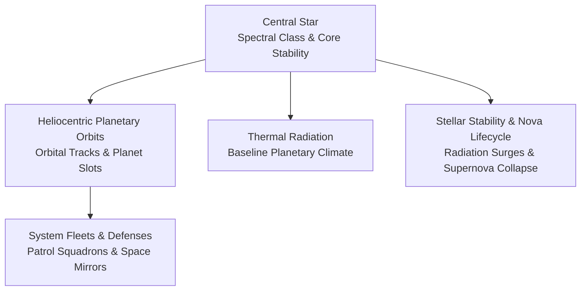
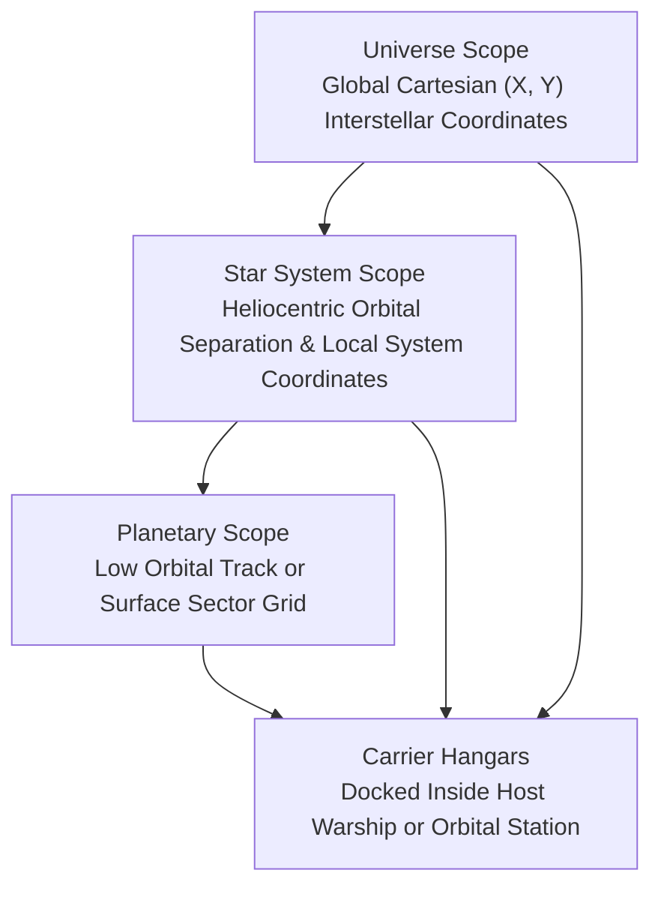
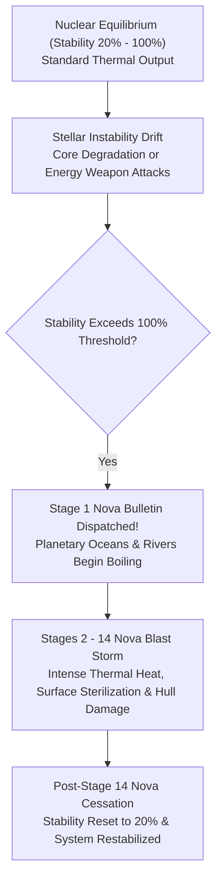

# Stellar Mechanics, Spectral Classes, and Nova Lifecycles

## Overview

Star systems form the primary gravitational hubs, economic crossroads, and navigational waypoints of **Galactic Bloodshed**. Each star system commands a heliocentric orbital hierarchy hosting terrestrial planets, moons, asteroid belts, orbital installations, and maneuvering naval fleets.

This guide details stellar spectral classifications, planetary thermal coupling, the catastrophic supernova lifecycle, spatial coordinate hierarchies, and system military intimidation.

---

## 1. Spatial Coordinate Hierarchy and Reference Frames

Galactic Bloodshed models the cosmos across four nested reference frames:

| Reference Frame | Coordinate System | Operational Context |
| :--- | :--- | :--- |
| **Universe Scope** | Global Cartesian $[0, \text{MaxX}] \times [0, \text{MaxY}]$ | Interstellar jump transit, deep space reconnaissance, hyperdrive navigation. |
| **Star System Scope** | Local heliocentric coordinates $(x, y)$ | Interplanetary cruising, space mirror alignment, system defense patrols. |
| **Planetary Scope** | Low orbit track or surface grid $[0, W-1] \times [0, H-1]$ | Orbital bombardment, cargo ferrying, assault troop landings, surface mining. |
| **Carrier Hangars** | Internal hangar bay capacity | Transporting parasite strike craft, fighters, and automated sensor probes. |

---

## 2. Stellar Classification and Spectral Types

Stars are categorized into distinct spectral classes that determine core luminosity, surface temperature, and the baseline thermal profile of orbited worlds:

| Spectral Class | Visual Classification | Stellar Temperature | Luminosity | Typical Planetary Biospheres |
| :--- | :--- | :--- | :--- | :--- |
| **O / B** | Blue-White Giants | $> 10,000\text{ K}$ | Extreme | Scorched, volcanic, super-heated molten wastelands. |
| **A / F** | White / Yellow-White Stars | $7,000 - 9,000\text{ K}$ | High | Warm, arid, tropical to temperate biospheres. |
| **G** | Yellow Dwarfs (Sol-like) | $5,000 - 6,000\text{ K}$ | Moderate | Temperate, balanced Earth-like biospheres. |
| **K / M** | Orange / Red Dwarfs | $3,000 - 4,500\text{ K}$ | Low | Cold, sub-zero, glaciated ice worlds. |
| **N** | Carbon Stars | Variable | Specialized | Hydrocarbon-rich, methane and sulfur atmospheres. |

### Planetary Thermal Coupling
A star's core luminosity ($L_{\text{star}}$) and the planet's orbital distance ($D_{\text{orbit}}$) determine the world's baseline surface temperature:

$$T_{\text{baseline}} = \left\lfloor \frac{L_{\text{star}} \times 1000}{D_{\text{orbit}}^2} \right\rfloor$$

During each turn update, planetary surface temperature fluctuates around this baseline, further modified by orbital space mirrors, greenhouse gas emissions, and atmospheric terraforming.

---

## 3. Stellar Stability and the Supernova Lifecycle

Every star core maintains a stability rating ($0\%$ to $100\%$) representing its nuclear equilibrium.

### Instability and Degeneration
- Natural stellar decay or concentrated directed-energy weapon attacks lower stellar stability.
- When core stability drifts past critical containment thresholds ($> 100\%$), the star triggers a **supernova event**.

### Supernova Stages and Blast Wave Hazards
1. **Stage 1 Nova Bulletin**: An emergency galactic bulletin broadcasts to all star empires warning that the star has entered nova collapse. On Earth-like, water, and forest worlds, seas and rivers begin boiling away. Planetary colonies must evacuate immediately.
2. **Stages 2 to 14 Nova Blast Storm**: The collapsing core unleashes devastating radiant heat and physical shockwaves:
   - **Vessel Blast Damage**: All starships and orbital stations in the star system suffer structural damage each simulation segment ($S$ segments per update):
     $$\Delta \text{Damage} = \left\lfloor \frac{5 \times \text{Nova Stage}}{(\text{Effective Armor} + 1) \times S} \right\rfloor$$
     Vessels accumulating $100\%$ structural damage are obliterated.
   - **Surface Sterilization**: Planetary biospheres suffer severe agricultural degradation, scorching fertile sectors into barren wasteland.
3. **Stage 15 Re-stabilization**: After progressing through Stage 14, the nova storm subsides. Scientists broadcast a galactic notice confirming the star has restabilized, resetting stability to $20\%$.

### Artificial Stellar Engineering
Empires equipped with space mirrors and harmonic energy emitters can focus stabilizing energy beams into the stellar core, restoring stability and preventing catastrophic nova collapse.

---

## 4. Stellar Surveying and Military Intimidation

### Exploration and Reconnaissance
- Unexplored star systems remain hidden until surveyed by an empire's starships, robotic sensor probes, orbital space telescopes, or ground observatories.
- Surveying a star system maps all orbited planets, orbital distances, planetary classifications, atmospheric compositions, and resident colonies.

### Military Intimidation
Maintaining overwhelming naval battlefleets or armed orbital platforms within a star system allows an empire to establish **military intimidation**:
- Intimidated systems experience impaired governor control, disrupted tax collection, and vulnerable trade routes.
- If a slave revolt occurs within an empire, master-owned colonies situated in intimidated star systems suffer a $50\%$ probability of sympathy uprisings and sector devastation.

---

## See Also
- [Starships, Orbital Hierarchies, and Naval Mechanics](ships.md)
- [Interstellar Navigation, Propulsion, and Hyperspace Mechanics](navigation.md)
- [Planetary Mechanics, Colonization, and Surface Topography](planets.md)
- [Planetary Simulation Engine and Sector Dynamics](planetary_simulation.md)
- [Turn Simulation Lifecycle and Scheduling](turn_cycle.md)
- [Imperial Economy, Planetary Stockpiles, and Technology Investment](economy.md)
- [Governance, Capitals, and Imperial Administration](governance.md)
