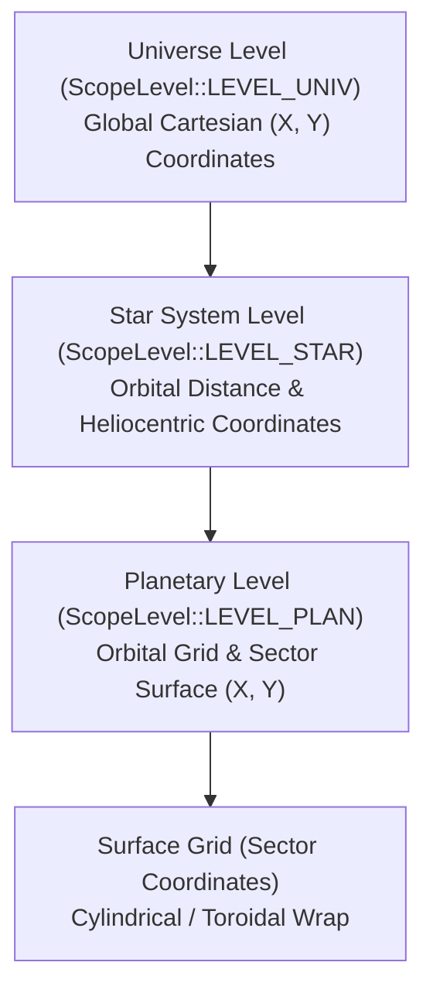

# Stellar Mechanics and Star Systems

## Overview

Star systems form the primary gravitational and navigational hubs of Galactic Bloodshed. Each star commands an orbital system containing planets, moons, asteroid belts, and fleets of spacefaring vessels. This document details stellar classification, stability and nova lifecycles, planetary destruction, and the spatial coordinate hierarchy.

## Stellar Classification and Spectral Types

Stars are categorized by their spectral class, determining baseline luminosity, surface temperature, and the thermal profile of orbited worlds:

| Spectral Class | Description | Surface Temperature | Typical Planetary Climate |
| :--- | :--- | :--- | :--- |
| **O / B** | Blue-White Giants | Extremely High (>10,000 K) | Scorched, Molten, Volatile |
| **A / F** | White / Yellow-White Stars | High (7,000–9,000 K) | Warm, Arid to Temperate |
| **G** | Yellow Dwarfs (Sol-like) | Moderate (5,000–6,000 K) | Temperate, Balanced Biospheres |
| **K / M** | Orange / Red Dwarfs | Low (3,000–4,500 K) | Cold, Glacial, Sub-zero |
| **N** | Carbon Stars | Variable | Specialized, Hydrocarbon-rich |

### Planetary Thermal Coupling
A star's temperature and radius determine the baseline radiation delivered to each orbited world:
$$T_{\text{baseline}} = f(\text{Star Temperature}, \text{Orbital Distance})$$
Planetary surface temperatures fluctuate around this baseline during turn updates, modified by planetary atmosphere, terraforming canisters, greenhouse gases, and orbital space mirrors (`STYPE_MIRROR`).

## Stellar Stability and Nova Lifecycles

Every star possesses a stability rating ($0\%$ to $100\%$) indicating nuclear equilibrium.

### Instability and Degeneration
- Natural stellar decay or destabilization attacks (such as focused solar disruption) lower stability.
- When stability degrades below critical thresholds ($< 10\%$), the star enters catastrophic instability phases:
  1. **Pre-Nova Phase**: Thermal surges increase orbital temperatures across all planets in the system.
  2. **Nova Event**: Radiation flares sweep the inner systems, devastating planetary biospheres and sterilizing low-atmosphere worlds.
  3. **Supernova Cataclysm**: The star collapses and explodes, wiping out inhabited colonies and shattering inner terrestrial worlds into asteroid fields and rubble.

### Artificial Stabilization
Empires can employ specialized stellar engineering ships and space mirrors to focus stabilizing harmonic energy into the stellar core, increasing stability and delaying or preventing nova events.

## Spatial Coordinate Hierarchy

Galactic Bloodshed uses a multi-tiered hierarchical coordinate model across three distinct reference frames:

### 1. Universe Scope (`ScopeLevel::LEVEL_UNIV`)
- Global galactic space spanning $[0, \text{MaxX}] \times [0, \text{MaxY}]$ (typically $2000 \times 2000$ light-years).
- Interstellar vessels, jump-drive ships, and deep-space probes traverse this scope.

### 2. Star System Scope (`ScopeLevel::LEVEL_STAR`)
- Local heliocentric orbital coordinates relative to the star center $(X_{\text{star}}, Y_{\text{star}})$.
- Interplanetary ships, orbital habitats, space mirrors, and defensive patrol craft maneuver in star orbits.
- Orbital separation between planets is defined by `PLORBITSIZE`.

### 3. Planetary Scope (`ScopeLevel::LEVEL_PLAN`)
- Vessels landed on the planetary surface or in low orbit around a specific planet.
- Surface coordinates $[x, y]$ correspond directly to the planet's sector map grid.

## Stellar Surveying and Intimidation

### Exploration & Sensor Range
- Stars remain unexplored (`explored = false`) until an empire's vessels, probes, or long-range telescopes (`OTYPE_STELE`, `OTYPE_GTELE`) survey the system.
- Once surveyed, planetary compositions, resources, and inhabitant colonies become visible to the player.

### Intimidation
When an empire maintains overwhelming military presence or armed vessels orbiting a star system, they can intimidate subordinate systems, influencing governor control, tax collection, and trade routes.
