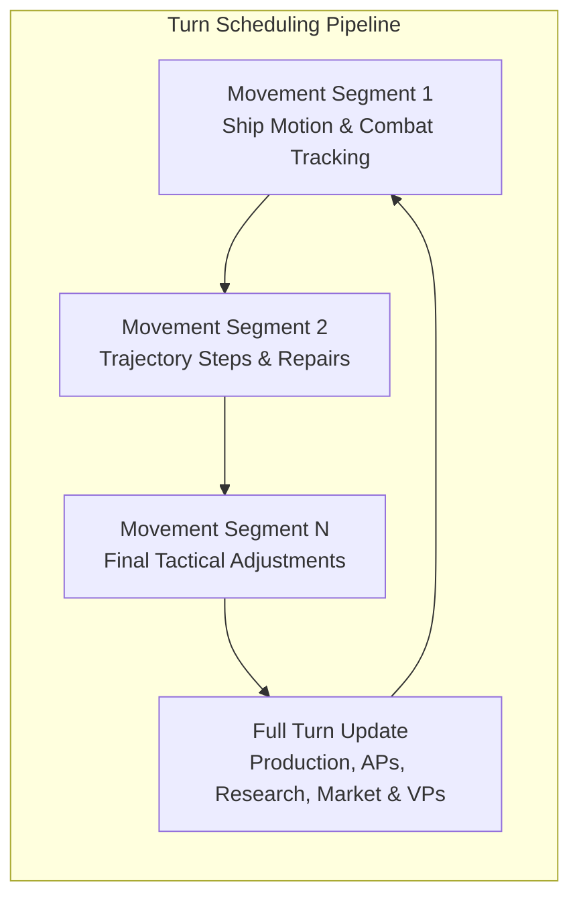

# Turn Cycles, Scheduling & Galactic Updates

## 1. Overview

The Galactic Bloodshed universe evolves through a continuous discrete simulation engine divided into two alternating operational cycles:

1. **Movement Segments**: Frequent tactical intervals where ships execute orbital and deep-space trajectory steps, active weapons (missiles, anti-ballistic missiles) track targets, and damage control teams perform structural repairs.
2. **Full Turn Updates**: Macro-economic simulation passes where planets produce raw commodities, populations grow or starve, action points are generated, research breakthroughs occur, market transactions are cleared, and victory points are tallied.

---

## 2. Movement Segments vs. Turn Updates

A complete turn is configured by the server administration into an interval of duration $T_{\text{update}}$ (in minutes) divided into $N_{\text{segments}}$ equal discrete movement segments:

$$\Delta t_{\text{segment}} = \frac{T_{\text{update}}}{N_{\text{segments}}}$$

### Phase Comparison

| Subsystem / Operation | Movement Segment | Full Turn Update |
| :--- | :---: | :---: |
| **Ship Movement & Hyperdrive** | Active | Active |
| **Tactical Missile / ABM Tracking** | Active | Active |
| **Ship Repair & Damage Control** | Active | Active |
| **Planetary Production & Mining** | Paused | Active |
| **Population Growth & Attrition** | Paused | Active |
| **System & Universe Action Points** | Paused | Allocated |
| **Technology Research & Discovery** | Paused | Progressed |
| **Interstellar Market Delivery** | Paused | Processed |
| **Empire Maintenance & Morale** | Paused | Deducted |
| **Victory Condition Checks** | Paused | Tallied |

---

## 3. Action Point Generation & Distribution

Action Points (APs) represent the logistical capacity of an empire to issue commands, launch operations, mobilize troops, and administer colonies.

### Star System Action Points

At each full turn update, an empire receives Action Points in every star system where it maintains planetary colonies or naval crews. The points awarded depend upon planetary population ($P$), stationed ship count ($N_{\text{ships}}$), and governance status:

$$\text{Raw APs} = \text{round\_rand}\left(\frac{N_{\text{ships}}}{10} + 5 \log_{10}\left(1 + \max(0, P)\right)\right)$$

#### Governance Efficiency Modifier
Operating without an active, operational Government Center palace or docked flagship severely impairs bureaucratic coordination:

$$\text{Final System APs} = \begin{cases} \min(250, \text{Current APs} + \text{Raw APs}) & \text{if Governed} \\ \min\left(250, \text{Current APs} + \max\left(1, \left\lfloor \frac{\text{Raw APs}}{20} \right\rfloor\right)\right) & \text{if in Anarchy} \end{cases}$$

### Universe Action Points

Planetary colonies generate planetary points that accumulate toward a centralized universe-level treasury. Governed empires receive universe-wide action points each update:

$$\Delta \text{AP}_{\text{univ}} = \text{Total Colonized Planet Points}$$

Ungoverned empires receive zero universe-level action points.

---

## 4. Governance Accounting & Treasury Maintenance

During each full update, planetary governors assess economic maintenance costs for planetary installations and standing naval assets.

### Maintenance & Deficit Morale Impact

When maintenance expenses exceed available treasury funds, the deficit directly degrades civil morale:

$$\text{Deficit} = \text{Total Maintenance Obligations} - \text{Governor Treasury}$$

$$\Delta \text{Morale} = -\left\lfloor \frac{\text{Deficit}}{10} \right\rfloor$$

Civilian morale is bounded within $[0, 100]$. If a governor cannot meet maintenance obligations, the treasury is emptied to $0$ and the morale penalty is immediately applied.

---

## 5. Interstellar Market Fulfillment & Freight Logistics

Open market lots on the Interstellar Exchange are evaluated and cleared during turn updates.

### Transaction Process

1. **Delivery Delay**: Commodities placed on the exchange require one update to register before bids are eligible for fulfillment.
2. **Affordability Check**: The highest bidder must possess sufficient funds to pay the bid price plus interstellar freight shipping costs.
3. **Freight Cost Calculation**:
   $$\text{Distance} = \sqrt{(x_2 - x_1)^2 + (y_2 - y_1)^2}$$
   $$\text{Shipping Fee} = \left\lfloor \frac{\text{Distance} \times \text{Bid Price}}{1000} \right\rfloor$$
4. **Deposit & Stockpile**: Commodities are delivered directly to the designated destination planet's resource reserves.

---

## 6. Player Voting & Turn Acceleration

In games where turn acceleration voting is enabled, empires can vote to bypass remaining wait timers when ready:

- **Commands**: `vote update go` (ready to advance) and `vote update wait` (request remaining scheduled time).
- **Unanimity Rule**: If **all mortal empires** currently active in the galaxy vote `go` (excluding Deities and Guest observers), the simulation immediately triggers the next scheduled movement segment or turn update.
- **Automatic Reset**: Upon completion of a full turn update, all player votes are automatically reset to `wait`.

---

## 7. Technological Discoveries & Thresholds

Empire research progression advances each update according to racial intelligence ($IQ$):

$$\Delta \text{Tech} = \frac{IQ}{100.0}$$

### Collective Intelligence Scaling

Races endowed with Collective Intelligence scale their effective IQ dynamically based on total galaxy-wide population ($P_{\text{total}}$):

$$IQ_{\text{effective}} = IQ_{\text{limit}} \times \left(\frac{2}{\pi} \arctan\left(\frac{P_{\text{total}}}{10^6}\right)\right)^2$$

### Breakthrough Milestones

Crossing technology rating thresholds unlocks new capabilities and dispatches breakthrough bulletins:

| Technology Breakthrough | Tech Threshold | Unlocked Capabilities |
| :--- | :---: | :--- |
| **Hyperdrive** | $50.0$ | Faster-than-light interstellar hyperdrive jumps |
| **Crystal Conversion** | $50.0$ | Crystal synthesis and exotic material processing |
| **Laser Weapons** | $100.0$ | Naval laser cannons and orbital fire platforms |
| **Von Neumann AI** | $100.0$ | Self-replicating autonomous machines |
| **Continuous Energy Weapons (CEW)** | $150.0$ | Heavy continuous beam batteries |
| **Anti-Vector Plasma Missiles (AVPM)** | $250.0$ | Guided anti-vector orbital defense munitions |
| **Tractor Beams** | $999.0$ | Gravitational capture and towing beams |
| **Transporters** | $999.0$ | Matter transmission and rapid orbital disembarkation |
| **Cloaking Devices** | $999.0$ | Optical and subspace sensor cloaking |
| **Wormhole Stabilization** | $999.0$ | Artificial wormhole navigation |

---

## 8. Victory Points & Galactic Supremacy

Each update, victory scores are evaluated across all active empires based on territorial dominion, naval power, stockpile reserves, and treasury wealth:

$$\text{Raw Score} = \frac{1}{1000} \Big( 50 \times N_{\text{sectors}} + 10 \times (\text{Fleet Build Cost} + 5 \times \text{Fleet Tech}) + 2 \times (\text{Resources} + \text{Destruct}) + \text{Fuel} + 5 \times \text{Treasury} \Big)$$

$$\text{Final Victory Score} = \left\lfloor \text{Raw Score} \times \left(\frac{\text{Morale}}{100.0}\right) \right\rfloor$$

### Victory Conditions

- **Lesser Winner**: Controlling at least $50\%$ of the galaxy's habitable planets triggers universal translation capabilities (all empires decipher communications).
- **Galactic Domination (Big Winner)**: Maintaining control of at least $60\%$ of all planets for $5$ consecutive turn updates triggers final game victory and concludes the simulation.

---

## 9. See Also

- [Planetary Simulation Engine and Sector Dynamics](planetary_simulation.md)
- [Planetary Mechanics, Colonization, and Surface Topography](planets.md)
- [Species Biology, Ecology, and Racial Genetics](races.md)
- [Imperial Economy, Planetary Stockpiles, and Technology Investment](economy.md)
- [Tactical Combat, Naval Gunnery, and Planetary Warfare](combat.md)
- [Interstellar Navigation, Propulsion, and Hyperspace Mechanics](navigation.md)
- [Governance, Capitals, and Imperial Administration](governance.md)
- [Diplomacy, Coalitions, and Power Blocks](diplomacy.md)
- [Starships, Orbital Hierarchies, and Naval Mechanics](ships.md)
- [Stellar Mechanics, Spectral Classes, and Nova Lifecycles](stars.md)
- [Autonomous Machine AI, Von Neumann Probes, and Berserker Warships](von_neumann.md)
