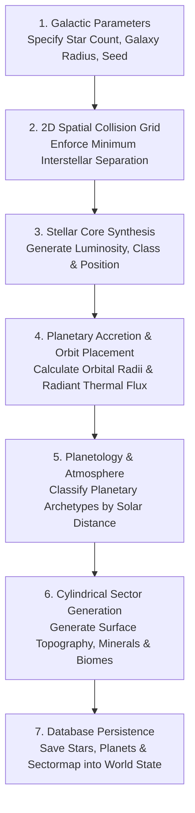

# Universe Creation and Stellar Cartography

## Overview

In **Galactic Bloodshed**, the galaxy is procedurally generated during the universe creation phase. This process establishes the galactic coordinate plane, synthesizes star systems, calculates planetary orbital dynamics and thermodynamic temperature gradients, models planetary terrain topologies, and deposits initial mineral and biological resources.

Understanding the mechanics of universe creation allows administrators to customize galaxy layouts and provides players with deep insight into stellar geography, solar radiation, and planetology.



---

## 1. Galactic Coordinate Plane and Stellar Spacing

The galaxy is mapped across a two-dimensional continuous Cartesian coordinate plane:

- **Galactic Origin**: The galactic center is anchored at $(0, 0)$.
- **Galactic Span**: The coordinate space extends across $`[-U, +U] \times [-U, +U]`$, where the default half-width $U = 25\,000$ coordinate units (a total bounding area of $50\,000 \times 50\,000$ units).
- **Spatial Occupancy Grid**: To prevent stars from overlapping or clustering unrealistically close together, universe creation partitions the entire galaxy into a $100 \times 100$ collision grid. Each cell spans:

$$\text{Cell Size} = \frac{2 \times U}{100} = 500 \text{ coordinate units}$$

Each spatial grid cell permits at most one star system. Candidate star coordinates are sampled uniformly across the galactic disc; if the designated cell is already occupied, the generator re-rolls until an open sector is located.

---

## 2. Stellar Classification and Radiation Physics

Each generated star is assigned a name from historical astronomical catalogs, unique galactic coordinates $(x, y)$, and an intrinsic **stellar luminosity** rating $L_\text{star}$ ($0.1 \le L_\text{star} \le 2.0$).

### Heliocentric Orbital Distance
Planets orbit their parent star in concentric, coplanar tracks. Orbital distances $d_\text{orbit}$ increase outward from the primary:

$$d_\text{orbit} = d_\text{base} + n \cdot \Delta d + \text{jitter}$$

where $n \in [0, N-1]$ represents the orbital index of the planet, and jitter introduces natural orbital eccentricity.

### Orbital Radiant Flux and Temperature Gradients
Planetary surface climates are governed by radiant flux decaying according to the inverse-square law of distance:

$$T_{\text{radiant}} = \frac{L_{\text{star}} \times \lambda}{(d_{\text{orbit}} + d_0)^2}$$

where:
- $`\lambda = 1315.0`$ is the galactic solar radiant flux coefficient.
- $`d_0`$ is the inner stellar corona buffer distance.

Planetary equilibrium surface temperature $T_{\text{surf}}$ is computed by superimposing solar flux onto the cosmic thermal floor:

$$T_{\text{surf}} = \max\left(T_{\text{cosmic}}, T_{\text{radiant}} + T_{\text{ambient}}\right)$$

- **Cosmic Thermal Floor**: $`T_{\text{cosmic}} = -269^\circ\text{C}`$ ($\approx 4\text{ K}$, representing deep-space microwave background equilibrium).
- **Core Thermal Zones**:
  1. **Scorched Inner Band** ($`T_{\text{surf}} > 60^\circ\text{C}`$): High radiant heat boils off volatile liquids, yielding arid deserts or molten rock.
  2. **Habitable Goldilocks Band** ($`-10^\circ\text{C} \le T_{\text{surf}} \le 40^\circ\text{C}`$): Liquid water condenses, supporting lush forests, expansive oceans, and earth-like ecologies.
  3. **Cryogenic Outer Band** ($`T_{\text{surf}} < -20^\circ\text{C}`$): Water freezes into planetary ice sheets, producing glaciated iceballs and frozen tundras.
  4. **Deep Orbital Gas Giants**: Massive Jovian worlds situated far from the primary star that trap thick atmospheres of hydrogen and helium.

---

## 3. Planetary Taxonomy and Topography

Each star system supports between 1 and 10 planets, classified into eight fundamental planetary archetypes based on temperature, mass, and atmospheric retention:

| Planetary Archetype | Typical Temperature Band | Common Surface Biomes | Strategic Suitability |
| :--- | :--- | :--- | :--- |
| **Earth** | Temperate ($10^\circ\text{C}$ to $25^\circ\text{C}$) | Oceans, Land, Mountain, Forest | Ideal general colonization and high agricultural capacity. |
| **Forest** | Mild ($5^\circ\text{C}$ to $20^\circ\text{C}$) | Vast Forests, Water, Plains | High biological growth and biomass reserves. |
| **Desert** | Hot ($35^\circ\text{C}$ to $70^\circ\text{C}$) | Sand Dunes, Rocky Canyons, Mountains | Abundant mineral extraction; limited food and water. |
| **Water** | Warm ($15^\circ\text{C}$ to $30^\circ\text{C}$) | Global Oceans, Archipelagos | Specialized aquatic habitability; limited dry landmass. |
| **Airless (Mars)** | Cold/Dry ($-50^\circ\text{C}$ to $0^\circ\text{C}$) | Barren Rock, Dust Plains, Craters | Low natural compatibility; requires domes and heavy mining infrastructure. |
| **Iceball** | Cryogenic ($-120^\circ\text{C}$ to $-30^\circ\text{C}$) | Glaciers, Ice Shelves, Frozen Mountains | Specialized cryogenic habitability; abundant water-ice volatiles. |
| **Gas Giant (Jovian)** | Frigid Outer System | High-Density Hydrogen/Helium Gas | Inhabitable only by specialized Jovian atmospheric floaters. |
| **Asteroid** | Varied Deep Space | Vacuum-Exposed Asteroid Regolith | **Non-habitable** for homeworlds; prime mining and listening outposts. |

---

## 4. Cylindrical Surface Sector Grids

Planets model their surface geography using two-dimensional toroidal-cylindrical coordinate grids:

- **Horizontal Cylindrical Wrapping**: The planetary surface wraps continuously from east to west. Moving off the eastern margin of the grid reappears at the western edge ($x_{\text{wrapped}} = x \pmod W$).
- **Polar Latitudinal Limits**: The northern and southern borders represent planetary poles and do not wrap ($0 \le y < H$).
- **Topological Biome Seeding**:
  - Mountain peaks, plains, oceanic basins, and forests are clustered using cellular growth algorithms.
  - Every non-Jovian world is seeded with structural **Plated** sectors representing stable geological bedrock suitable for starport foundations, industrial complexes, and planetary capitals.

---

## 5. Mineral Wealth and Ecological Deposits

Each surface sector is endowed with foundational economic metrics:

1. **Mineral Concentration** ($0$ to $100\%$): Determines the efficiency of automated mining rigs and industrial extraction.
2. **Fertility Rating** ($0$ to $100\%$): Dictates natural agricultural food yields and maximum population carrying capacity.
3. **Exploration Mask**: Initially hidden under planetary fog of war until explored by landed survey teams or orbital sensors.

---

## 6. Administration and Generation Utilities

Game operators initialize a new universe using the administrative generation tool (`makeuniv`):

```bash
# Generate a standard 30-star galaxy in the default database
./build/gb/makeuniv

# Generate a dense 50-star cluster in a custom database file
./build/gb/makeuniv --db /var/games/gb/cluster.db --stars 50

# Generate a deterministic universe using a specific random seed
./build/gb/makeuniv -d test.db -s 25 -r 1337
```

| Flag | Parameter | Default | Description |
| :--- | :--- | :--- | :--- |
| `-d`, `--db` | `<filepath>` | `/usr/local/var/galactic-bloodshed/gb.db` | Target SQLite database file. |
| `-s`, `--stars` | `<integer>` | `25` | Number of star systems to place in the galaxy. |
| `-p`, `--planets` | `<integer>` | `10` | Maximum planets permitted per star system. |
| `-r`, `--seed` | `<integer>` | Random | Deterministic pseudo-random number generator seed. |

---

## See Also

- [Planets and Biomes Guide](planets.md) — Comprehensive technical reference on planetary environments, sector types, and habitability formulas.
- [Stellar Astronomy Guide](stars.md) — Mechanics of star system orbits, stellar gravity, and interstellar navigation.
- [Race Generation and Imperial Onboarding Guide](race_generation.md) — Player registration, racial archetypes, genetic customization, and homeworld allocation.
