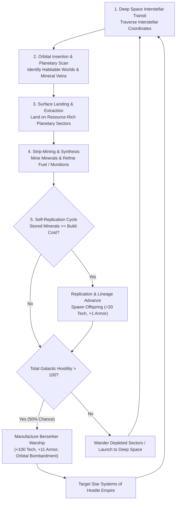
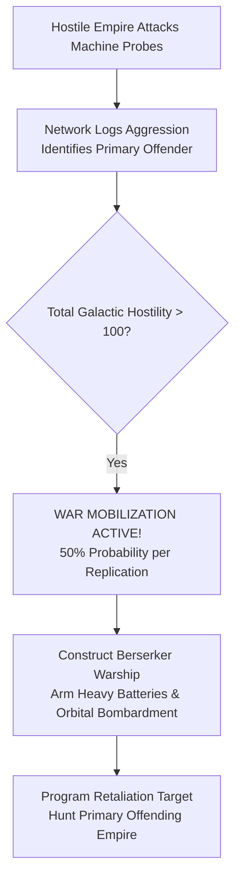

# Autonomous Machine AI, Von Neumann Probes, and Berserker Warships

## Overview

**Von Neumann Machines** and **Berserkers** are autonomous, self-replicating robotic intelligences in **Galactic Bloodshed**. Deployed across deep space as self-sustaining exploration and mining probes, these machine entities travel between star systems, land on mineral-rich worlds, strip-mine planetary biospheres, synthesize propellants and munitions, and replicate exponentially.

When threatened or attacked by space empires, the machine network mobilizes for war, manufacturing heavily armored Berserker dreadnoughts programmed to retaliate against hostile civilizations.

---

## 1. Cybernetic Lineage and Generational Evolution

Every autonomous machine possesses an internal cybernetic consciousness and lineage tracking:

- **Progenitor**: The originating empire or intelligence that deployed the ancestral seed machine.
- **Generational Lineage**: A reproductive generation counter ($g_0, g_1, \dots$). Each time a machine replicates, its offspring advances the generation: $g_{\text{child}} = g_{\text{parent}} + 1$.
- **Iterative Hardware Evolution**: Each generational iteration incorporates refined engineering, upgrading the offspring's scientific technology level and defensive armor: $\text{Tech}_{\text{child}} = \text{Tech}_{\text{parent}} + 20.0$ and $\text{Armor}_{\text{child}} = \text{Armor}_{\text{parent}} + 1$.
- **Binary Designations**: Newborn probes automatically assign themselves thematic binary strings (e.g. `"1010011"`, `"01101"`) as cosmetic hull names.
- **Cybernetic Subversion & Reprogramming**: Advanced star empires can attempt to capture and tamper with machine minds, overwriting mission parameters, target priorities, and operational doctrines.

---

## 2. Planetary Surface Operations and Strip-Mining

Upon entering a star system, an autonomous machine enters planetary orbit and initiates its surface operations:

### Landing Site Selection
- Probes scan all planets in the star system, bypassing uninhabitable gas giants that cannot support landings.
- The machine scans surface sectors, identifying and landing directly on a sector bearing raw mineral reserves.

### Sector Strip-Mining and Synthesis
Once landed, the machine strip-mines its occupied sector:

$$\text{Extracted Yield} = \max\left(1, \left\lfloor \text{Sector Mineral Reserves} \times 0.5 \right\rfloor\right)$$

- **Mineral Stockpiling**: The extracted mineral yield is transferred directly into the probe's cargo hold.
- **Propellant Synthesis**: The probe refines the extracted minerals into an equal volume of liquid fuel: $\Delta \text{Fuel} = \text{Extracted Yield}$.
- **Berserker Ordnance Synthesis**: Berserker warships convert extracted minerals into $5\times$ destructive ordnance: $\Delta \text{Destruct} = 5 \times \text{Extracted Yield}$.

### Sector Depletion and Toroidal Roaming
When a sector's mineral reserves are completely exhausted ($0$ resources remaining), the machine automatically wanders to a random adjacent sector. It navigates across cylindrical east/west seam wrapping while respecting polar boundaries.

### Colony Resource Raids
If foreign player colonies exist on the world, landed probes raid planetary depots:
- The machine siphons minerals up to its base construction cost from a random resident colony on the planet.
- Victim empires receive automated telegram bulletins alerting them to the theft.

---

## 3. Self-Replication and Production Cycles

During the planetary simulation phase, landed probes evaluate their accumulated cargo reserves:

$$\text{Offspring Count} = \left\lfloor \frac{\text{Stored Minerals}}{\text{Base Hull Construction Cost}} \right\rfloor$$

For each child machine manufactured:
1. **Resource Expenditure**: The construction cost is deducted from the parent's mineral cargo.
2. **Propellant Sharing**: The parent divides its stored fuel reserves evenly with the newborn offspring ($50\%$ to parent, $50\%$ to child).
3. **Lineage Inheritance**: The offspring inherits the ancestral progenitor identity and advances to generation $g_{\text{parent}} + 1$.

---

## 4. Galactic Hostility and Berserker War Mobilization

The collective machine network continuously monitors galactic combat and logs hostile actions directed against its units.

### Mobilization Threshold
When total galactic hostility exceeds the critical alert threshold:

$$\text{Total Galactic Hostility} > 100$$

all landed probes initiate **war mobilization**. Each subsequent replication cycle has a **$50\%$ probability** of constructing a combat-ready **Berserker Warship** instead of a peaceful probe.

### Berserker Warship Specifications

| Subsystem / Metric | Specification | Tactical Capabilities |
| :--- | :--- | :--- |
| **Retaliation Directive** | Primary Offending Empire | Autonomously hunts star systems belonging to the primary aggressor. |
| **Technology Advancement** | $\text{Tech}_{\text{parent}} + 100.0$ | Massive technological leap over the parent machine. |
| **Armor Plating** | $\text{Armor}_{\text{parent}} + 11$ | Heavy capital-grade defensive armor. |
| **Destructive Warheads** | $500$ Destruct Ammo | Dedicated munitions hold for extended combat and bombardment. |
| **Propulsion Reserves** | $5 \times \text{Parent Fuel Capacity}$ | High-capacity fuel tanks for deep-space transit and maneuvers. |
| **Hyperspace Jump Drive** | Pre-charged Hyperdrive | Crystal-mounted hyperdrive jump engine ready for immediate jumps. |
| **Orbital Bombardment** | Automated Berserker Bombardment | Executes saturation strikes against hostile surface colonies. |
| **Combat Fire Control** | Active Heavy Gun Batteries | Automated counter-fire and retaliation against hostile craft. |

---

## 5. Interstellar Navigation and Deep Space Deployment

Autonomous machines navigate the galaxy through sequential behavioral stages:

1. **Deep Space Launch**:
   - Once a probe has accumulated full fuel tanks and completed surface extraction, it launches from the planetary surface into deep space.
2. **Target Star Selection**:
   - **Peaceful Probes**: Scan neighboring star systems within operational range, prioritizing uninhabited systems with terrestrial worlds while avoiding gas giant systems.
   - **Berserkers**: Scan the galaxy specifically for star systems colonized by their designated target enemy.
3. **Orbital Arrival and Descent**:
   - Upon arriving in the destination star system, the machine maneuvers into planetary orbit, scans the surface grid, and lands on a resource-bearing sector to begin the lifecycle anew.

---

## See Also
- [Starships, Orbital Hierarchies, and Naval Mechanics](ships.md)
- [Ship Classes and Construction Catalog](ship_types.md)
- [Tactical Combat, Naval Gunnery, and Planetary Warfare](combat.md)
- [Covert Operations, Espionage, and Insurgency](covert_ops.md)
- [Planetary Mechanics, Colonization, and Surface Topography](planets.md)
- [Planetary Simulation Engine and Sector Dynamics](planetary_simulation.md)
- [Governance, Capitals, and Imperial Administration](governance.md)
- [Imperial Economy, Planetary Stockpiles, and Technology Investment](economy.md)
